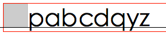

# 摘录

## 行高

参考: [前端读书寻宝记之读《包容性 Web 设计》有感](https://juejin.im/post/5bfa8f4be51d4574b133d0a0)

行高要设置成无单位的相对值，建议 1.5 倍间距

```css
p {
  font-size: 1rem;
  line-height: 1.5;
}
```

## DOM 事件

### DOM 级别

参考: [DOM 事件机制](https://juejin.im/post/5bd2e5f8e51d4524640e1304)

DOM 级别一共可以分为四个级别：DOM0 级、DOM1 级、DOM2 级和 DOM3 级。
而 DOM 事件分为 3 个级别：DOM 0 级事件处理，DOM 2 级事件处理和 DOM 3 级事件处理。由于 DOM 1 级中没有事件的相关内容，所以没有 DOM 1 级事件。

#### DOM0 级

```js
element.on[] = function() {}
```

当给元素绑定多个同类型事件时，最后一个事件会覆盖前面的事件。

绑定事件在当前元素的冒泡阶段（或者目标阶段）执行。

#### DOM2 级

```js
element.addEventListener(event - name, callback, useCapture);
```

参数：

- event-name: 事件名称，可以是标准的 DOM 事件
- callback: 回调函数，当事件触发时，函数会被注入一个参数为当前的事件对象 event
- useCapture: 默认是 false，代表事件句柄在冒泡阶段执行（事件句柄）

可以同一元素绑定多个同类型事件（执行顺序有待实验）

#### DOM3 级

在 DOM2 级事件的基础上添加了更多的事件类型

- UI 事件，当用户与页面上的元素交互时触发，如：load、scroll
- 焦点事件，当元素获得或失去焦点时触发，如：blur、focus
- 鼠标事件，当用户通过鼠标在页面执行操作时触发如：dblclick、mouseup
- 滚轮事件，当使用鼠标滚轮或类似设备时触发，如：mousewheel
- 文本事件，当在文档中输入文本时触发，如：textInput
- 键盘事件，当用户通过键盘在页面上执行操作时触发，如：keydown、keypress
- 合成事件，当为 IME（输入法编辑器）输入字符时触发，如：compositionstart
- 变动事件，当底层 DOM 结构发生变化时触发，如：DOMsubtreeModified
- 同时 DOM3 级事件也允许使用者自定义一些事件。

## Event 对象常见的应用

### event. preventDefault()

阻止默认事件行为触发

### touchstart & click

意思的是，当我们在目标元素同时绑定 touchstart 和 click 事件时，在 touchstart 事件回调函数中使用该方法，可以阻止后续 click 事件的发生。

### event.stopPropagation() & event.stopImmediatePropagation()

event.stopPropagation() 方法阻止事件冒泡到父元素，阻止任何父事件处理程序被执行

event.stopImmediatePropagation 既能阻止事件向父元素冒泡，也能阻止元素同事件类型的其它监听器被触发

### event.target & event.currentTarget

event.target 指向引起触发事件的元素，而 event.currentTarget 则是事件绑定的元素，只有被点击的那个目标元素的 event.target 才会等于 event.currentTarget。也就是说，event.currentTarget 始终是监听事件者，而 event.target 是事件的真正发出者。

## 空格字符

参考: [小 tips: 使用&#x3000;等空格实现最小成本中文对齐](https://www.zhangxinxu.com/wordpress/2015/01/tips-blank-character-chinese-align/)

| 字符以及 HTML 实体                                                                                                                                                                                                                                   | 描述以及说明                                                                                                                                                                                         |
| ---------------------------------------------------------------------------------------------------------------------------------------------------------------------------------------------------------------------------------------------------- | ---------------------------------------------------------------------------------------------------------------------------------------------------------------------------------------------------- |
| `&nbsp;`                                                                                                                                                                                                                                             | 这是我们使用最多的空格，也就是按下 space 键产生的空格。在 HTML 中，如果你用空格键产生此空格，空格是不会累加的（只算 1 个）。                                                                         |
| 要使用 html 实体表示才可累加。为了便于记忆，我总是把这个空格成为“牛逼(nb)空格(sp – space)”，虽然实际上并不牛逼。该空格占据宽度受字体影响明显而强烈。在 inline-block 布局中会搞些小破坏，在两端对齐布局中又是不可少的元素。是个让人又爱又恨的小东东。 |
| `&ensp;`                                                                                                                                                                                                                                             | 该空格学名不详。为了便于记忆，我们不妨就叫它“恶念(e n-ian)空格”。此空格传承空格家族一贯的特性：透明滴！此空格有个相当稳健的特性，就是其**占据的宽度正好是 1/2 个中文宽度**，而且基本上不受字体影响。 |
| `&emsp;`                                                                                                                                                                                                                                             | 该空格学名不详。为了便于记忆，我们不妨就叫它”恶魔(e m-o)空格”。此空格也传承空格家族一贯的特性：透明滴！此空格也有个相当稳健的特性，就是其**占据的宽度正好是 1 个中文宽度**，而且基本上不受字体影响。 |
| `&thinsp;`                                                                                                                                                                                                                                           | 该空格学名不详。我们不妨称之为“瘦弱空格”，就是该空格长得比较瘦弱，身体单薄，占据的宽度比较小。我目前是没用过这个东西，这里亮出来是让其过一下群众演员的瘾                                             |

## MuationObserver

参考：[了解 HTML5 中的 MutationObserver](https://segmentfault.com/a/1190000012787829)

MutationObserver 翻译过来就是变动观察器，字面上就可以理解这是用来观察 Node（节点）变化的。

MutationObserver 是一个构造器，接受一个 callback 参数，用来处理节点变化的回调函数，返回两个参数，mutations：节点变化记录列表（`sequence<MutationRecord>`），observer：构造 MutationObserver 对象。

```js
var observe = new MutationObserver(function(mutations, observer) {});
```

MutationObserver 对象有三个方法，分别如下：

1. **observe**：设置观察目标，接受两个参数，target：观察目标，options：通过对象成员来设置观察选项
2. **disconnect**：阻止观察者观察任何改变
3. **takeRecords**：清空记录队列并返回里面的内容

关于 observe 方法中 options 参数有已下几个选项：

1. **childList**：设置 true，表示观察目标子节点的变化，比如添加或者删除目标子节点，不包括修改子节点以及子节点后代的变化
2. **attributes**：设置 true，表示观察目标属性的改变
3. **characterData**：设置 true，表示观察目标数据的改变
4. **subtree**：设置为 true，目标以及目标的后代改变都会观察
5. **attributeOldValue**：如果属性为 true 或者省略，则相当于设置为 true，表示需要记录改变前的目标属性值，设置了 attributeOldValue 可以省略 attributes 设置
6. **characterDataOldValue**：如果 characterData 为 true 或省略，则相当于设置为 true,表示需要记录改变之前的目标数据，设置了 characterDataOldValue 可以省略 characterData 设置
7. **attributeFilter**：如果不是所有的属性改变都需要被观察，并且 attributes 设置为 true 或者被忽略，那么设置一个需要观察的属性本地名称（不需要命名空间）的列表

## css 加载会造成阻塞吗

参考：[css 加载会造成阻塞吗？](https://www.cnblogs.com/chenjg/p/7126822.html)

1. css 加载不会阻塞 DOM 解析
2. css 加载会阻塞 DOM 树的渲染
3. css 加载会阻塞后面 js 语句的执行

## 浏览器如果渲染过程遇到 JS 文件怎么处理

原文：[你不知道的浏览器页面渲染机制](https://juejin.im/post/5ca0c0abe51d4553a942c17d?tdsourcetag=s_pcqq_aiomsg)

渲染过程中，如果遇到`<script>`就停止渲染，执行 JS 代码。因为浏览器渲染和 JS 执行共用一个线程，
而且这里必须是单线程操作，多线程会产生渲染 DOM 冲突。

JavaScript 的加载、解析与执行会阻塞 DOM 的构建，也就是说，在构建 DOM 时，HTML 解析器若遇到了 JavaScript，那么它会暂停构建 DOM，将控制权移交给 JavaScript 引擎，等 JavaScript 引擎运行完毕，浏览器再从中断的地方恢复 DOM 构建。

也就是说，如果你想首屏渲染的越快，就越不应该在首屏就加载 JS 文件，这也是都建议将 script 标签放在 body 标签底部的原因。
当然在当下，并不是说 script 标签必须放在底部，因为你可以给 script 标签添加 defer 或者 async 属性（下文会介绍这两者的区别）。

原本 DOM 和 CSSOM 的构建是互不影响，井水不犯河水，但是一旦引入了 JavaScript，CSSOM 也开始阻塞 DOM 的构建，只有 CSSOM 构建完毕后，DOM 再恢复 DOM 构建。

这是因为 JavaScript 不只是可以改 DOM，它还可以更改样式，也就是它可以更改 CSSOM。因为不完整的 CSSOM 是无法使用的，如果 JavaScript 想访问 CSSOM 并更改它，那么在执行 JavaScript 时，必须要能拿到完整的 CSSOM。所以就导致了一个现象，如果浏览器尚未完成 CSSOM 的下载和构建，而我们却想在此时运行脚本，那么浏览器将延迟脚本执行和 DOM 构建，直至其完成 CSSOM 的下载和构建。也就是说，在这种情况下，浏览器会先下载和构建 CSSOM，然后再执行 JavaScript，最后在继续构建 DOM。

## 浏览器多内核与 JS 线程

原文：[浅谈浏览器多进程与 JS 线程](https://segmentfault.com/a/1190000013083967)

- 图形用户界面 GUI 渲染线程
  - 负责渲染浏览器界面，包括解析 HTML、CSS、构建 DOM 树、Render 树、布局与绘制等
  - 当界面需要重绘（Repaint）或由于某种操作引发回流（Reflow）时，该线程就会执行
- JS 引擎线程
  - JS 内核，也称 JS 引擎，负责处理执行 javascript 脚本
  - 等待任务队列的任务的到来，然后加以处理，浏览器无论什么时候都只有一个 JS 引擎在运行 JS 程序
- 事件触发线程
  - 听起来像 JS 的执行，但其实归属于浏览器，而不是 JS 引擎，用来控制时间循环
  - 当 JS 引擎执行代码如 setTimeout 时，会将对应任务添加到事件线程中
  - 当对应的事件符合触发条件被触发时，该线程会把事件添加到待处理队列的队尾，等待 JS 引擎的处理
  - 注意：由于 JS 单线程关系，所以这些待处理队列中过的事件都得排队等待 JS 引擎处理
- 定时触发器线程
  - setIntervel 与 setTimeout 所在线程
  - 定时计时器并不是又 JS 引擎计时的，因为如果 JS 引擎时单线程又处于堵塞状态，那回影响到及时的准确
  - 当计时完成被触发，事件会被添加到事件队列，等待 JS 引擎空闲了执行
- 异步 HTTP 请求线程
  - 在 XMLHttpRequest 在连接后新启动的一个线程
  - 线程如果检测到请求的状态变更，如果设置又回调函数，该线程会把回调函数添加到事件队列，同理，等待 JS 引擎空闲了执行

setTimout 不是内置的 JS 函数，而是浏览器 API( Browser API)的一部分，它是浏览器免费提供给我们的一组方便的工具

## Load 和 DOMContentLoadad 区别

- DOMContentLoaded 事件将在 DOM 层次结构完全构建后立即触发
- Load 事件将在所有图像和 CSS 文件完成加载后执行

## ios12 键盘收起页面不回弹问题

原文: [ios 最新系统 bug 与解决——微信公众号中弹出键盘再收起时，原虚拟键盘位点击事件无效](https://juejin.im/post/5c07442f51882528c4469769?tdsourcetag=s_pcqq_aiomsg)

```js
/iphone|ipod|ipad/i.test(navigator.appVersion) &&
  document.addEventListener(
    "blur",
    (e) => {
      // 这里加了个类型判断，因为a等元素也会触发blur事件
      ["input", "textarea"].includes(e.target.localName) &&
        document.body.scrollIntoView(false);
    },
    true,
  );
```

## 在单页应用中，如何优雅的监听 url 的变化

原文: [在单页应用中，如何优雅的监听 url 的变化](https://juejin.im/post/5c26ec2f51882501cd6f497a)

### 1. 单页应用原理

通过 hash 或者 html5 Bom 对象中的 history 可以做到改变 url，但是不刷新页面。

(1)通过 hash 来实现单页路由

```js
window.location.hash;
```

(2)通过 history 实现前端路由

HTML5 的 History 接口，History 对象是一个底层接口，不继承于任何的接口。History 接口允许我们操作浏览器会话历史记录。

属性:

- History.length
- History.state

方法:

- History.back (会刷新)
- History.forward (会刷新)
- History.go (会刷新)
- History.pushState (不会刷新)
- History.replaceState (不会刷新)

### 2. 监听 url 中的 hash 变化

```js
1;
window.onhashchange = function(event) {
  console.log(event);
};
2;
window.addEventListener("hashchange", function(event) {
  console.log(event);
});
```

### 3. 监听通过 history 来改变 url 的事件

监听 back,forward 和 go

```js
window.addEventListener("popstate", function(event) {
  console.log(event);
});
```

监听 replaceState 和 pushState

手动创建全局事件

```js
var _wr = function(type) {
  var orig = history[type];
  return function() {
    var rv = orig.apply(this, arguments);
    var e = new Event(type);
    e.arguments = arguments;
    window.dispatchEvent(e);
    return rv;
  };
};
history.pushState = _wr("pushState");
history.replaceState = _wr("replaceState");
```

```js
window.addEventListener("replaceState", function(e) {
  console.log("THEY DID IT AGAIN! replaceState 111111");
});
window.addEventListener("pushState", function(e) {
  console.log("THEY DID IT AGAIN! pushState 2222222");
});
```

## 深浅拷贝

### 浅拷贝

- Object.assign()

- 拓展运算符

- Array.prototype.slice()

### 深拷贝

- JSON.stringify()

注意事项:

1. 拷贝的对象的值中如果有函数,undefined,symbol 则经过 JSON.stringify()序列化后的 JSON 字符串中这个键值对会消失。
2. 无法拷贝不可枚举的属性，无法拷贝对象的原型链。
3. 拷贝 Date 引用类型会变成字符串。
4. 拷贝 RegExp 引用类型会变成空对象。
5. 对象中含有 NaN、Infinity 和-Infinity，则序列化的结果会变成 null。
6. 无法拷贝对象的循环应用(即 obj[key] = obj)。

- lodash & jQuery

## console 中的'\$'

### \$0

在 Chrome 的 Elements 面板中，\$0 是当前我们选中的 html 节点的引用。

理所当然，$1 是我们上一次选择的节点的引用，$2 是在那之前选择的节点的引用，等等。一直到 \$4。

### \$ 和 \$\$

在你还没有在 app 中定义 $变量的情况下(例如 jQuery)，$在 console 中是冗长的函数 document.querySelector 的一个别名。
但是$$ 能节省更多的时间，因为它不仅仅执行document.QuerySelectorAll并且返回的是一个节点的数组，而不是一个Node list
从本质上说:Array.from(document.querySelectorAll('div')) === $$('div'),但是\$\$('div')要简短太多了！

### \$\_

\$\_变量是上次执行的结果的引用。

## setTimeout & requestAnimationFrame

原文: [你知道的 requestAnimationFrame【从 0 到 0.1】](https://juejin.im/post/5c3ca3d76fb9a049a979f429)

- 使用 setTimeout 实现的动画，当页面被隐藏或最小化时，定时器 setTimeout 仍在后台执行动画任务，
  此时刷新动画是完全没有意义的（实际上 FireFox/Chrome 浏览器对定时器做了优化：页面闲置时，如果时间间隔小于 1000ms，则停止定时器，与 requestAnimationFrame 行为类似。如果时间间隔>=1000ms，定时器依然在后台执行）

- 使用 requestAnimationFrame，当页面处于未激活的状态下，该页面的屏幕刷新任务会被系统暂停，
  由于 requestAnimationFrame 保持和屏幕刷新同步执行，所以也会被暂停。当页面被激活时，动画从上次停留的地方继续执行，节约 CPU 开销。

## 真值和虚值

原文: [[译] 优秀 JavaScript 开发人员应掌握的 9 个技巧](https://juejin.im/post/5c4506c9e51d45524c7cf206)

当我们使用默认值时，通常要对现有值进行一系列判断，这种方法使代码变得异常繁琐，而现在我们可以真值（Truthy）和虚值（Falsy）的方式来改进它，不仅可以节省代码量，还使人更加信服。

Falsy

```js
if (false)
if (null)
if (undefined)
if (0)
if (NaN)
if ('')
if ("")
if (``)
if (document.all)
```

Truthy

```js
if (true)
if ({})
if ([])
if (42)
if ("foo")
if (new Date())
if (-42)
if (3.14)
if (-3.14)
if (Infinity)
if (-Infinity)
```

## object-fit

当你在 CSS 中改变一个图片的大小，如果没有设置宽高的话，图片的大小会被压缩或拉伸。
解决方法很简单，就是使用 CSS 的 object-fit，它的实用性跟背景图片的 background-size: cover 很类似。

链接: [object-fit](https://developer.mozilla.org/zh-CN/docs/Web/CSS/object-fit)

`object-fit` CSS 属性指定可替换元素的内容应该如何适应到其使用的高度和宽度确定的框。

取值:

`contain`

被替换的内容将被缩放，以在填充元素的内容框时保持其宽高比。 整个对象在填充盒子的同时保留其长宽比，因此如果宽高比与框的宽高比不匹配，该对象将被添加“黑边”。

`cover`

被替换的内容在保持其宽高比的同时填充元素的整个内容框。如果对象的宽高比与内容框不相匹配，该对象将被剪裁以适应内容框。

`fill`

被替换的内容正好填充元素的内容框。整个对象将完全填充此框。如果对象的宽高比与内容框不相匹配，那么该对象将被拉伸以适应内容框。

`none`

被替换的内容将保持其原有的尺寸。

`scale-down`

内容的尺寸与 none 或 contain 中的一个相同，取决于它们两个之间谁得到的对象尺寸会更小一些。

## 不同刷新的请求执行过程

原文: [HTTP----HTTP 缓存机制](https://juejin.im/post/5a1d4e546fb9a0450f21af23)

1. 浏览器地址栏中写入 URL，回车
   浏览器发现缓存中有这个文件了，不用继续请求了，直接去缓存拿。（最快）
2. F5  
   F5 就是告诉浏览器，别偷懒，好歹去服务器看看这个文件是否有过期了。于是浏览器就胆胆襟襟的发送一个请求带上 If-Modify-since。
3. Ctrl+F5  
   告诉浏览器，你先把你缓存中的这个文件给我删了，然后再去服务器请求个完整的资源文件下来。于是客户端就完成了强行更新的操作。

## -webkit-tap-highlight-color

这个属性只用于 iOS（iPhone 和 iPad）。当你点击一个链接或者通过 Javascript 定义的可点击元素的时候，它就会出现一个半透明的灰色背景。要重设这个表现，你可以设置-webkit-tap-highlight-color 为任何颜色。

想要禁用这个高亮，设置颜色的 alpha 值为 0 即可。

## text-align:justify

text-align:justify 属性规定元素中的文本水平对齐方式为两端对齐文本效果。

移动端` &npsp``&ensp``&emsp``&thinsp `的显示效果与浏览器端不同，不能够完美占位就需要使用 text-align: justify;

但该属性对于单行及多行的最后一行不起作用，可以用（伪类）伪元素解决

```css
::after {
  content: "";
  display: inline-block;
  width: 100%;
}
```

## sessionStorage 共享问题

页面会话在浏览器打开期间一直保持，并且重新加载或恢复页面仍会保持原来的页面会话。
在新标签或窗口打开一个页面时会在顶级浏览上下文中初始化一个新的会话。

**通过点击链接（或者用了 window.open）打开的新标签页之间是属于同一个 session 的**，
但新开一个标签页总是会初始化一个新的 session，即使网站是一样的，它们也不属于同一个 session。

## 即时计算属性获取导致回流（reflow）

offset(Top/Left/Width/Height)

scroll(Top/Left/Width/Height)

client(Top/Left/Width/Height)

...

使用这些属性时，需要通过及时计算得到，因此浏览器为了获取这些值，也会进行回流

## 环境变量管理工具

- dotenv 可以解决跨平台和持久化的问题，但使用场景有限，只适用于 node 项目，且和项目代码强耦合，需要在弄得代码运行后手动执行触发
- cross-env 支持在命令行自定义环境变量。问题也非常明显，不能解决大型项目中自定义环境变量的持久化问题
- env-cmd 也可以解决跨平台和持久化的问题，支持定义默认环境变量，不足的是不支持在命令行自定义环境变量

## 进程 线程 携程

### 进程

进程（Process）是计算机中的程序关于某数据集合上的一次运行活动，是系统进行资源分配和调度的基本单位，是操作系统结构的基础。在早期面向进程设计的计算机结构中，进程是程序的基本执行实体；在当代面向线程设计的计算机结构中，进程是线程的容器。程序是指令、数据及其组织形式的描述，进程是程序的实体。

组成

进程是一个实体。每一个进程都有它自己的地址空间，一般情况下，包括文本区域（text region）、数据区域（data region）和堆栈（stack region）。文本区域存储处理器执行的代码；数据区域存储变量和进程执行期间使用的动态分配的内存；堆栈区域存储着活动过程调用的指令和本地变量。

特征

动态性：进程的实质是程序在多道程序系统中的一次执行过程，进程是动态产生，动态消亡的。
并发性：任何进程都可以同其他进程一起并发执行
独立性：进程是一个能独立运行的基本单位，同时也是系统分配资源和调度的独立单位；
异步性：由于进程间的相互制约，使进程具有执行的间断性，即进程按各自独立的、不可预知的速度向前推进
结构特征：进程由程序、数据和进程控制块三部分组成。
多个不同的进程可以包含相同的程序：一个程序在不同的数据集里就构成不同的进程，能得到不同的结果；但是执行过程中，程序不能发生改变。

### 线程

在多线程 OS 中，通常是在一个进程中包括多个线程，每个线程都是作为利用 CPU 的基本单位，是花费最小开销的实体。线程具有以下属性。

- 轻型实体
  线程中的实体基本上不拥有系统资源，只是有一点必不可少的、能保证独立运行的资源。
  线程的实体包括程序、数据和 TCB。线程是动态概念，它的动态特性由线程控制块 TCB（Thread Control Block）描述。TCB 包括以下信息：

  - 线程状态。
  - 当线程不运行时，被保存的现场资源。
  - 一组执行堆栈。
  - 存放每个线程的局部变量主存区。
  - 访问同一个进程中的主存和其它资源。
    用于指示被执行指令序列的程序计数器、保留局部变量、少数状态参数和返回地址等的一组寄存器和堆栈。

- 独立调度和分派的基本单位。
  在多线程 OS 中，线程是能独立运行的基本单位，因而也是独立调度和分派的基本单位。由于线程很“轻”，故线程的切换非常迅速且开销小（在同一进程中的）。

- 可并发执行。
  在一个进程中的多个线程之间，可以并发执行，甚至允许在一个进程中所有线程都能并发执行；同样，不同进程中的线程也能并发执行，充分利用和发挥了处理机与外围设备并行工作的能力。

- 共享进程资源。

在同一进程中的各个线程，都可以共享该进程所拥有的资源，这首先表现在：所有线程都具有相同的地址空间（进程的地址空间），这意味着，线程可以访问该地址空间的每一个虚地址；此外，还可以访问进程所拥有的已打开文件、定时器、信号量机构等。由于同一个进程内的线程共享内存和文件，所以线程之间互相通信不必调用内核。

### 协程

协程与子例程一样，协程（coroutine）也是一种程序组件。相对子例程而言，协程更为一般和灵活，但在实践中使用没有子例程那样广泛。
协程源自 Simula 和 Modula-2 语言，但也有其他语言支持。

协程不是进程或线程，其执行过程更类似于子例程，或者说不带返回值的函数调用。
一个程序可以包含多个协程，可以对比与一个进程包含多个线程，因而下面我们来比较协程和线程。我们知道多个线程相对独立，有自己的上下文，切换受系统控制；而协程也相对独立，有自己的上下文，但是其切换由自己控制，由当前协程切换到其他协程由当前协程来控制。

协程和线程区别：协程避免了无意义的调度，由此可以提高性能，但也因此，程序员必须自己承担调度的责任，同时，协程也失去了标准线程使用多 CPU 的能力。

## click 事件存在的问题

### IE

IE8&9，具有 background-color 样式计算为 transparent 的元素覆盖在其他元素顶端时，不会收到 click 事件。取而代之，所有的 click 事件将被触发于其地下的元素

已知会触发此漏洞的情景:

- 仅针对 IE9
  - 设置`background-color: rgba(0,0,0,0)`
  - 设置`opacity: 0`并且明确指定 background-color 而不是 transparent
- 对于 IE8 和 IE9: 设置`filter: alpha(opacity = 0);`并且明确指定`background-color`而不是 transparent

### Safari

safari 手机版会有一个 bug，当点击事件不是绑定在交互式的元素上（比如说 HTML 的 div），并且也没有直接的事件监听器绑定在他们自身。

解决方法如下：

为其元素或者祖先元素，添加 cursor: pointer 的样式，使元素具有交互式点击为需要交互式点击的元素添加 onclick="void(0)"的属性，但并不包括 body 元素使用可点击元素如`<a>`,代替不可交互式元素如 div 不使用 click 的事件委托。

Safari 手机版里，以下元素不会受到上述 bug 的影响：

- `<a>` 需要 href 链接
- `<area>` 需要 href
- `<button>`
- ``
- `<input>`
- `<label>` 需要与 form 控制器连接

## 文本换行 css 属性

### overflow-wrap (word-warp)

控制单词如何被拆分换行

用来说明当一个不能被分开的字符串太长而不能填充其包裹盒时，为防止其溢出，浏览器是否允许这样的单词中断换行

- normal 表示在正常的单词结束处换行
- break-word 表示如果行内没有多余的地方容纳该单词到结尾，则那些正常的不能被分隔的单词会被强制分隔换行

### word-break

指定了怎样在单词内断行

- normal 使用默认的断行规则
- break-all 对于 non-CJK（CJK 指中文/日文/韩文）文本，可在任意字符间断行
- keep-all CJK 文本不断行。Non-CJK 文本表现同 normal
- break-word （非标准）

### white-space

用来设置如何处理元素中的空白

- normal 连续的空白会被合并，换行符会被空白符来处理，填充 line 盒子时，必要的话会换行
- nowrap 和 normal 一样，连续的空白符会被合并。但文本内的换行无效
- pre 连续的空白符会被保留。在遇到换行符或者`<br>`元素时才会换行
- pre-wrap 连续的空白符会被保留。在遇到换行符或者`<br>`元素，或者需要为了填充 line 盒子时才会换行
- pre-line 连续的空白符会被合并。在遇到换行符或者`<br>`元素，或者需要为了填充 line 盒子时才会换行
- break-spaces 与 pre-wrap 的行为相同
  - 任何保留的空白序列总是占用空间，包括在行尾
  - 每个保留的空格字符后都存在换行机会，包括空格字符之间
  - 这样保留的空间占用空间而不会挂起，从而影响盒子的固有尺寸（最小内容大小和最大内容大小）

## 自定义滚动条样式

- 整体部分，::-webkit-scrollbar;
- 两端按钮，::-webkit-scrollbar-button;
- 外层轨道，::-webkit-scrollbar-track;
- 内层轨道，::-webkit-scrollbar-track-piece;
- 滚动滑块，::-webkit-scrollbar-thumb;
- 边角部分，::-webkit-scrollbar-corner;

## npm

原文: [你所需要的 npm 知识储备都在这了](https://juejin.im/post/5d08d3d3f265da1b7e103a4d?tdsourcetag=s_pcqq_aiomsg)

### npm 2.x - 嵌套结构

npm 2.x 安装依赖方式比较简单直接，以递归的方式按照包依赖的树形结构下载填充本地目录结构，也就是说每个包都会将该包的依赖安装到当前包所在的 node_modules 目录中

### npm 3.x - 扁平结构

npm 3.x 则采用了扁平化的结构来安装组织 node_modules。也就是在执行 npm install 的时候，
按照 package.json 里依赖的顺序依次解析，遇到新的包就把它放在第一级目录，
后面如果遇到一级目录已经存在的包，会先按照约定版本判断版本，如果符合版本约定则忽略，否则会按照 npm 2.x 的方式依次挂在依赖包目录下

### npm 5.x - package-lock.json

npm 为了让开发者在安全的前提下使用最新的依赖包，在 package.json 中通常做了锁定大版本的操作，这样在每次 npm install 的时候都会拉去依赖包大版本下的最新的版本。这种机制最大的一个缺点就是当有依赖包有小版本更新时，可能会出现协同开发者的依赖包不一致的问题

package-lock.json 文件精确描述了 node_modules 目录下所有的包的树状依赖结构，每个包的版本都是完全精确的

- version: 包唯一的版本号
- resolved: 安装源
- integrity: 表明包完整性的 hash 值（验证包是否已失效）
- dev: 如果为 true，则此依赖关系仅是顶级模块的开发依赖关系或者是一个的传递依赖关系
- require: 依赖包所需要的所有依赖项，对应依赖包 package.json 里 dependencies 中的依赖项
- dependencies: 依赖包 node_modules 中依赖的包，与顶层的 dependencies 一样的结构

### 依赖包版本号

npm 采用了语义化版本（semver）规范作为依赖版本管理方案 （x.y.z）

#### 主版本号（major version）

#### 次版本号（minor version）

#### 修订号（patch）

### 版本格式

#### x.y.z

表示精确版本号。任何其他版本号都不匹配，在一些比较重要的线上项目中，建议使用这种方式锁定版本

#### ^x.y.z

表示兼容补丁和小版本更新的版本号。官方的定义是`能够兼容除了最左侧非0版本号之外的其他变化`

```text
"^1.2.3" 等价于 ">= 1.2.3 < 2.0.0"。即只要最左侧的 "1" 不变，其他都可以改变。所以 "1.2.4", "1.3.0" 都可以兼容。

"^0.2.3" 等价于 ">= 0.2.3 < 0.3.0"。因为最左侧的是 "0"，那么只要第二位 "2" 不变，其他的都兼容，比如 "0.2.4" 和 "0.2.99"

"^0.0.3" 等价于 ">= 0.0.3 < 0.0.4"。这里最左侧的非 "0" 只有 "3"，且没有其他版本号了，所以这个也等价于精确的 "0.0.3"。
```

#### ~x.y.z

表示只兼容补丁更新的版本号。关于 ~ 的定义分为两部分：如果列出了小版本号（第二位），则只兼容补丁（第三位）的修改；如果没有列出小版本号，则兼容第二和第三位的修改

```text
"~1.2.3" 列出了小版本号 "2"，因此只兼容第三位的修改，等价于 ">= 1.2.3 < 1.3.0"。

"~1.2" 也列出了小版本号，因此和上面一样兼容第三位的修改，等价于 ">= 1.2.0 < 1.3.0"。

"~1" 没有列出小版本号，可以兼容第二第三位的修改，因此等价于 ">= 1.0.0 < 2.0.0"
```

#### x.y.z-beta.1

带预发布关键词的版本号

```text
alpha(α)：预览版，或者叫内部测试版；一般不向外部发布，会有很多bug；一般只有测试人员使用。

beta(β)：测试版，或者叫公开测试版；这个阶段的版本会一直加入新的功能；在alpha版之后推出。

rc(release candidate)：最终测试版本；可能成为最终产品的候选版本，如果未出现问题则可发布成为正式版本。
```

### npm script

如果全局安装@vue/cli-service 的话，@vue/cli-service 源文件会被安装在全局源文件安装目录（/user/local/lib/node_modules）下，而 npm 会在全局可执行 bin 文件安装（/usr/local/bin）目录下创建一个指向../lib/node_modules/@vue/cli-service/bin/vue-cli-service.js 文件的名为 vue-cli-service 的软链接，这样就可以直接在终端输入 vue-cli-service 来执行。

如果局部安装@vue/cli-service 的话，
npm 则会在本地项目 node_modules/.bin 目录下创建一个指向../@vue/cli-service/bin/vue-cli-service.js 名为 vue-cli-service 的软链接，
这个时候需要在终端中输入./node_modules/.bin/vue-cli-service 来执行（也可以使用 npx vue-cli-service 命令来执行，
npx 的作用就是为了方便调用项目内部安装的模块）。

### 多命令运行

- && 串行
- & 并行

### Oliver Steele 的嵌套对象访问模式

const name = ((user || {}).personalInfo || {}).name;

使用这种表示法，永远不会遇到无法读取未定义的属性“name”。做法是检查用户是否存在，如果不存在，就创建一个空对象，这样，下一个级别的键将始终从存在的对象访问。

### 如何让 `a == 1 && a == 2 && a == 3`

```js
const a = {
  value: [3, 2, 1],
  valueOf: function() {
    return this.value.pop();
  },
};
```

## 为什么 div 里嵌套了 img 底部会有白块

因为 img 默认是按基线(baseline)对齐的。对比一下图片和右边的 p, q, y 等字母，你会发现这三个字母的“小尾巴”和图片下方的空白一样高。下面这张图中的黑线就是那条基线



要去掉空格可以使用 vertical-align: bottom 或将 img 标签变为块级元素

## 前后端鉴权

原文: [前后端鉴权](https://blog.csdn.net/wang839305939/article/details/78713124/)

### HTTP Basic Authentication

这种授权方式是浏览器遵守 http 协议实现的基本授权方式,HTTP 协议进行通信的过程中，HTTP 协议定义了基本认证认证允许 HTTP 服务器对客户端进行用户身份证的方法。

1. 客户端向服务器请求数据，请求的内容可能是一个网页或者是一个 ajax 异步请求，此时，假设客户端尚未被验证，则客户端提供如下请求至服务器:

2. 服务器向客户端发送验证请求代码 401,（WWW-Authenticate: Basic realm=”google.com”这句话是关键，如果没有客户端不会弹出用户名和密码输入界面）

   ```txt
   HTTP/1.0 401 Unauthorised
     Server: SokEvo/1.0
     WWW-Authenticate: Basic realm=”google.com”
     Content-Type: text/html
     Content-Length: xxx
   ```

3. 当符合 http1.0 或 1.1 规范的客户端（如 IE，FIREFOX）收到 401 返回值时，将自动弹出一个登录窗口，要求用户输入用户名和密码。

4. 用户输入用户名和密码后，将用户名及密码以 BASE64 加密方式加密，并将密文放入前一条请求信息中，则客户端发送的第一条请求信息则变成如下内容：

   ```txt
   Get /index.html HTTP/1.0
     Host:www.google.com
     Authorization: Basic d2FuZzp3YW5n
   ```

5. 服务器收到上述请求信息后，将 Authorization 字段后的用户信息取出、解密，将解密后的用户名及密码与用户数据库进行比较验证，如用户名及密码正确，服务器则根据请求，将所请求资源发送给客户端

通过上面的简单讲解 其实我们已经可以返现这种验证方式的缺陷加密方式简单，仅仅是 base64 加密，这种加密方式是可逆的。同时在每个请求的头上都会附带上用户名和密码信息，这样在外网是很容易被嗅探器探测到的。

### session-cookie

1. 服务器在接受客户端首次访问时在服务器端创建 seesion，然后保存 seesion(我们可以将 seesion 保存在内存中，也可以保存在 redis 中，推荐使用后者)，然后给这个 session 生成一个唯一的标识字符串,然后在响应头中种下这个唯一标识字符串。

2. 签名。这一步只是对 sid 进行加密处理，服务端会根据这个 secret 密钥进行解密。（非必需步骤）

3. 浏览器中收到请求响应的时候会解析响应头，然后将 sid 保存在本地 cookie 中，浏览器在下次 http 请求 de 请求头中会带上该域名下的 cookie 信息，

4. 服务器在接受客户端请求时会去解析请求头 cookie 中的 sid，然后根据这个 sid 去找服务器端保存的该客户端的 session，然后判断该请求是否合法。

### Token

1. 客户端使用用户名跟密码请求登录

2. 服务端收到请求，去验证用户名与密码

3. 验证成功后，服务端会签发一个 Token，再把这个 Token 发送给客户端

4. 客户端收到 Token 以后可以把它存储起来，比如放在 Cookie 里或者 Local Storage 里

5. 客户端每次向服务端请求资源的时候需要带着服务端签发的 Token

6. 服务端收到请求，然后去验证客户端请求里面带着的 Token，如果验证成功，就向客户端返回请求的数据

#### 与 session-cookie 区别

1. sessionid 他只是一个唯一标识的字符串，服务端是根据这个字符串，来查询在服务器端保持的 seesion，这里面才保存着用户的登陆状态。但是 token 本身就是一种登陆成功凭证，他是在登陆成功后根据某种规则生成的一种信息凭证，他里面本身就保存着用户的登陆状态。服务器端只需要根据定义的规则校验这个 token 是否合法就行。

2. session-cookie 是需要 cookie 配合的，居然要 cookie，那么在 http 代理客户端的选择上就是只有浏览器了，
   因为只有浏览器才会去解析请求响应头里面的 cookie,然后每次请求再默认带上该域名下的 cookie。
   但是我们知道 http 代理客户端不只有浏览器，还有原生 APP 等等，这个时候 cookie 是不起作用的，
   或者浏览器端是可以禁止 cookie 的(虽然可以，但是这基本上是属于吃饱没事干的人干的事)…，但是 token 就不一样，
   他是登陆请求在登陆成功后再请求响应体中返回的信息，客户端在收到响应的时候，
   可以把他存在本地的 cookie,storage，或者内存中，然后再下一次请求的请求头重带上这个 token 就行了。简单点来说 cookie-session 机制他限制了客户端的类型，而 token 验证机制丰富了客户端类型。

3. 时效性。session-cookie 的 sessionid 实在登陆的时候生成的而且在登出事时一直不变的，在一定程度上安全就会低，而 token 是可以在一段时间内动态改变的。

4. 可扩展性。token 验证本身是比较灵活的，一是 token 的解决方案有许多，常用的是 JWT,二来我们可以基于 token 验证机制，专门做一个鉴权服务，用它向多个服务的请求进行统一鉴权。

#### 优点

- Token 完全由应用管理，所以它可以避开同源策略. (Cookie 是不允许垮域访问的,token 不存在)
- Token 可以避免 CSRF 攻击(也是因为不需要 cookie 了)
- Token 可以是无状态的，可以在多个服务间共享
- Token 支持手机端访问(Cookie 不支持手机端访问)
- 服务器只需要对浏览器传来的 token 值进行解密，解密完成后进行用户数据的查询，如果查询成功，则通过认证.所以，即时有了多台服务器，服务器也只是做了 token 的解密和用户数据的查询，它不需要在服务端去保留用户的认证信息或者会话信息，这就意味着基于 token 认证机制的应用不需要去考虑用户在哪一台服务器登录了，这就为应用的扩展提供了便利，解决了 session 扩展性的弊端。

#### 缺点

- 占带宽: 正常情况下 token 要比 session_id 更大，需要消耗更多流量，挤占更多带宽.(不过几乎可以忽略)
- 性能问题: 相比于 session-cookie 来说，token 需要服务端花费更多的时间和性能来对 token 进行解密验证.其实 Token 相比于 session-cookie 来说就是一个"时间换空间"的方案.

#### JWT(JSON WEB TOKEN)

JWT 是 Auth0 提出的通过对 JSON 进行加密签名来实现授权验证的方案，就是登陆成功后将相关信息组成 json 对象，然后对这个对象进行某种方式的加密，返回给客户端，客户端在下次请求时带上这个 token，服务端再收到请求时校验 token 合法性，其实也就是在校验请求的合法性。

JWT 对象通常由三部分构成:

1. Headers: 包括类别（typ）、加密算法（alg）

2. Claims: 包括需要传递的用户信息

3. Signature: 根据 alg 算法与私有秘钥进行加密得到的签名字串， 这一段是最重要的敏感信息，只能在服务端解密；

### OAuth(开放授权)

## npm 参数问题

在 window 系统中，类似`$npm_package_xxx`的变量是无法使用的，需要用`%npm_package_xxx%`形式代替

[stackoverflow 中的解答](https://stackoverflow.com/questions/43705195/how-can-i-use-variables-in-package-json)

## 最后一行列表左对齐的 N 种方式

原文：[让 CSS flex 布局最后一行列表左对齐的 N 种方法](https://www.zhangxinxu.com/wordpress/2019/08/css-flex-last-align/?tdsourcetag=s_pcqq_aiomsg)

1. Grid 布局（注意兼容性）
2. 使用空白标签进行填充占位（容易理解，但引入无用标签）
3. 使用 margin 模拟 space-between 和间隙
4. 根据个数最后一个元素动态 margin

## 函数式编程

主要思想是把运算过程尽量写成一些类嵌套的函数调用

特点：

1. 函数是“第一等公民”

   所谓“第一等公民”，指的是函数和其他数据类型一样，处于平等地位，可以赋值给其他变量，也可以作为参数，传入另一个函数，或者作为别的函数的返回值。

2. 只用“表达式”，不用“语句”

   “表达式”是一个单纯的运算过程，总是有返回值；语句是执行某种惭怍，没有返回值。函数式编程要求，只使用表达式，不使用语句。也就是说，每一步都是单纯的运算，而且都有返回值。

3. 没有“副作用”

   所谓“副作用”，指的是函数内部与外部互动（最经典的情况，就是修改全局标量的值），产生运算以外的其他结果。

   函数式编程强调没有“副作用”，意味着函数要保持独立，所有功能就是返回一个新的值，没有其他行为，尤其是不得修改外部变量的值。

4. 不修改状态

   函数式编程只是返回新的值，不修改系统变量

5. 引用透明

   引用透明指的是函数的运行不依赖外部变量或状态。只依赖输入的参数，任何时候只要参数相同，引用函数所得到的返回值总是相同的。

意义：

1. 代码简洁，开发快速

   函数式编程大量使用函数，减少了代码的重复，因此程序变焦端，开发速度较快。

2. 接近自然语言，易于理解

   函数式编程的自由度很高，可以写出很接近自然语言的代码

3. 更方便的代码管理

   函数式编程不依赖、也不会改变外界状态，只要给定输出参数，返回的结果必定相同。因此每一个函数可以被看做独立单元，很有利于进行单元测试和除错，以及模块化组合。

4. 易于“并发编程”

   函数式编程不与要考虑“死锁”，因为它不修改变量，所以根本不存在“锁”线程的问题。

5. 代码的热升级

   函数式编程没有副作用，只要保证接口不变，内部实现是外部无关的。

## SOLID（面向对象设计）

在程序设计领域，SOLID（单一功能、开闭原则、里氏替换、接口隔离以及依赖反转），指代了面向对象编程和面向对象设计的五个基本原则

| 首字母 | 全称                                | 指代         | 概念                                                                               |
| ------ | ----------------------------------- | ------------ | ---------------------------------------------------------------------------------- |
| S      | The Single Responsibility Principle | 单一功能原则 | 认为对象应该仅具有一种单一功能的概念                                               |
| O      | The Open Closed Principle           | 开闭原则     | 认为软件应该是对于扩展开放的，但是对于修改封闭的概念                               |
| L      | Liskov Substitution Principle       | 里氏替换原则 | 认为程序中的对象应该是可以在不改变程序正确性的前提下被它的子类所替换的概念         |
| I      | The Interface Segregation Principle | 接口隔离原则 | 认为多个特定的客户端接口要好于一个宽泛用途的接口的概念                             |
| D      | The Dependency Inversion Principle  | 依赖反转原则 | 认为一个方法应该遵从依赖于抽象而不是一个实例的概念，依赖注入是该原则的一种实现方式 |

## 滚动条样式

```css
/*定义滚动条宽高及背景，宽高分别对应横竖滚动条的尺寸*/
::-webkit-scrollbar {
  width: 10px; /*对垂直流动条有效*/
  height: 10px; /*对水平流动条有效*/
}
​
/*定义滚动条的轨道颜色、内阴影及圆角*/
::-webkit-scrollbar-track {
  -webkit-box-shadow: inset 0 0 6px rgba(0, 0, 0, 0.3);
  background-color: rosybrown;
  border-radius: 3px;
}
​
/*定义滑块颜色、内阴影及圆角*/
::-webkit-scrollbar-thumb {
  border-radius: 7px;
  -webkit-box-shadow: inset 0 0 6px rgba(0, 0, 0, 0.3);
  background-color: #e8e8e8;
}
​
/*定义两端按钮的样式*/
::-webkit-scrollbar-button {
  background-color: cyan;
}
​
/*定义右下角汇合处的样式*/
::-webkit-scrollbar-corner {
  background: khaki;
}
```

<Vssue />
