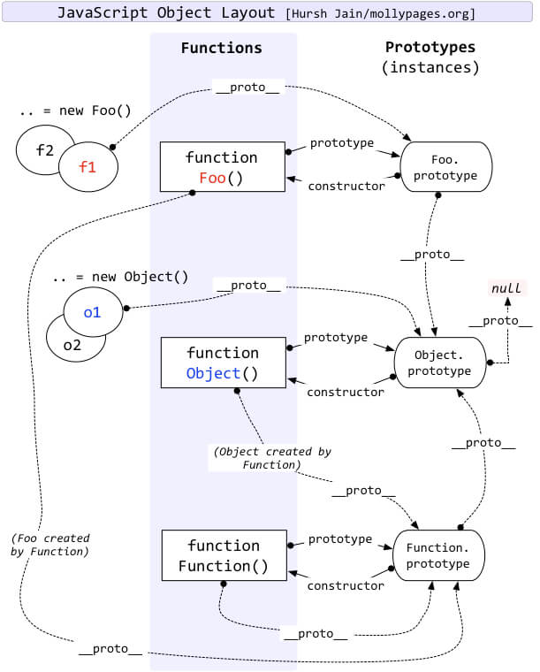

# JS

## 数据类型

Undefined Null Boolean Number String Symbol BigInt Object

Symbol 和 BigInt 新增于 ES6

- Symbol 代表创建后独一无二且不可变的数据类型，它主要是为了解决可能出现的全局变量冲突的问题
- BigInt 是一种数字类型的数据，它可以表示任意精度格式的整数，使用 BigInt 可以安全存储和操作大整数，即使这个数已经超出了 Number 能够表示的安全整数范围

数据类型分为原始数据类型和引用数据类型

- 栈：原始数据类型（Undefined Null Boolean Number String Symbol BigInt）
- 堆：引用数据类型（Object（对象、数据、函数））

两种类型的区别在于**存储位置**的不同

- 原始数据类型直接存储在栈（stack）中的简单数据段，占据空间小、大小固定，属于被频繁使用数据，所以放入栈中存储
- 引用数据类型存储在堆（heap）中的对象，占据空间大、大小不固定。如果存储在栈中，将会影响程序运行的性能；引用数据类型在栈中存储了指针，该指针指向堆中该实体的起始地址。当解释器寻找引用值时，会首先检索其在栈中的地址，取得地址后从堆中获得实体。

堆和栈的概念存在于数据结构和操作系统内存中，在数据结构中

- 栈中数据的存取方式为先进后出
- 堆是一个有限队列，是按优先级来进行排序的，优先级可以按照大小来规定

在操作系统中，内存被分为栈区和堆区

- 栈区内存由编译器自动分配释放，存放函数的参数值，局部变量的值等。其操作方式类似于数据结构中的栈
- 堆区内存一般由开发者分配释放，若开发者不释放，程序结束时可能由垃圾回收机制回收

## 数据类型的检测方式

1. typeof

```
console.log(typeof 2);               // number
console.log(typeof true);            // boolean
console.log(typeof 'str');           // string
console.log(typeof []);              // object
console.log(typeof function(){});    // function
console.log(typeof {});              // object
console.log(typeof undefined);       // undefined
console.log(typeof null);            // object
console.log(typeof Symbol(1))          // symbol
console.log(typeof BigInt(1))          // bigint
```

其中数组、对象、null都会被判断为object，其他判断都正确。

2. instanceof

`instanceof` 可以正确判断对象的类型，**其内部运行机制是判断在其原型链中能否找到该类型的原型**。

```
console.log(2 instanceof Number);                    // false
console.log(true instanceof Boolean);                // false 
console.log('str' instanceof String);                // false 

console.log([] instanceof Array);                    // true
console.log(function(){} instanceof Function);       // true
console.log({} instanceof Object);                   // true
```

可以看到，`instanceof` 只能正确判断引用数据类型，而不能判断基本数据类型。`instanceof` 运算符可以用来测试一个对象在其原型链中是否存在一个构造函数的 `prototype` 属性。

3. constructor

```
console.log((2).constructor === Number); // true
console.log((true).constructor === Boolean); // true
console.log(('str').constructor === String); // true
console.log(([]).constructor === Array); // true
console.log((function() {}).constructor === Function); // true
console.log(({}).constructor === Object); // true
```

`constructor` 有两个作用，一是判断数据的类型，二是对象实例通过 `constructor` 对象访问它的构造函数。需要注意，如果创建一个对象来改变它的原型，`constructor` 就不能用来判断数据类型了：

```
function Fn(){};

Fn.prototype = new Array();

var f = new Fn();

console.log(f.constructor === Fn);    // false
console.log(f.constructor === Array); // true
```

4. Object.prototype.toString.call()

`Object.prototype.toString.call()` 使用 Object 对象的原型方法 toString 来判断数据类型：

```
var a = Object.prototype.toString;
 
console.log(a.call(2));
console.log(a.call(true));
console.log(a.call('str'));
console.log(a.call([]));
console.log(a.call(function(){}));
console.log(a.call({}));
console.log(a.call(undefined));
console.log(a.call(null));
```

同样是检测对象obj调用toString方法，obj.toString()的结果和Object.prototype.toString.call(obj)的结果不一样，这是为什么？

这是因为toString是Object的原型方法，而Array、function等类型作为Object的实例，都重写了toString方法。不同的对象类型调用toString方法时，根据原型链的知识，调用的是对应的重写之后的toString方法（function类型返回内容为函数体的字符串，Array类型返回元素组成的字符串…），而不会去调用Object上原型toString方法（返回对象的具体类型），所以采用obj.toString()不能得到其对象类型，只能将obj转换为字符串类型；因此，在想要得到对象的具体类型时，应该调用Object原型上的toString方法。

## 数组的判断方法

1. 通过Object.prototype.toString.call()做判断

```
Object.prototype.toString.call(obj).slice(8,-1) === 'Array';
```

2. 通过原型链做判断

```
obj.__proto__ === Array.prototype;
```

3. 通过 ES6 的 Array.isArray 做判断

```
Array.isArray(obj)
```

4. 通过 instanceof 做判断

```
obj instanceof Array
```

5. 通过 Array.prototype.isPrototypeOf

```
Array.prototype.isPrototypeOf(obj)
```

## null 与 undefined 区别

首先 Undefined 和 Null 都是基本数据类型，这两个基本数据类型分别都只有一个值，就是 undefined 和 null。

undefined 代表的含义是未定义，null 代表的含义是空对象。一般变量声明了但还没有定义的时候会返回 undefined，null主要用于赋值给一些可能会返回对象的变量，作为初始化。

undefined 在 JavaScript 中不是一个保留字，这意味着可以使用 undefined 来作为一个变量名，但是这样的做法是非常危险的，它会影响对 undefined 值的判断。我们可以通过一些方法获得安全的 undefined 值，比如说 void 0。

当对这两种类型使用 typeof 进行判断时，Null 类型化会返回 “object”，这是一个历史遗留的问题。当使用双等号对两种类型的值进行比较时会返回 true，使用三个等号时会返回 false。

## typeof null 的结果

typeof null 的结果是Object。

在 JavaScript 第一个版本中，所有值都存储在 32 位的单元中，每个单元包含一个小的 类型标签(1-3 bits) 以及当前要存储值的真实数据。类型标签存储在每个单元的低位中，共有五种数据类型：

```
000: object   - 当前存储的数据指向一个对象。
  1: int      - 当前存储的数据是一个 31 位的有符号整数。
010: double   - 当前存储的数据指向一个双精度的浮点数。
100: string   - 当前存储的数据指向一个字符串。
110: boolean  - 当前存储的数据是布尔值。
```

如果最低位是 1，则类型标签标志位的长度只有一位；如果最低位是 0，则类型标签标志位的长度占三位，为存储其他四种数据类型提供了额外两个 bit 的长度。

有两种特殊数据类型：

- undefined 的值是 (-2)30(一个超出整数范围的数字)；
- null 的值是机器码 NULL 指针(null 指针的值全是 0)

那也就是说null的类型标签也是000，和Object的类型标签一样，所以会被判定为Object。

## instanceof 操作符的实现

[https://github.com/nmsn/demo/blob/master/instanceof%E5%AE%9E%E7%8E%B0.js](https://github.com/nmsn/demo/blob/master/instanceof%E5%AE%9E%E7%8E%B0.js)

## 0.1 + 0.2 !== 0.3

计算机是通过二进制的方式存储数据的，所以计算机计算0.1+0.2的时候，实际上是计算的两个数的二进制的和。0.1的二进制是0.0001100110011001100...（1100循环），0.2的二进制是：0.00110011001100...（1100循环），这两个数的二进制都是无限循环的数。那JavaScript是如何处理无限循环的二进制小数呢？

一般我们认为数字包括整数和小数，但是在 JavaScript 中只有一种数字类型：Number，它的实现遵循IEEE 754标准，使用64位固定长度来表示，也就是标准的double双精度浮点数。在二进制科学表示法中，双精度浮点数的小数部分最多只能保留52位，再加上前面的1，其实就是保留53位有效数字，剩余的需要舍去，遵从“0舍1入”的原则。

根据这个原则，0.1和0.2的二进制数相加，再转化为十进制数就是：0.30000000000000004。

对于0.1，它的二进制为：

0.00011001100110011001100110011001100110011001100110011001 10011...
转为科学计数法（科学计数法的结果就是浮点数）：

1.1001100110011001100110011001100110011001100110011001*2^-4
可以看出0.1的符号位为0，指数位为-4，小数位为：

1001100110011001100110011001100110011001100110011001
那么问题又来了，指数位是负数，该如何保存呢？

IEEE标准规定了一个偏移量，对于指数部分，每次都加这个偏移量进行保存，这样即使指数是负数，那么加上这个偏移量也就是正数了。由于JavaScript的数字是双精度数，这里就以双精度数为例，它的指数部分为11位，能表示的范围就是0~2047，IEEE固定双精度数的偏移量为1023。

- 当指数位不全是0也不全是1时(规格化的数值)，IEEE规定，阶码计算公式为 e-Bias。 此时e最小值是1，则1-1023= -1022，e最大值是2046，则2046-1023=1023，可以看到，这种情况下取值范围是-1022~1013。
- 当指数位全部是0的时候(非规格化的数值)，IEEE规定，阶码的计算公式为1-Bias，即1-1023= -1022。
- 当指数位全部是1的时候(特殊值)，IEEE规定这个浮点数可用来表示3个特殊值，分别是正无穷，负无穷，NaN。 具体的，小数位不为0的时候表示NaN；小数位为0时，当符号位s=0时表示正无穷，s=1时候表示负无穷。

对于上面的0.1的指数位为-4，-4+1023 = 1019 转化为二进制就是：1111111011.

所以，0.1表示为：

0 1111111011 1001100110011001100110011001100110011001100110011001

说了这么多，是时候该最开始的问题了，如何实现0.1+0.2=0.3呢？

对于这个问题，一个直接的解决方法就是设置一个误差范围，通常称为“机器精度”。对JavaScript来说，这个值通常为2-52，在ES6中，提供了Number.EPSILON属性，而它的值就是2-52，只要判断0.1+0.2-0.3是否小于Number.EPSILON，如果小于，就可以判断为0.1+0.2 ===0.3

```
function numberepsilon(arg1,arg2){
  return Math.abs(arg1 - arg2) < Number.EPSILON;
}

console.log(numberepsilon(0.1 + 0.2, 0.3)); // true
```

## typeof NaN 的结果是什么

NaN 指“不是一个数字”（not a number），NaN 是一个“警戒值”（sentinel value，有特殊用途的常规值），用于指出数字类型中的错误情况，即“执行数学运算没有成功，这是失败后返回的结果”。

```
typeof NaN; // "number"
```

NaN 是一个特殊值，它和自身不相等，是唯一一个非自反（自反，reflexive，即 x === x 不成立）的值。而 NaN !== NaN 为 true。

## isNaN 和 Number.isNaN 函数的区别

函数 isNaN 接收参数后，会尝试将这个参数转换为数值，任何不能被转换为数值的的值都会返回 true，因此非数字值传入也会返回 true ，会影响 NaN 的判断。
函数 Number.isNaN 会首先判断传入参数是否为数字，如果是数字再继续判断是否为 NaN ，不会进行数据类型的转换，这种方法对于 NaN 的判断更为准确。

```
isNaN(undefined) // true
Number.isNaN(undefined) // false
```

## == 操作符的强制类型转换

对于 `==` `来说，如果对比双方的类型不一样，就会进行类型转换。假如对比 x 和 y 是否相同，就会进行如下判断流程

1. 首先会判断两者类型是否相同，相同的话就比较两者的大小
2. 类型不同的话，就会进行类型转换
3. 会先判断是否在对比 null 和 undefined，是的话就会返回 true
4. 判断两者类型是否为 string 和 number，是的话就会将字符串转换为 number
   ```
    1 == '1'
    转换为
    1 == 1
   ```
5. 判断其中一方是否为 boolean，是的话就会把 boolean 转为 number 再进行判断

  ```
  '1' == true
  转换为
  '1' == 1
  转换为
  1 == 1
  ```
6. 判断其中一方是否为 object 且另一方为 string、number、symbol，是的话会把 object 转为原始类型再进行判断

  ```
  '1' == { name: 'a' }
  转换为
  '1' == '[object Object]'
  ```
  
  其流程图如下
  
  
  
## 字符串转换规则

- null 和 undefined 转换为 'null' 和 'undefined'
- boolean: true 转为 'true',false 转换为 'false'
- number: 直接转换，极小和极大的数字会使用指数形式
- symbol: 直接转换，但是只允许显式强制类型转换，使用隐式类型强制转换会产生错误
- 对普通对象来说，除非自行定义 toString() 方法，否则会调用 toString()（Object.prototype.toString()）来返回内部属性 [[Class]] 的值，如"[object Object]"。如果对象有自己的 toString() 方法，字符串化时就会调用该方法并使用其返回值

## 数值转换规则

- undefined 类型的值转换为 NaN
- null 类型的值转换为 0
- boolean 类型的值，true 转换为 1，false 转换为 0
- string 类型的值转换如同使用 Number() 函数进行转换，如果包含非数字值则转换为 NaN，空字符串为 0
- symbol 类型的值不能转换为数字，会报错
- 对象（包含数组）会首先被转换为相应的基本类型值，如果返回的是非数字的基本类型值，则再遵循以上规则将其强制转换为数字

为了将值转换为相应的基本类型值，抽象操作 ToPrimitive 会首先（通过内部操作 DefaultValue）检查该值是否有valueOf()方法。如果有并且返回基本类型值，就使用该值进行强制类型转换。如果没有就使用 toString() 的返回值（如果存在）来进行强制类型转换

如果 valueOf() 和 toString() 均不返回基本类型值，会产生 TypeError 错误

## 布尔值转换规则

以下都是假值:

- undefined
- null
- false
- +0 -0 NaN
- ''

假值的布尔强制类型转换结果为 false。从逻辑上说，假值列表以外的都应该是真值

## ==、=== 和 Object.is

- 使用双等号（==）进行相等判断时，如果两边的类型不一致，则会进行强制类型转化后再进行比较
- 使用三等号（===）进行相等判断时，如果两边的类型不一致时，不会做强制类型准换，直接返回 false
- Object.is 与 === 行为基本一致，不同点在于
  - +0 不等于 -0
  - NaN 等于自身

## js 包装类型

在 JavaScript 中，基本类型是没有属性和方法的，但是为了便于操作基本类型的值，在调用基本类型的属性或方法时 JavaScript 会在后台隐式地将基本类型的值转换为对象，如：

```js
const a = "abc";
a.length; // 3
a.toUpperCase(); // "ABC"
```

在访问 'abc'.length 时，JavaScript 将 'abc' 在后台转换成 String('abc')，然后再访问其length属性

JavaScript也可以使用Object函数显式地将基本类型转换为包装类型：

```js
var a = 'abc'
Object(a) // String {"abc"}
```

也可以使用 valueOf 方法将包装类型倒转成基本类型：

```js
var a = 'abc'
var b = Object(a)
var c = b.valueOf() // 'abc'
```

看看如下代码会打印出什么：

```js
var a = new Boolean( false );
if (!a) {
    console.log( "Oops" ); // never runs
}
```

答案是什么都不会打印，因为虽然包裹的基本类型是false，但是false被包裹成包装类型后就成了对象，所以其非值为false，所以循环体中的内容不会运行

## 原型与原型链

> JavaScript 常被描述为一种基于原型的语言 (prototype-based language)——每个对象拥有一个原型对象，对象以其原型为模板、从原型继承方法和属性。原型对象也可能拥有原型，并从中继承方法和属性，一层一层、以此类推。这种关系常被称为原型链 (prototype chain)，它解释了为何一个对象会拥有定义在其他对象中的属性和方法。

### 原型对象

绝大部分的函数(少数内建函数除外)都有一个prototype属性,这个属性是原型对象用来创建新对象实例,而所有被创建的对象都会共享原型对象,因此这些对象便可以访问原型对象的属性。

### 原型链

原因是每个对象都有`__proto__`属性，此属性指向该对象的构造函数的原型。

对象可以通过`__proto__`与上游的构造函数的原型对象连接起来，而上游的原型对象也有一个`__proto__`，这样就形成了原型链。



## this绑定的4种形式

> 优先级： new > 显式 > 隐式 > 默认

### 1. 默认绑定

- 独立函数调用，可以把默认绑定看作是无法应用其他规则时的默认规则，this指向全局对象
- 严格模式下，不能将全局对象用于默认绑定，this会绑定到undefined，只有函数运行在非严格模式下，默认绑定才能绑定到全局对象。
在严格模式下调用函数则不影响默认绑定。

```js
function foo() {
  // 运行在严格模式下，this会绑定到undefined
  "use strict";

  console.log(this.a);
}

var a = 2;

// 调用
foo(); // TypeError: Cannot read property 'a' of undefined

// --------------------------------------

function foo() {
  // 运行
  console.log(this.a);
}

var a = 2;

(function() {
  // 严格模式下调用函数则不影响默认绑定
  "use strict";

  foo(); // 2
})();
```

### 2. 隐式绑定

- 当函数引用有上下文对象时，隐式绑定规则会把函数种的this绑定到这个上下文对象。
对象属性引用链中只有上一层或者说最后一层在调用中起作用。
- 被隐式绑定的函数特定情况下会丢失绑定对象，应用默认绑定，把this绑定到全局对象或者undefined上。

```js
function foo() {
  console.log(this.a);
}

var obj = {
  a: 2,
  foo: foo,
};

obj.foo(); // 2

// 虽然bar是obj.foo的一个引用，但是实际上，它引用的是foo函数本身。
// bar()是一个不带任何修饰的函数调用，应用默认绑定。
function foo() {
  console.log(this.a);
}

var obj = {
  a: 2,
  foo: foo,
};

var bar = obj.foo; // 函数别名

var a = "oops, global"; // a是全局对象的属性

bar(); // "oops, global"
```

### 3. 显式绑定

- 通过call或者apply方法。第一个参数是一个对象，在底用函数时将这个对象绑定到this。因为直接指定this的绑定对象，称之为显式绑定。

```js
function foo() {
  console.log(this.a);
}

var obj = {
  a: 2,
};

foo.call(obj); // 2  调用foo时强制把foo的this绑定到obj上


// 显式绑定无法解决丢失绑定的问题
// 解决办法1.硬绑定

function foo() {
  console.log( this.a );
}

var obj = {
  a: 2
};

var bar = function() {
  foo.call( obj );
};

bar(); // 2
setTimeout( bar, 100 ); // 2

// 硬绑定的bar不可能再修改它的this
bar.call( window ); // 2

// 解决办法2.API调用的“上下文”

function foo(el) {
  console.log( el, this.id );
}

var obj = {
    id: "awesome"
}

var myArray = [1, 2, 3]
// 调用foo(..)时把this绑定到obj
myArray.forEach( foo, obj );
// 1 awesome 2 awesome 3 awesome
```

### 4. new绑定

- 在js中，构造函数只是使用new操作符时被调用的普通函数，他们不属于某个类，也不会实例化一个类。
- 包括内置对象函数（比如Number）在内的所有函数都可以用new来调用，这种函数调用被称为构造函数调用。
- 实际上并不存在所谓的“构造函数”,只是对于函数的“构造调用”。

#### new实现

使用new来调用函数，或者说发生构造函数调用时，会自动执行下面的操作。

1. 创建（或者说构造）一个新对象。
2. 这个新对象会被执行[[Prototype]]连接。
3. 这个新对象会绑定到函数调用的this。
4. 如果函数没有返回其他对象，那么new表达式中的函数调用会自动返回这个新对象。

```js
function create() {
  // 创建一个空的对象
  var obj = new Object(),
    // 获得构造函数，arguments中去除第一个参数，即构造函数
    Constructor = [].shift.call(arguments);
  // 链接到原型，obj 可以访问到构造函数原型中的属性
  obj.__proto__ = Constructor.prototype;
  // 绑定 this 实现继承，obj 可以访问到构造函数中的属性
  var ret = Constructor.apply(obj, arguments);
  // 优先返回构造函数返回的对象
  return ret instanceof Object ? ret : obj;
}

function Person (name, age) {
    this.name = name;
    this.age = age;

    // 如果构造函数有返回值且为对象，则返回该对象 ret
    // return {
    //     name: name,
    //     age: '25'
    // }

    // 如果构造函数有返回值不是对象，则返回 obj
    // return 'Tom is a 18 boy';
}

// 用来替代 new Person('Tom', '18')
var person = create(Person, 'Tom', '18');
```

## 执行上线文和作用域链

JavaScript代码的整个执行过程，分为两个阶段，代码编译阶段与代码执行阶段。编译阶段由编译器完成，将代码翻译成可执行代码，这个阶段**作用域**规则会确定。执行阶段由引擎完成，主要任务是执行可执行代码，**执行上下文**在这个阶段创建。

### 执行上下文

函数每调用一次，都会产生一个新的执行上下文环境。因为不同的调用可能就有不同的参数。

#### 执行上下文栈

执行全局代码时，会产生一个执行上下文环境，每次调用函数都又会执行上下文环境。当函数调用完成时，这个上下文环境以及其中的数据都会被消除（当然了闭包并不会乖乖就范），处于活动状态的执行上下文环境只有一个。

既然调用一个函数时一个新的执行上下文会被创建。那执行上下文的生命周期同样可以分为两个阶段。

- 创建阶段

  在这个阶段中，执行上下文会分别创建
  - 变量对象(Variable object，VO)
  - 建立作用域链(Scope chain)
  - 确定this的指向

- 代码执行阶段

  在此阶段，js引擎会重扫一遍函数，用具体的变量的值来更新可变对象，并执行代码内容。

#### 变量对象

在函数上下文中，我们用活动对象(Activation object, AO)来表示变量对象(Variable object，VO)。

活动对象其实就是被激活的变量对象，只是变量对象是规范上的或者说是引擎实现上的，不可在 JavaScript 环境中访问，只有到当进入一个执行上下文中，这个执行上下文的变量对象才会被激活，所以才叫 activation object，而只有活动对象上的各种属性才能被访问。

变量对象会包括：

1. 语言内置
    - this
    - arguments

2. 函数的所有形参 (如果是函数上下文)
     - 由名称和对应值组成的一个变量对象的属性被创建
     - 没有实参，属性值设为 undefined

3. 函数声明
     - 由名称和对应值（函数对象(function-object)）组成一个变量对象的属性被创建
     - 如果变量对象已经存在相同名称的属性，则完全替换这个属性

4. 变量声明
     - 由名称和对应值（undefined）组成一个变量对象的属性被创建；
     - 如果变量名称跟已经声明的形式参数或函数相同，则变量声明不会干扰已经存在的这类属性

### 作用域

作用域(scope chain)是每一个执行上下文自身持有的活动对象的集合，如在本执行上下文中声明的变量和函数以及方法参数传入的对象。

每一个执行上下文可以访问的对象包括自身的作用域和父执行上下文的作用域和父父执行上下文作用域直到全局作用域，这就产生了作用域链。作用域链的用途是保证对执行环境有权访问的所有变量和函数的有序访问。

作用域规定了如何查找变量，也就是确定当前执行代码对变量的访问权限。
JavaScript 采用词法作用域(lexical scoping)，也就是静态作用域。

作用域只是一个“地盘”，其中没有变量。变量是通过作用域对应的执行上下文环境中的变量对象来实现的。所以作用域是静态观念的，而执行上下文环境是动态上的，两者并不一样。有闭包存在时，一个作用域存在两个上下文环境也是有的。也就是说，作用域只是用于划分你在这个作用域里面定义的变量的有效范围，出了这个作用域就无效。

同一个作用域下，对同一个函数的不同的调用会产生不同的执行上下文环境，继而产生不同的变量的值，所以，作用域中变量的值是在执行过程中确定的，而作用域是在函数创建时就确定的。

如果要查找一个作用域下某个变量的值，就需要找到这个作用域对应的执行上下文环境，再在其中找到变量的值。

```js
var a = 1
function out(){
    var a = 2
    inner()
}
function inner(){
    console.log(a)
}
out()  //====>  1
```

#### 自由变量

函数在定义的时候（不是调用的时候）就已经确定了函数体内部自由变量的作用域。

```js
let a = 100
function fn() {
  let b = 20
  function bar() {
    console.log(a + b) // a是在fn作用域使用，但是并没有在fn作用域定义，这就是自由变量。
  }
  return bar
}

let x = fn(), b = 200
x()
```

bar要取得a的值，就要到创建bar这个函数的作用域中取值（这里是fn作用域），fn作用域也没有a，就到创建fn这个函数的作用域中取值（这里是全局作用域），找到了就结束了。这就是作用域链。

#### 作用域链

当查找变量的时候，会先从当前上下文的变量对象中查找，如果没有找到，就会从父级(词法层面上的父级)执行上下文的变量对象中查找，一直找到全局上下文的变量对象，也就是全局对象。这样由多个执行上下文的变量对象构成的链表就叫做作用域链。

其本质是JavaScript在执行过程中会创造可执行上下文，可执行上下文中的词法环境中含有外部词法环境的引用，我们可以通过这个引用获取外部词法环境的变量、声明等，这些引用串联起来一直指向全局的词法环境，因此形成了作用域链。

## 防抖与节流

### 防抖（debounce）

```js
// 防抖函数
const debounce = (fn, delay) => {
  let timer = null;
  return function(...args) => {
    clearTimeout(timer);
    timer = setTimeout(() => {
      fn.apply(this, args);
    }, delay);
  };
};
```

使用场景

- 按钮提交场景：防止多次提交按钮，只执行最后提交的一次
- 服务端验证场景：表单验证需要服务端配合，只执行一段连续的输入事件的最后一次，还有搜索联想词功能类似

### 节流（throttle）

```js
const throttle = (func, delay) => {
    let prev = Date.now();
    return function(...args) {
        const context = this;
        const now = Date.now();
        if (now - prev >= delay) {
            func.apply(context, args);
            prev = Date.now();
        }
    }
}
```

使用场景

- 拖拽场景：固定时间内只执行一次，防止超高频次触发位置变动
- 缩放场景：监控浏览器resize
- 动画场景：避免短时间内多次触发动画引起性能问题

## 深克隆

```js
/**
 * deep clone
 * @param  {[type]} parent object 需要进行克隆的对象
 * @return {[type]}        深克隆后的对象
 */
const clone = parent => {
  // 判断类型
  const isType = (obj, type) => {
    if (typeof obj !== "object") return false;
    const typeString = Object.prototype.toString.call(obj);
    let flag;
    switch (type) {
      case "Array":
        flag = typeString === "[object Array]";
        break;
      case "Date":
        flag = typeString === "[object Date]";
        break;
      case "RegExp":
        flag = typeString === "[object RegExp]";
        break;
      default:
        flag = false;
    }
    return flag;
  };

  // 处理正则
  const getRegExp = re => {
    var flags = "";
    if (re.global) flags += "g";
    if (re.ignoreCase) flags += "i";
    if (re.multiline) flags += "m";
    return flags;
  };
  // 维护两个储存循环引用的数组
  const parents = [];
  const children = [];

  const _clone = parent => {
    if (parent === null) return null;
    if (typeof parent !== "object") return parent;

    let child, proto;

    if (isType(parent, "Array")) {
      // 对数组做特殊处理
      child = [];
    } else if (isType(parent, "RegExp")) {
      // 对正则对象做特殊处理
      child = new RegExp(parent.source, getRegExp(parent));
      if (parent.lastIndex) child.lastIndex = parent.lastIndex;
    } else if (isType(parent, "Date")) {
      // 对Date对象做特殊处理
      child = new Date(parent.getTime());
    } else {
      // 处理对象原型
      proto = Object.getPrototypeOf(parent);
      // 利用Object.create切断原型链
      child = Object.create(proto);
    }

    // 处理循环引用
    const index = parents.indexOf(parent);

    if (index != -1) {
      // 如果父数组存在本对象,说明之前已经被引用过,直接返回此对象
      return children[index];
    }
    parents.push(parent);
    children.push(child);

    for (let i in parent) {
      // 递归
      child[i] = _clone(parent[i]);
    }

    return child;
  };
  return _clone(parent);
};

```

局限性:

1. 一些特殊情况没有处理: 例如Buffer对象、Promise、Set、Map
2. 另外对于确保没有循环引用的对象，我们可以省去对循环引用的特殊处理，因为这很消耗时间

## 实现订阅发布模式

```js
class EventEmitter {
  constructor() {
    this._events = this._events || new Map(); // 储存事件/回调键值对
    this._maxListeners = this._maxListeners || 10; // 设立监听上限
  }
}

// 触发名为type的事件
EventEmitter.prototype.emit = function(type, ...args) {
  let handler;
  handler = this._events.get(type);
  if (Array.isArray(handler)) {
    // 如果是一个数组说明有多个监听者,需要依次此触发里面的函数
    for (let i = 0; i < handler.length; i++) {
      if (args.length > 0) {
        handler[i].apply(this, args);
      } else {
        handler[i].call(this);
      }
    }
  } else {
    // 单个函数的情况我们直接触发即可
    if (args.length > 0) {
      handler.apply(this, args);
    } else {
      handler.call(this);
    }
  }

  return true;
};

// 监听名为type的事件
EventEmitter.prototype.addListener = function(type, fn) {
  const handler = this._events.get(type); // 获取对应事件名称的函数清单
  if (!handler) {
    this._events.set(type, fn);
  } else if (handler && typeof handler === "function") {
    // 如果handler是函数说明只有一个监听者
    this._events.set(type, [handler, fn]); // 多个监听者我们需要用数组储存
  } else {
    handler.push(fn); // 已经有多个监听者,那么直接往数组里push函数即可
  }
};

EventEmitter.prototype.removeListener = function(type, fn) {
  const handler = this._events.get(type); // 获取对应事件名称的函数清单

  // 如果是函数,说明只被监听了一次
  if (handler && typeof handler === "function") {
    this._events.delete(type, fn);
  } else {
    let position;
    // 如果handler是数组,说明被监听多次要找到对应的函数
    for (let i = 0; i < handler.length; i++) {
      if (handler[i] === fn) {
        position = i;
      } else {
        position = -1;
      }
    }
    // 如果找到匹配的函数,从数组中清除
    if (position !== -1) {
      // 找到数组对应的位置,直接清除此回调
      handler.splice(position, 1);
      // 如果清除后只有一个函数,那么取消数组,以函数形式保存
      if (handler.length === 1) {
        this._events.set(type, handler[0]);
      }
    } else {
      return this;
    }
  }
};
```

## 实现Promise

[手动实现 Promise 代码](https://github.com/nmsn/demo/blob/master/Promise.js)

## 内存管理

### 内存回收

V8的垃圾回收策略基于分代回收机制，该机制又基于世代假说,该假说有两个特点:

- 大部分新生对象倾向于早死
- 不死的对象，会活得更久

基于这个理论，现代垃圾回收算法根据对象的存活时间将内存进行了分代，并对不同分代的内存采用不同的高效算法进行垃圾回收

### V8的内存分代

在V8中，将内存分为了新生代（new space）和老生代（old space）。它们特点如下：

- 新生代：对象的存活时间较短。新生对象或只经过一次垃圾回收的对象。
- 老生代：对象存活时间较长。经历过一次或多次垃圾回收的对象。

### Scavenge 算法

Scavenge 算法的缺点是，它的算法机制决定了只能利用一半的内存空间。但是新生代中的对象生存周期短、存活对象少，进行对象复制的成本不是很高，因而非常适合这种场景。

新生代中的对象主要通过 Scavenge 算法进行垃圾回收。Scavenge 的具体实现，主要采用了Cheney算法。


Cheney算法采用复制的方式进行垃圾回收。它将堆内存一分为二，每一部分空间称为 semispace。这两个空间，只有一个空间处于使用中，另一个则处于闲置。使用中的 semispace 称为 「From 空间」，闲置的 semispace 称为 「To 空间」。

过程如下：

- 从 From 空间分配对象，若 semispace 被分配满，则执行 Scavenge 算法进行垃圾回收。
- 检查 From 空间的存活对象，若对象存活，则检查对象是否符合晋升条件，若符合条件则晋升到老生代，否则将对象从 From 空间复制到 To 空间。
- 若对象不存活，则释放不存活对象的空间。
- 完成复制后，将 From 空间与 To 空间进行角色翻转（flip）。

### 对象晋升

- 对象是否经历过Scavenge回收。对象从 From 空间复制 To 空间时，会检查对象的内存地址来判断对象是否已经经过一次Scavenge回收。若经历过，则将对象从 From 空间复制到老生代中；若没有经历，则复制到 To 空间。
- To 空间的内存使用占比是否超过限制。当对象从From 空间复制到 To 空间时，若 To 空间使用超过 25%，则对象直接晋升到老生代中。设置为25%的比例的原因是，当完成 Scavenge 回收后，To 空间将翻转成From 空间，继续进行对象内存的分配。若占比过大，将影响后续内存分配。

对象晋升到老生代后，将接受新的垃圾回收算法处理。下图为Scavenge算法中，对象晋升流程图。


### Mark-Sweep & Mark-Compact

老生代中的对象有两个特点，第一是存活对象多，第二个存活时间长。若在老生代中使用 Scavenge 算法进行垃圾回收，将会导致复制存活对象的效率不高，且还会浪费一半的空间。因而，V8在老生代采用Mark-Sweep 和 Mark-Compact 算法进行垃圾回收。

Mark-Sweep，是标记清除的意思。它主要分为标记和清除两个阶段。

- 标记阶段，它将遍历堆中所有对象，并对存活的对象进行标记；
清除阶段，对未标记对象的空间进行回收。
- 与 Scavenge 算法不同，Mark-Sweep 不会对内存一分为二，因此不会浪费空间。但是，经历过一次 Mark-Sweep 之后，内存的空间将会变得不连续，这样会对后续内存分配造成问题。比如，当需要分配一个比较大的对象时，没有任何一个碎片内支持分配，这将提前触发一次垃圾回收，尽管这次垃圾回收是没有必要的。

为了解决内存碎片的问题，提高对内存的利用，引入了 Mark-Compact （标记整理）算法。Mark-Compact 是在 Mark-Sweep 算法上进行了改进，标记阶段与Mark-Sweep相同，但是对未标记的对象处理方式不同。与Mark-Sweep是对未标记的对象立即进行回收，Mark-Compact则是将存活的对象移动到一边，然后再清理端边界外的内存。

由于Mark-Compact需要移动对象，所以执行速度上，比Mark-Sweep要慢。所以，V8主要使用Mark-Sweep算法，然后在当空间内存分配不足时，采用Mark-Compact算法。

### Incremental Marking（增量标记）

在新生代中，由于存活对象少，垃圾回收效率高，全停顿时间短，造成的影响小。但是老生代中，存活对象多，垃圾回收时间长，全停顿造成的影响大。为了减少全停顿的时间，V8对标记进行了优化，将一次停顿进行的标记过程，分成了很多小步。每执行完一小步就让应用逻辑执行一会儿，这样交替多次后完成标记。如下图所示：


长时间的GC，会导致应用暂停和无响应，将会导致糟糕的用户体验。从2011年起，v8就将「全暂停」标记换成了增量标记。改进后的标记方式，最大停顿时间减少到原来的1/6。

### 弱引用

前面说过，及时清除引用非常重要。但是，你不可能记得那么多，有时候一疏忽就忘了，所以才有那么多内存泄漏。

最好能有一种方法，在新建引用的时候就声明，哪些引用必须手动清除，哪些引用可以忽略不计，当其他引用消失以后，垃圾回收机制就可以释放内存。这样就能大大减轻程序员的负担，你只要清除主要引用就可以了。

ES6 考虑到了这一点，推出了两种新的数据结构：WeakSet 和 WeakMap。它们对于值的引用都是不计入垃圾回收机制的，所以名字里面才会有一个"Weak"，表示这是弱引用。

### WeakMap 和 WeakSet

#### WeakMap

WeakMap 和 Map 的第一个不同点就是，WeakMap 的键必须是对象，不能是原始值：

```js
let weakMap = new WeakMap();

let obj = {};

weakMap.set(obj, "ok"); // 正常工作（以对象作为键）

// 不能使用字符串作为键
weakMap.set("test", "Whoops"); // Error，因为 "test" 不是一个对象
```

现在，如果我们在 weakMap 中使用一个对象作为键，并且没有其他对这个对象的引用 —— 该对象将会被从内存（和map）中自动清除。

```js
let john = { name: "John" };

let weakMap = new WeakMap();
weakMap.set(john, "...");

john = null; // 覆盖引用

// john 被从内存中删除了！
```

与上面常规的 Map 的例子相比，现在如果 john 仅仅是作为 WeakMap 的键而存在 —— 它将会被从 map（和内存）中自动删除。

WeakMap 不支持迭代以及 keys()，values() 和 entries() 方法。所以没有办法获取 WeakMap 的所有键或值。

WeakMap 只有以下的方法：

- weakMap.get(key)
- weakMap.set(key, value)
- weakMap.delete(key)
- weakMap.has(key)

为什么会有这种限制呢？这是技术的原因。如果一个对象丢失了其它所有引用（就像上面示例中的 john），那么它就会被垃圾回收机制自动回收。但是在从技术的角度并不能准确知道 何时会被回收。

这些都是由 JavaScript 引擎决定的。JavaScript 引擎可能会选择立即执行内存清理，如果现在正在发生很多删除操作，那么 JavaScript 引擎可能就会选择等一等，稍后再进行内存清理。因此，从技术上讲，WeakMap 的当前元素的数量是未知的。JavaScript 引擎可能清理了其中的垃圾，可能没清理，也可能清理了一部分。因此，暂不支持访问 WeakMap 的所有键/值的方法。

#### WeakSet

WeakSet 的表现类似：

- 与 Set 类似，但是我们只能向 WeakSet 添加对象（而不能是原始值）。
- 对象只有在其它某个（些）地方能被访问的时候，才能留在 set 中。
- 跟 Set 一样，WeakSet 支持 add，has 和 delete 方法，但不支持 size 和 keys()，并且不可迭代。

变“弱（weak）”的同时，它也可以作为额外的存储空间。但并非针对任意数据，而是针对“是/否”的事实。WeakSet 的元素可能代表着有关该对象的某些信息。

例如，我们可以将用户添加到 WeakSet 中，以追踪访问过我们网站的用户：

```js
let visitedSet = new WeakSet();

let john = { name: "John" };
let pete = { name: "Pete" };
let mary = { name: "Mary" };

visitedSet.add(john); // John 访问了我们
visitedSet.add(pete); // 然后是 Pete
visitedSet.add(john); // John 再次访问

// visitedSet 现在有两个用户了

// 检查 John 是否来访过？
alert(visitedSet.has(john)); // true

// 检查 Mary 是否来访过？
alert(visitedSet.has(mary)); // false

john = null;

// visitedSet 将被自动清理
```

WeakMap 和 WeakSet 最明显的局限性就是不能迭代，并且无法获取所有当前内容。那样可能会造成不便，但是并不会阻止 WeakMap/WeakSet 完成其主要工作 — 成为在其它地方管理/存储“额外”的对象数据。

#### 总结

WeakMap 是类似于 Map 的集合，它仅允许对象作为键，并且一旦通过其他方式无法访问它们，便会将它们与其关联值一同删除。

WeakSet 是类似于 Set 的集合，它仅存储对象，并且一旦通过其他方式无法访问它们，便会将其删除。

它们都不支持引用所有键或其计数的方法和属性。仅允许单个操作。

WeakMap 和 WeakSet 被用作“主要”对象存储之外的“辅助”数据结构。一旦将对象从主存储器中删除，如果该对象仅被用作 WeakMap 或 WeakSet 的键，那么它将被自动清除。

### 参考文献

- JavaScript内存管理：[https://www.cxymsg.com/guide/memory.html#%E5%86%85%E5%AD%98%E5%9B%9E%E6%94%B6](https://www.cxymsg.com/guide/memory.html#%E5%86%85%E5%AD%98%E5%9B%9E%E6%94%B6)
- JavaScript 内存泄漏教程：[http://www.ruanyifeng.com/blog/2017/04/memory-leak.html](http://www.ruanyifeng.com/blog/2017/04/memory-leak.html)
-WeakMap and WeakSet（弱映射和弱集合）: [https://zh.javascript.info/weakmap-weakset](https://zh.javascript.info/weakmap-weakset)

## 前端路由的实现

### H5 History API

```js
class Routers {
  constructor() {
    this.routes = {};
    // 在初始化时监听popstate事件
    this._bindPopState();
  }
  // 初始化路由
  init(path) {
    history.replaceState({path: path}, null, path);
    this.routes[path] && this.routes[path]();
  }
  // 将路径和对应回调函数加入hashMap储存
  route(path, callback) {
    this.routes[path] = callback || function() {};
  }

  // 触发路由对应回调
  go(path) {
    history.pushState({path: path}, null, path);
    this.routes[path] && this.routes[path]();
  }
  // 监听popstate事件
  _bindPopState() {
    window.addEventListener('popstate', e => {
      const path = e.state && e.state.path;
      this.routes[path] && this.routes[path]();
    });
  }
}
```

## offset/client/scroll


## 立即调用函数表达式（IIFE）/立即执行函数

### 标准形式的立即执行函数

```js
(function*(){})(3);
```

- JavaScript解析器必须能够轻易区分函数声明和函数表达式之间的区别。

  如果去掉包裹函数表达式的括号，把立即调用作为一个独立语句function() {}(3)，JavaScript开始解析时便会结束，因为这个独立语句以function开头，那么解析器就会认为它在处理一个函数声明。

  每个函数声明必须有一个名字(然而这里并没有指定名字)，所以程序执行到这里会报错。为了 避免错误，函数表达式要放在括号内，为JavaScript解析器指明它正在处理一个函数表达式而不是语句。

- 还有一种相对简单的替代方案(function(){}(3))也能达到相同目标(然而这种方案有些 奇怪，故不常使用)。把立即函数的定义和调用都放在括号内，同样可以为JavaScript 解析器指明它正在处理函数表达式。

### 特殊形式的立即执行函数

```js
+function(){}();
-function(){}();
!function(){}();
~function(){}();
```

- 不同于用加括号的方式区分函数表达式和函数声明，这里我们使用一元操作符+、-、!和~。这种做法也是用于向JavaScript引擎指明它处理的是表达式，而不是语句。从计算机的角度来讲，注意应用一元操作符得到的结果没有存储到任何地方并不重要，只有调用 IIFE 才重要。

### encodeURI 与 encodeURIComponent 的区别

- 相同点：都可以对url进行一个编码
- 区别：encodeURI()不会对本身属于URI的特殊字符进行编码，例如冒号、正斜杠、问号和井字号；而encodeURIComponent()则会对它发现的任何非标准字符进行编码

- encodeURI：适用于url跳转时
- encodeURIComponent：适用于url作为参数传递时
- 注意：当url作为参数传递时如果没有用encodeURIComponent进行编码，往往会造成传递时url中的特殊字符丢失

## 事件循环（Event Loop）

众所周知 JS 是门非阻塞单线程语言，因为在最初 JS 就是为了和浏览器交互而诞生的。如果 JS 是门多线程的语言话，我们在多个线程中处理 DOM 就可能会发生问题（一个线程中新加节点，另一个线程中删除节点），当然可以引入读写锁解决这个问题。

JS 在执行的过程中会产生执行环境，这些执行环境会被顺序的加入到执行栈中。如果遇到异步的代码，会被挂起并加入到 Task（有多种 task） 队列中。一旦执行栈为空，Event Loop 就会从 Task 队列中拿出需要执行的代码并放入执行栈中执行，所以本质上来说 JS 中的异步还是同步行为。

以上代码虽然 setTimeout 延时为 0，其实还是异步。这是因为 HTML5 标准规定这个函数第二个参数不得小于 4 毫秒，不足会自动增加。所以 setTimeout 还是会在 script end 之后打印。

不同的任务源会被分配到不同的 Task 队列中，任务源可以分为 微任务（microtask） 和 宏任务（macrotask）。在 ES6 规范中，microtask 称为 jobs，macrotask 称为 task。

宏任务包括

- script
- setTimeout
- setInterval
- setImmediate
- I/O
- UI rendering

微任务包括

- process.nextTick
- promise
- Object.observe
- MutationObserver

1. 执行同步代码，这属于宏任务
2. **执行栈为空，查询是否有微任务需要执行**
3. 执行所有微任务
4. 必要的话渲染 UI
5. 然后开始下一轮 Event loop，执行宏任务中的异步代码

node 环境下，process.nextTick 的优先级高于 Promise，也就是可以简单理解为，在宏任务结束后会先执行微任务队列中的 nextTickQueue 部分，然后才会执行微任务中的 Promise 部分。
setImmediate 则是规定：在下一次`Event loop`时触发（所以它是属于优先级较高的宏任务，排在 setTimeout 前面）

注：polyfill 中的 setTimeout 是 macrotask

补充：

除了宏任务、微任务队列外，还包含 requestAnimationFrame 所在的 animation 队列以及 requestIdleCallback 所在的 idle 队列。

requestAnimationFrame处于渲染阶段，不在微任务队列，也不在宏任务队列

执行顺序

- 同步代码
- 微任务队列会在 JS 运行栈为空的时候立即执行
- animation 队列会在页面渲染前执行
- 宏任务队列优先级低于微任务队列，一般也会比 animation 队列优先级低，但不是绝对
- idle 队列优先级最低，当浏览器有空闲时间的时候才会执行

队列特点

- 宏任务队列，每次只会执行队列内的一个任务。
- 微任务队列，每次会执行队列里的全部任务。假设微任务队列内有 100 个 Promise，它们会一次过全部执行完。这种情况下极有可能会导致页面卡顿。如果在微任务执行过程中继续往微任务队列中添加任务，新添加的任务也会在当前事件循环中执行，很容易造成死循环, 如：

  ```js
  function loop() {
    Promise.resolve().then(loop);
  }

  loop();
  ```

- animation 队列，跟微任务队列有点相似，每次会执行队列里的全部任务。但如果在执行过程中往队列中添加新的任务，新的任务不会在当前事件循环中执行，而是在下次事件循环中执行。
- idle 队列，每次只会执行一个任务。任务完成后会检查是否还有空闲时间，有的话会继续执行下一个任务，没有则等到下次有空闲时间再执行。需要注意的是此队列中的任务也有可能阻塞页面，当空闲时间用完后任务不会主动退出。如果任务占用时间较长，一般会将任务拆分成多个阶段，执行完一个阶段后检查还有没有空闲时间，有则继续，无则注册一个新的 idle 队列任务，然后退出当前任务。React Fiber 就是用这个机制。但最新版的 React Fiber 已经不用 rIC 了，因为调用的频率太低，改用 rAF 了

### 参考文献

- Event loop：[https://yuchengkai.cn/docs/frontend/browser.html#event-loop](https://yuchengkai.cn/docs/frontend/browser.html#event-loop)
