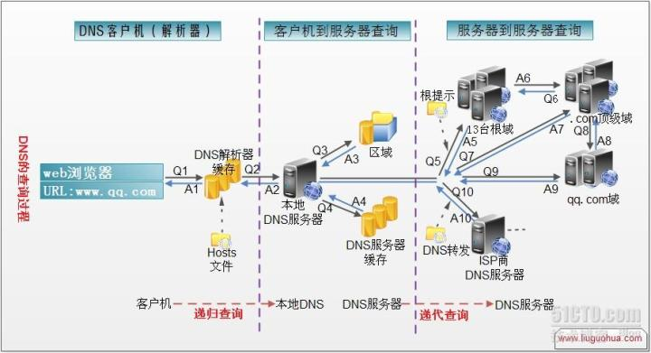
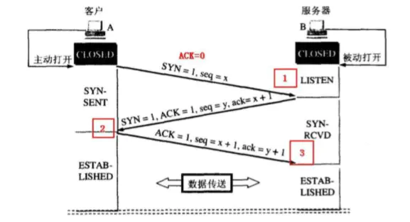

# 网络

## DNS 域名解析



1. 浏览器将会检查缓存中有没有这个域名对应的解析过的 IP 地址，如果有该解析过程将会结束。浏览器缓存域名也是有限制的，包括缓存的时间、大小，可以通过 TTL 属性来设置。

2. 如果用户的浏览器中缓存中没有，操作系统会先检查自己本地的 hosts 文件是否有这个网址映射关系，如果有，就先调用这个 IP 地址映射，完成域名解析。

3. 路由器缓存，如果 DNS 记录不在自己电脑上的话，浏览器就会和与之相连的路由器共同维护 DNS 记录。

4. 如果 hosts 里没有这个域名的映射，则查找本地 DNS 解析器缓存，是否有这个网址映射关系，如果有，直接返回，完成域名解析。

   > 电脑的本地 DNS 服务器一般是各大运营商如电信联通提供的，或者像 180.76.76.76，223.5.5.5，4 个 114 等知名 dns 服务商提供的，本身缓存了大量的常见域名的 ip，所以常见的网站，都是有记录的。不需要找根服务器。

5. 如果 hosts 与本地 DNS 解析器缓存都没有相应的网址映射关系，首先会找 TCP/IP 参数中设置的首选 DNS 服务器，在此我们叫它本地 DNS 服务器，此服务器收到查询时，如果要查询的域名，包含在本地配置区域资源中，则返回解析结果给客户机，完成域名解析，此解析具有权威性。

6. 如果要查询的域名，不由本地 DNS 服务器区域解析，但该服务器已缓存了此网址映射关系，则调用这个 IP 地址映射，完成域名解析，此解析不具有权威性。

7. 如果本地 DNS 服务器本地区域文件与缓存解析都失效，则根据本地 DNS 服务器的设置（是否设置转发器）进行查询，如果未用转发模式，本地 DNS 就把请求发至 13 台根 DNS，根 DNS 服务器收到请求后会判断这个域名(.com)是谁来授权管理，并会返回一个负责该顶级域名服务器的一个 IP。本地 DNS 服务器收到 IP 信息后，将会联系负责.com 域的这台服务器。这台负责.com 域的服务器收到请求后，如果自己无法解析，它就会找一个管理.com 域的下一级 DNS 服务器地址给本地 DNS 服务器。当本地 DNS 服务器收到这个地址后，就会找域名域服务器，重复上面的动作，进行查询，直至找到域名对应的主机。

8. 如果用的是转发模式，此 DNS 服务器就会把请求转发至上一级 DNS 服务器，由上一级服务器进行解析，上一级服务器如果不能解析，或找根 DNS 或把转请求转至上上级，以此循环。不管是本地 DNS 服务器用是是转发，还是根提示，最后都是把结果返回给本地 DNS 服务器，由此 DNS 服务器再返回给客户机。

### 递归查询与迭代查询

#### 主机向本地域名服务器的查询一般都是采用递归查询

所谓递归查询就是：如果主机所询问的本地域名服务器不知道被查询的域名的 IP 地址，那么本地域名服务器就以 DNS 客户的身份，

向其它根域名服务器继续发出查询请求报文(即替主机继续查询)，而不是让主机自己进行下一步查询。

因此，递归查询返回的查询结果或者是所要查询的 IP 地址，或者是报错，表示无法查询到所需的 IP 地址。

#### 本地域名服务器向根域名服务器的查询的迭代查询

迭代查询的特点：当根域名服务器收到本地域名服务器发出的迭代查询请求报文时，要么给出所要查询的 IP 地址，要么告诉本地服务器：“你下一步应当向哪一个域名服务器进行查询”。

然后让本地服务器进行后续的查询。根域名服务器通常是把自己知道的顶级域名服务器的 IP 地址告诉本地域名服务器，让本地域名服务器再向顶级域名服务器查询。

顶级域名服务器在收到本地域名服务器的查询请求后，要么给出所要查询的 IP 地址，要么告诉本地服务器下一步应当向哪一个权限域名服务器进行查询。

最后，知道了所要解析的 IP 地址或报错，然后把这个结果返回给发起查询的主机

### 参考文献

- 一次 dns 缓存引发的惨案：[https://zhuanlan.zhihu.com/p/25152493](https://zhuanlan.zhihu.com/p/25152493)

## TCP 建立连接为何是三次握手



SYN/ACK：标志位，只为 1 或者 0

- SYN：1 表示发起连接
- ACK：1 表示确认收到
- seq：一个随机序号的数据包
- ack：确认号，表示对这次数据包的确认，以及对下次收到数据包的期待

需要注意的是：

- 不要将确认号 ack 与标志位中的 ACK 搞混了
- 确认方 ack=发起方 seq+1，两端配对

大致过程：

客户端 SYN=1 发起连接，并发送一个 seq=x 的数据包（TCP 规定 SYN=1 时必须发送一个序号包）

服务端 ACK=1 确认收到，ack=x+1 表示我方到 x 为止的数据包已收到，期待客户端下次发我一个 seq 为 x+1 的数据包，SYN=1 发起连接，并发送一个 seq=y 的数据包

客户端 ACK=1 确认收到。ack=y+1 表示我方到 y 为止的数据包已收到，并发送一个 seq=x+1 的数据包

### 三次握手原因

在谢希仁著《计算机网络》第四版中讲“三次握手”的目的是“为了防止已失效的连接请求报文段突然又传送到了服务端，因而产生错误”。

在另一部经典的《计算机网络》一书中讲“三次握手”的目的是为了解决“网络中存在延迟的重复分组”的问题。

这两种不用的表述其实阐明的是同一个问题。

谢希仁版《计算机网络》中的例子是这样的，“已失效的连接请求报文段”的产生在这样一种情况下：client 发出的第一个连接请求报文段并没有丢失，而是在某个网络结点长时间的滞留了，以致延误到连接释放以后的某个时间才到达 server。

本来这是一个早已失效的报文段。但 server 收到此失效的连接请求报文段后，就误认为是 client 再次发出的一个新的连接请求。

于是就向 client 发出确认报文段，同意建立连接。假设不采用“三次握手”，那么只要 server 发出确认，新的连接就建立了。

由于现在 client 并没有发出建立连接的请求，因此不会理睬 server 的确认，也不会向 server 发送数据。但 server 却以为新的运输连接已经建立，并一直等待 client 发来数据。这样，server 的很多资源就白白浪费掉了。采用“三次握手”的办法可以防止上述现象发生。
例如刚才那种情况，client 不会向 server 的确认发出确认。
server 由于收不到确认，就知道 client 并没有要求建立连接。

### 参考文献

- TCP 为什么是三次握手，而不是两次或四次？：[https://www.zhihu.com/question/24853633/answer/63668444](https://www.zhihu.com/question/24853633/answer/63668444)
- 前端该了解的 HTTP 和 HTTPS：[https://juejin.im/post/5e6851f96fb9a07ca24f63a7](https://juejin.im/post/5e6851f96fb9a07ca24f63a7)

## GET 与 POST 的区别

1. get 重点在从服务器上获取资源，post 重点在向服务器发送数据
2. get 传输数据是通过 URL 请求，以 field（字段）= value 的形式，置于 URL 后，并用'?'连接，多个请求数据间用'&'连接，这个过程用户是可见的；post 传输数据通过将字段与对应值存在请求实体中发送给服务器，这个过程对用户是不可见的
3. get 传输的数据量小，因为受 URL 长度限制，但效率较高，post 可以传输大量数据，所以上传文件时只能用 post 方法
4. get 是不安全的，因为 post 是可见的，可能会泄露私密信息，密码等；post 安全性较高
5. get 方法只支持 ASCII 字符，向服务器传的中文字符可能会乱码；post 支持标准字符集，可以传递中文字符

## 浏览器缓存

1. 浏览器在加载资源时，先根据这个资源的一些 http header 判断它是否命中强缓存，强缓存如果命中，浏览器直接从自己的缓存中读取资源，不会发请求到服务器。比如某个 css 文件，如果浏览器在加载它所在的网页时，这个 css 文件的缓存配置命中了强缓存，浏览器就直接从缓存中加载这个 css，连请求都不会发送到网页所在服务器；
2. 当强缓存没有命中的时候，浏览器一定会发送一个请求到服务器，通过服务器端依据资源的另外一些 http header 验证这个资源是否命中协商缓存，如果协商缓存命中，服务器会将这个请求返回，但是不会返回这个资源的数据，而是告诉客户端可以直接从缓存中加载这个资源，于是浏览器就又会从自己的缓存中去加载这个资源；
3. 强缓存与协商缓存的共同点是：如果命中，都是从客户端缓存中加载资源，而不是从服务器加载资源数据；区别是：强缓存不发请求到服务器，协商缓存会发请求到服务器。
4. 当协商缓存也没有命中的时候，浏览器直接从服务器加载资源数据。

### 强缓存

### Expires

`Expires`是较老的强缓存管理 header，是 http1.0 提出的一个表示资源过期时间的 header，由于它是服务器返回的一个绝对时间，在服务器时间与客户端时间相差较大时，缓存管理容易出现问题，比如随意修改下客户端时间，就能影响缓存命中的结果

### Cache-Control

所以在 http1.1 的时候，提出了一个新的 header，就是`Cache-Control`，这是一个相对时间，在配置缓存的时候，以秒为单位，用数值表示，如：`Cache-Control:max-age=315360000`

`Cache-Control`描述的是一个相对时间，在进行缓存命中的时候，都是利用客户端时间进行判断，所以相比较`Expires`，`Cache-Control`的缓存管理更有效，安全一些。

这两个 header 可以只启用一个，也可以同时启用，当 response header 中，`Expires`和`Cache-Control`同时存在时，`Cache-Control`优先级高于`Expires`

目前主流的做法使用 Cache-Control 控制缓存，除了 max-age 控制过期时间外，还有一些不得不提

- Cache-Control: public 可以被所有用户缓存，包括终端和 CDN 等中间代理服务器
- Cache-Control: private 只能被终端浏览器缓存，中间的代理服务器不能缓存
- Cache-Control: no-cache，先缓存本地，但是在命中缓存之后必须与服务器验证缓存的新鲜度才能使用。跳过当前的强缓存，发送 HTTP 请求，即直接进入协商缓存阶段。
- Cache-Control: no-store，不会产生任何缓存

### 协商缓存

当浏览器对某个资源的请求没有命中强缓存，就会发一个请求到服务器，验证协商缓存是否命中，如果协商缓存命中，
请求响应返回的 http 状态为 304 并且会显示一个`Not Modified`的字符串

协商缓存是利用的是`Last-Modified`，`If-Modified-Since`和`ETag`、`If-None-Match`这两对 Header 来管理的

| client                                          | server                         |
| ----------------------------------------------- | ------------------------------ |
| `If-None-Match`表示资源上一次返回的`Etag`       | `Etag`根据资源生成的唯一标识   |
| `If-Modified`表示资源上一次返回的`LastModified` | `LastModified`资源最后修改时间 |

#### Last-Modified/If-Modified-Since

客户端首次请求资源时，服务器会把资源的最新修改时间 Last-Modified:Thu, 19 Feb 2019 08:20:55 GMT 通过响应部首发送给客户端，当再次发送请求是，客户端将服务器返回的修改时间放在请求头 If-Modified-Since:Thu, 19 Feb 2019 08:20:55 GMT 发送给服务器，服务器再跟服务器上的对应资源进行比对，如果服务器的资源更新，那么返回最新的资源，此时状态码 200，当服务器资源跟客户端的请求的部首时间一致，证明客户端的资源是最新的，返回 304 状态码，表示客户端直接用缓存即可。

#### ETag/If-None-Match

ETag 的流程跟 Last-Modified 是类似的，区别就在于 ETag 是根据资源内容进行 hash，生成一个信息摘要，只要资源内容有变化，这个摘要就会发生巨变，通过这个摘要信息比对，即可确定客户端的缓存资源是否为最新，这比 Last-Modified 的精确度要更高

### 图示


### 参考文献

- 浏览器缓存知识小结及应用：[https://www.cnblogs.com/lyzg/p/5125934.html?from=cnblogs](https://www.cnblogs.com/lyzg/p/5125934.html?from=cnblogs)
- HTTP 的缓存的过程是怎样的？：[https://www.cxymsg.com/guide/http.html#http 的缓存的过程是怎样的？](https://www.cxymsg.com/guide/http.html#http%E7%9A%84%E7%BC%93%E5%AD%98%E7%9A%84%E8%BF%87%E7%A8%8B%E6%98%AF%E6%80%8E%E6%A0%B7%E7%9A%84%EF%BC%9F)

### 刷新

- `f5`跳过强缓存，但是会检查协商缓存
- `ctrl + f5`直接从服务器加载，跳过强缓存和协商缓存

## HTTP/2

### 1. 二进制分帧

- HTTP/2 性能提升的核心就在于二进制分帧层。HTTP/2 是二进制协议，他采用二进制格式传输数据而不是 1.x 的文本格式。
- HTTP/2 中，同域名下所有通信都在单个连接上完成。
- 单个连接可以承载任何数量的双向数据流。
- 每个数据流都已消息的形式发送，而消息又由一个或多个帧组成，多个帧之间可以乱序发送，根据帧首部的流标识可以重新组装。

### 2. HTTP/2 对头部进行压缩

- 在客户端与服务端使用“首部表”来跟踪和存储之前发送的键值对，对于相同的数据，不再通过每次请求和响应发送。
- 首部表再 HTTP/2 的连续存续期内始终存在，由客户端和服务器共同渐进地更新。
- 每个新的首部键值对要么被追加到当前表的末尾，要么替换表中之前的值。

### 3. HTTP/2 多路复用解决 HTTP/1.x 的线头阻塞和多个 TCP 连接的问题

之所以速度能有如此优化，主要得益于 HTTP2.0 的多路复用技术。

有了新的分帧机制后，HTTP/2 不再依赖多个 TCP 连接去处理更多并发的请求，每个数据流都拆分成很多互不依赖的帧，而这些帧可以交错（乱序发送），还可以分优先级。最后再在另一端根据每个帧首部的流标识符把它们重新组合起来。从始至终，客户端与服务器之间只需要一个连接(同个域名下)即可

### 4. 数据流

因为 HTTP/2 的数据包是不按顺序发送的，同一个连接里面连续的数据包，可能属于不同的回应。因此，必须要对数据包做标记，指出它属于哪个回应。

HTTP/2 将每个请求或回应的所有数据包，称为一个数据流（stream）。每个数据流都有一个独一无二的编号。数据包发送的时候，都必须标记数据流 ID，用来区分它属于哪个数据流。另外还规定，客户端发出的数据流，ID 一律为奇数，服务器发出的，ID 为偶数。

数据流发送到一半的时候，客户端和服务器都可以发送信号（RST_STREAM 帧），取消这个数据流。1.1 版取消数据流的唯一方法，就是关闭 TCP 连接。
这就是说，HTTP/2 可以取消某一次请求，同时保证 TCP 连接还打开着，可以被其他请求使用。
客户端还可以指定数据流的优先级。优先级越高，服务器就会越早回应。

### 5. 服务器推送

HTTP/2 允许服务器未经请求，主动向客户端发送资源，这叫做服务器推送（server push）。常见场景是客户端请求一个网页，这个网页里面包含很多静态资源。服务端能在客户端请求静态资源前主动把这些静态资源随着网页一起发给客户端了，省去了客户端建立连接、发起请求等过程，极大提升了速度

### 存在的问题

在 HTTP/2 中，多个请求时跑在同一个 TCP 管道当中。但当出现了丢包时，HTTP/2 整个 TCP 都要开始等待重传，那么会阻塞该 TCP 连接中的所有请求。而对于 HTTP/1.1 来说，可以开启多个 TCP 连接，出现这种 i 情况反倒只回影响其中一个连接，剩余的 TCP 连接还可以正常传输数据

## 跨域

跨域是指一个域下的文档或脚本试图去请求另一个域下的资源，这里跨域是广义的。
其实我们通常所说的跨域是狭义的，是由浏览器同源策略限制的一类请求场景。

### 同源策略

同源策略/SOP（Same origin policy）是一种约定，由 Netscape 公司 1995 年引入浏览器，它是浏览器最核心也最基本的安全功能，如果缺少了同源策略，浏览器很容易受到 XSS、CSFR 等攻击。所谓同源是指"协议+域名+端口"三者相同，即便两个不同的域名指向同一个 ip 地址，也非同源。

#### 同源策略目的

防止 CSRF（跨站请求伪造）攻击
Cookie、LocalStorage、IndexedDB 等存储性内容
DOM 节点
AJAX 请求发送后，结果被浏览器拦截了

### 跨域解决方案

1. [跨域资源共享（CORS）](#CORS（跨域资源共享）)
2. [通过 JSONP 跨域](#JSONP)
3. [document.domain+iframe 跨域](#document.domain+iframe跨域)
4. [location.hash+iframe 跨域](#location.hash+iframe跨域)
5. [postMessage 跨域](#postMessage跨域)
6. [WebSocket 协议跨域](#WebSocket协议跨域)
7. [服务器代理](#服务器代理)

#### CORS（跨域资源共享）

普通跨域请求：只服务端设置 Access-Control-Allow-Origin 即可，前端无须设置，若要带 cookie 请求：前后端都需要设置。

需注意的是：由于同源策略的限制，所读取的 cookie 为跨域请求接口所在域的 cookie，而非当前页。如果想实现当前页 cookie 的写入

目前，所有浏览器都支持该功能(IE8+：IE8/9 需要使用 XDomainRequest 对象来支持 CORS）)，CORS 也已经成为主流的跨域解决方案。

```js
// 前端设置是否带cookie
xhr.withCredentials = true;
```

##### CORS 请求种类

浏览器将 CORS 请求分成两类：简单请求（simple request）和非简单请求（not-so-simple request）。

> 简单请求就是普通 HTML Form 在不依赖脚本的情况下可以发出的请求，比如表单的 method 如果指定为 POST ，可以用 enctype 属性指定用什么方式对表单内容进行编码，合法的值就是前述这三种。
>
> 非简单请求就是普通 HTML Form 无法实现的请求。比如 PUT 方法、需要其他的内容编码方式、自定义头之类的。

##### 简单请求

只要同时满足以下两大条件，就属于简单请求。

1. 请求方法是以下三种方法之一：

   - HEAD
   - GET
   - POST

2. HTTP 的头信息不超出以下几种字段：

   - Accept
   - Accept-Language
   - Content-Language
   - Last-Event-ID
   - Content-Type：只限于三个值
     - application/x-www-form-urlencoded
     - multipart/form-data
     - text/plain

凡是不同时满足上面两个条件，就属于非简单请求。

对于简单请求，浏览器直接发出 CORS 请求。具体来说，就是在头信息之中，增加一个 Origin 字段。

```text
Origin: http://xxx.xxx.com
```

上面的头信息中，Origin 字段用来说明，本次请求来自哪个源（协议 + 域名 + 端口）。服务器根据这个值，决定是否同意这次请求。

如果 Origin 指定的域名在许可范围内，服务器返回的响应，会多出几个头信息字段。

```text
Access-Control-Allow-Origin: http://xxx.xxx.com
Access-Control-Allow-Credentials: true
Access-Control-Expose-Headers: FooBar
```

1. Access-Control-Allow-Origin

   该字段是必须的。它的值要么是请求时 Origin 字段的值，要么是一个\*，表示接受任意域名的请求。

2. Access-Control-Allow-Credentials

   该字段可选。它的值是一个布尔值，表示是否允许发送 Cookie。默认情况下，Cookie 不包括在 CORS 请求之中。设为 true，即表示服务器明确许可，Cookie 可以包含在请求中，一起发给服务器。这个值也只能设为 true，如果服务器不要浏览器发送 Cookie，删除该字段即可。

3. Access-Control-Expose-Headers

   该字段可选。CORS 请求时，XMLHttpRequest 对象的 getResponseHeader()方法只能拿到 6 个基本字段：Cache-Control、Content-Language、Content-Type、Expires、Last-Modified、Pragma。如果想拿到其他字段，就必须在 Access-Control-Expose-Headers 里面指定。上面的例子指定，getResponseHeader('FooBar')可以返回 FooBar 字段的值。

##### 非简单请求

非简单请求是那种对服务器有特殊要求的请求，比如请求方法是`PUT`或 DELETE，或者`Content-Type`字段的类型是`application/json`。

非简单请求的 CORS 请求，会在正式通信之前，增加一次 HTTP 查询请求，称为"预检"请求（preflight）。

```text
OPTIONS /cors HTTP/1.1
Origin: http://xxx.xxx.com
Access-Control-Request-Method: PUT
Access-Control-Request-Headers: X-Custom-Header
```

"预检"请求用的请求方法是 OPTIONS，表示这个请求是用来询问的。头信息里面，关键字段是 Origin，表示请求来自哪个源。

1. Access-Control-Request-Method

   该字段是必须的，用来列出浏览器的 CORS 请求会用到哪些 HTTP 方法，上例是 PUT。

2. Access-Control-Request-Headers

   该字段是一个逗号分隔的字符串，指定浏览器 CORS 请求会额外发送的头信息字段，上例是 X-Custom-Header。

服务器收到"预检"请求以后，检查了 Origin、Access-Control-Request-Method 和 Access-Control-Request-Headers 字段以后，确认允许跨源请求，就可以做出回应。

```text
Access-Control-Allow-Origin: http://xxx.xxx.com
Access-Control-Allow-Methods: GET, POST, PUT
Access-Control-Allow-Headers: X-Custom-Header
Access-Control-Allow-Credentials: true
Access-Control-Max-Age: 1728000
```

上面的 HTTP 回应中，关键的是 Access-Control-Allow-Origin 字段，表示`http://xxx.xxx.com`可以请求数据。该字段也可以设为星号，表示同意任意跨源请求。

如果浏览器否定了"预检"请求，会返回一个正常的 HTTP 回应，但是没有任何 CORS 相关的头信息字段。这时，浏览器就会认定，服务器不同意预检请求，因此触发一个错误，被 XMLHttpRequest 对象的 onerror 回调函数捕获。控制台会打印出如下的报错信息。

服务器回应的其他 CORS 相关字段如下。

1. Access-Control-Allow-Methods

   该字段必需，它的值是逗号分隔的一个字符串，表明服务器支持的所有跨域请求的方法。注意，返回的是所有支持的方法，而不单是浏览器请求的那个方法。这是为了避免多次"预检"请求。

2. Access-Control-Allow-Headers

   如果浏览器请求包括 Access-Control-Request-Headers 字段，则 Access-Control-Allow-Headers 字段是必需的。它也是一个逗号分隔的字符串，表明服务器支持的所有头信息字段，不限于浏览器在"预检"中请求的字段。

3. Access-Control-Allow-Credentials

   该字段与简单请求时的含义相同。

4. Access-Control-Max-Age

   该字段可选，用来指定本次预检请求的有效期，单位为秒。上面结果中，有效期是 20 天（1728000 秒），即允许缓存该条回应 1728000 秒（即 20 天），在此期间，不用发出另一条预检请求。

#### JSONP

通常为了减轻 web 服务器的负载，我们把 js、css，img 等静态资源分离到另一台独立域名的服务器上，在 html 页面中再通过相应的标签从不同域名下加载静态资源，而被浏览器允许，基于此原理，我们可以通过动态创建 script，再请求一个带参网址实现跨域通信。

浏览器

```js
var script = document.createElement("script");
script.type = "text/javascript";

// 传参一个回调函数名给后端，方便后端返回时执行这个在前端定义的回调函数
script.src =
  "http://www.domain2.com:8080/login?user=admin&callback=handleCallback";
document.head.appendChild(script);

// 回调执行函数
function handleCallback(res) {
  alert(JSON.stringify(res));
}
```

服务端返回

```js
handleCallback({ status: true, user: "admin" });
```

缺点

- 只能使用 get 方法

#### document.domain+iframe 跨域

此方案仅限主域相同，子域不同的跨域应用场景。

实现原理：两个页面都通过 js 强制设置 document.domain 为基础主域，就实现了同域。

父窗口：`http://www.domain.com/a.html`

```html
<iframe id="iframe" src="http://child.domain.com/b.html"></iframe>
<script>
  document.domain = "domain.com";
  var user = "admin";
</script>
```

子窗口：`http://child.domain.com/b.html`

```html
<script>
  document.domain = "domain.com";
  // 获取父窗口中变量
  alert("get js data from parent ---> " + window.parent.user);
</script>
```

#### location.hash+iframe 跨域

实现原理： a 欲与 b 跨域相互通信，通过中间页 c 来实现。 三个页面，不同域之间利用 iframe 的 location.hash 传值，相同域之间直接 js 访问来通信。

具体实现：A 域：a.html -> B 域：b.html -> A 域：c.html，a 与 b 不同域只能通过 hash 值单向通信，b 与 c 也不同域也只能单向通信，但 c 与 a 同域，所以 c 可通过 parent.parent 访问 a 页面所有对象。

a.html：`http://www.domain1.com/a.html`

```html
<iframe
  id="iframe"
  src="http://www.domain2.com/b.html"
  style="display:none;"
></iframe>
<script>
  var iframe = document.getElementById("iframe");

  // 向b.html传hash值
  setTimeout(function() {
    iframe.src = iframe.src + "#user=admin";
  }, 1000);

  // 开放给同域c.html的回调方法
  function onCallback(res) {
    alert("data from c.html ---> " + res);
  }
</script>
```

b.html：`http://www.domain2.com/b.html`

```html
<iframe
  id="iframe"
  src="http://www.domain1.com/c.html"
  style="display:none;"
></iframe>
<script>
  var iframe = document.getElementById("iframe");

  // 监听a.html传来的hash值，再传给c.html
  window.onhashchange = function() {
    iframe.src = iframe.src + location.hash;
  };
</script>
```

c.html：`http://www.domain1.com/c.html`

```html
<script>
  // 监听b.html传来的hash值
  window.onhashchange = function() {
    // 再通过操作同域a.html的js回调，将结果传回
    window.parent.parent.onCallback(
      "hello: " + location.hash.replace("#user=", ""),
    );
  };
</script>
```

#### postMessage 跨域

postMessage 是 HTML5 XMLHttpRequest Level 2 中的 API，且是为数不多可以跨域操作的 window 属性之一，它可用于解决以下方面的问题：

1. 页面和其打开的新窗口的数据传递
2. 多窗口之间消息传递
3. 页面与嵌套的 iframe 消息传递
4. 上面三个场景的跨域数据传递

用法：postMessage(data,origin)方法接受两个参数

- data： html5 规范支持任意基本类型或可复制的对象，但部分浏览器只支持字符串，所以传参时最好用 JSON.stringify()序列化。
- origin： 协议+主机+端口号，也可以设置为"\*"，表示可以传递给任意窗口，如果要指定和当前窗口同源的话设置为"/"。

#### WebSocket 协议跨域

WebSocket protocol 是 HTML5 一种新的协议。它实现了浏览器与服务器全双工通信，同时允许跨域通讯，是 server push 技术的一种很好的实现。
原生 WebSocket API 使用起来不太方便，我们使用 Socket.io，它很好地封装了 webSocket 接口，提供了更简单、灵活的接口，也对不支持 webSocket 的浏览器提供了向下兼容。

#### 服务器代理

跨域原理： 同源策略是浏览器的安全策略，不是 HTTP 协议的一部分。服务器端调用 HTTP 接口只是使用 HTTP 协议，不会执行 JS 脚本，不需要同源策略，也就不存在跨越问题。

### 参考文献

- 前端常见跨域解决方案（全）：[https://segmentfault.com/a/1190000011145364](https://segmentfault.com/a/1190000011145364)
- 跨域资源共享 CORS 详解：[https://www.ruanyifeng.com/blog/2016/04/cors.html](https://www.ruanyifeng.com/blog/2016/04/cors.html)
- HTTP 访问控制（CORS）：[https://developer.mozilla.org/zh-CN/docs/Web/HTTP/Access_control_CORS](https://developer.mozilla.org/zh-CN/docs/Web/HTTP/Access_control_CORS)

## Web 攻击

### 跨站脚本攻击（XSS）

攻击者在网页上发布包含攻击性代码的数据和信息。

当浏览者看到或者打开此网页时，特定的脚本就会以浏览者用户的身份和权限来执行该攻击性代码。

通过 XSS 可以比较容易地修改用户数据、窃取用户信息，以及造成其他类型的攻击，例如 CSRF 攻击。

常见的解决办法就是：让用户无法修改可视页面的 HTML 代码，即确保输出到 HTML 页面的数据以 HTML 的方式被转义

#### XSS 三种类型

##### 1.存储型 XSS

1. 攻击者将恶意代码提交到目标网站的数据库中。
2. 用户打开目标网站时，网站服务端将恶意代码从数据库取出，拼接在 HTML 中返回给浏览器。
3. 用户浏览器接收到响应后解析执行，混在其中的恶意代码也被执行。
4. 恶意代码窃取用户数据并发送到攻击者的网站，或者冒充用户的行为，调用目标网站接口执行攻击者指定的操作。

这种攻击常见于带有用户保存数据的网站功能，如论坛发帖、商品评论、用户私信等。

##### 2. 反射型 XSS

1. 攻击者构造出特殊的 URL，其中包含恶意代码。
2. 用户打开带有恶意代码的 URL 时，网站服务端将恶意代码从 URL 中取出，拼接在 HTML 中返回给浏览器。
3. 用户浏览器接收到响应后解析执行，混在其中的恶意代码也被执行。
4. 恶意代码窃取用户数据并发送到攻击者的网站，或者冒充用户的行为，调用目标网站接口执行攻击者指定的操作。

反射型 XSS 跟存储型 XSS 的区别是：存储型 XSS 的恶意代码存在数据库里，反射型 XSS 的恶意代码存在 URL 里。

反射型 XSS 漏洞常见于通过 URL 传递参数的功能，如网站搜索、跳转等。

由于需要用户主动打开恶意的 URL 才能生效，攻击者往往会结合多种手段诱导用户点击。

POST 的内容也可以触发反射型 XSS，只不过其触发条件比较苛刻（需要构造表单提交页面，并引导用户点击），所以非常少见。

##### 3. DOM 型 XSS

1. 攻击者构造出特殊的 URL，其中包含恶意代码。
2. 用户打开带有恶意代码的 URL。
3. 用户浏览器接收到响应后解析执行，前端 JavaScript 取出 URL 中的恶意代码并执行。
4. 恶意代码窃取用户数据并发送到攻击者的网站，或者冒充用户的行为，调用目标网站接口执行攻击者指定的操作。

DOM 型 XSS 跟前两种 XSS 的区别：DOM 型 XSS 攻击中，取出和执行恶意代码由浏览器端完成，属于前端 JavaScript 自身的安全漏洞，而其他两种 XSS 都属于服务端的安全漏洞

比如通过网络劫持在页面传输过程中修改 HTML 页面的内容，这种劫持类型很多，有通过 WiFi 路由器劫持的，有通过本地恶意软件来劫持的，它们的共同点是在 Web 资源传输过程或者在用户使用页面的过程中修改 Web 页面的数据。

#### 防御 XSS 攻击

1. 从客户端和服务器端双重验证所有的输入数据，这一般能阻挡大部分注入的脚本
2. 对所有的数据进行适当的编码
3. 充分利用内容安全策略（CSP Content-Security-Policy）
    > CSP通过指定有效域——即浏览器认可的可执行脚本的有效来源——使服务器管理者有能力减少或消除XSS攻击所依赖的载体。一个CSP兼容的浏览器将会仅执行从白名单域获取到的脚本文件，忽略所有的其他脚本 (包括内联脚本和HTML的事件处理属性)。
    
    实施严格的 CSP 可以有效地防范 XSS 攻击，具体来讲 CSP 有如下几个功能：
    - 限制加载其他域下的资源文件，这样即使黑客插入了一个 JavaScript 文件，这个 JavaScript 文件也是无法被加载的；
    - 禁止向第三方域提交数据，这样用户数据也不会外泄；
    - 禁止执行内联脚本和未授权的脚本；
    - 还提供了上报机制（配置report uri），这样可以帮助我们尽快发现有哪些 XSS 攻击，以便尽快修复问题。

4. ~~设置 HTTP Header "X-XSS-Protection"， 启用 XSS 过滤~~
5. cookie 加上 HttpOnly,只允许请求，不允许 js 读取

### 跨站请求伪造攻击（CSRF）

攻击者通过各种办法伪造一个请求，模仿用户提交表单等行为，从而达到修改用户的数据、个人资料等敏感信息，或者执行特定任务的目的。

一个典型的 CSRF 攻击有着如下的流程：

- 受害者登录`a.com`，并保留了登录凭证（Cookie）
- 攻击者引诱受害者访问了`b.com`
- `b.com`向`a.com`发送了一个请求：`a.com/act=xx`浏览器会默认携带`a.com`的 Cookie
- `a.com`接收到请求后，对请求进行验证，并确认是受害者的凭证，误以为是受害者自己发送的请求
- `a.com`以受害者的名义执行了 act=xx
- 攻击完成，攻击者在受害者不知情的情况下，冒充受害者，让`a.com`执行了自己定义的操作

它和 XSS 也有所不同，简而言之：XSS 利用站点内的信任用户，CSRF 是通过伪装来自受信任用户的请求来利用受信任的网站。但是两者经常会一起使用，例如诱导用户来点击一个包含攻击的链接或地址。

#### 解决办法

1. 对请求进行认证，确保该请求确实是用户本人填写表单并提交的，而不是第三者伪造的，可在会话中增加 token，来进行校验。
2. 验证 HTTP Referer 字段，在 HTTP 头中有 Referer 字段，他记录该 HTTP 请求的来源地址，如果跳转的网站与来源地址相符，那就是合法的，如果不符则可能是 csrf 攻击，拒绝该请求（不过由于 http 头在某些版本的浏览器上存在可被篡改的可能性，所以这个解决方案并不完善）
3. 充分利用好 Cookie 的 SameSites 属性

PS：因为 CSRF 和 XSS 攻击相比，CSRF 攻击往往不大流行（因此对其进行防范的资源也是相当的稀少，并且对其防范的经验也是稀少的）和难以防范，所以被认为比 XSS 更具有危险性。

### SQL Injection （SQL 注入）

所谓 SQL 注入，就是通过客户端的输入把 SQL 命令注入到一个应用的数据库中，从而得以执行恶意 SQL 语句。

### 重定向攻击

顾名思义，就是在点击一个链接或者地址时，将用户导至攻击者制定的网站，进而窃取用户的资料、个人信息等敏感信息。一般是钓鱼网站常用。

### 上传文件攻击

文件上传文件攻击是指网络攻击者上传了一个可执行的文件到服务器并执行。这个上传的文件可以是木马、病毒、恶意脚本或者 WebShell 等。这种攻击方式是最为直接和有效的，部分上传文件漏洞的利用技术门槛非常的低，对于攻击者来说也是很容易实现的。

在这里，稍微多介绍一点 WebShell。文件上传漏洞本身就是一个危害巨大的漏洞，而 WebShell 更是将这种漏洞的利用无限的扩大。大多数的上传漏洞被利用后攻击者都会留下 WebShell 以方便后续进入系统。攻击者在受影响系统放置或者插入 WebShell 后，可通过该 WebShell 更容易、隐秘的在服务中为所欲为。

### Distributed Denial of Service （DDoS， 分布式拒绝服务）

DoS 攻击就是通过大量恶意流量占用带宽和计算资源以达到瘫痪对方网络的目的。

### 网络劫持

网络劫持一般分为两种:

- DNS 劫持: (输入京东被强制跳转到淘宝这就属于 dns 劫持)

  - DNS 强制解析: 通过修改运营商的本地 DNS 记录，来引导用户流量到缓存服务器
  - 302 跳转的方式: 通过监控网络出口的流量，分析判断哪些内容是可以进行劫持处理的,再对劫持的内存发起 302 跳转的回复，引导用户获取内容

- HTTP 劫持: (访问谷歌但是一直有贪玩蓝月的广告),由于 http 明文传输,运营商会修改你的 http 响应内容(即加广告)

#### 如何应对网络劫持

DNS 劫持由于涉嫌违法,已经被监管起来,现在很少会有 DNS 劫持,而 http 劫持依然非常盛行.

最有效的办法就是全站 HTTPS,将 HTTP 加密,这使得运营商无法获取明文,就无法劫持你的响应内容.

### 中间人攻击

中间人 (Man-in-the-middle attack, MITM) 是指攻击者与通讯的两端分别创建独立的联系, 并交换其所收到的数据, 使通讯的两端认为他们正在通过一个私密的连接与对方直接对话, 但事实上整个会话都被攻击者完全控制. 在中间人攻击中, 攻击者可以拦截通讯双方的通话并插入新的内容.

一般的过程如下:

- 客户端发送请求到服务端，请求被中间人截获
- 服务器向客户端发送公钥
- 中间人截获公钥，保留在自己手上。然后自己生成一个【伪造的】公钥，发给客户端
- 客户端收到伪造的公钥后，生成加密 hash 值发给服务器
- 中间人获得加密 hash 值，用自己的私钥解密获得真秘钥,同时生成假的加密 hash 值，发给服务器
- 服务器用私钥解密获得假密钥,然后加密数据传输给客户端

## HTTP 状态码常用状态码

2XX 成功

- 200 OK，表示从客户端发来的请求在服务器端被正确处理
- 201 Created 请求已经被实现，而且有一个新的资源已经依据请求的需要而建立
- 202 Accepted 请求已接受，但是还没执行，不保证完成请求
- 204 No content，表示请求成功，但响应报文不含实体的主体部分
- 206 Partial Content，进行范围请求

3XX 重定向

- 301 moved permanently，永久性重定向，表示资源已被分配了新的 - URL
- 302 found，临时性重定向，表示资源临时被分配了新的 URL
- 303 see other，表示资源存在着另一个 URL，应使用 GET 方法丁香- 获取资源
- 304 not modified，表示服务器允许访问资源，但因发生请求未满足- 条件的情况
- 307 temporary redirect，临时重定向，和 302 含义相同

4XX 客户端错误

- 400 bad request，请求报文存在语法错误
- 401 unauthorized，表示发送的请求需要有通过 HTTP 认证的认证信- 息
- 403 forbidden，表示对请求资源的访问被服务器拒绝
- 404 not found，表示在服务器上没有找到请求的资源
- 408 Request timeout, 客户端请求超时
- 409 Confict, 请求的资源可能引起冲突

5XX 服务器错误

- 500 internal sever error，表示服务器端在执行请求时发生了错误
- 501 Not Implemented 请求超出服务器能力范围，例如服务器不支持当前请求所需要的某个功能，或者请求是服务器不支持的某个方法
- 503 service unavailable，表明服务器暂时处于超负载或正在停机维护，无法处理请求
- 505 http version not supported 服务器不支持，或者拒绝支持在请求中使用的 HTTP 版本

## HTTP 状态码 301/302/303/307/308

### 301 Moved Permanently

301 状态码表明目标资源被永久的移动到了一个新的 URI，任何未来对这个资源的引用都应该使用新的 URI。（请求通常会进行缓存）

### 302 Found（http1.0）

302 是最常见的一种重定向方法，但同时也是现实与标准相矛盾的典型案例。

规范中规定 302 重定向不允许修改请求方式。也就是当一个 POST 请求返回了 302 时，按照规范仍然应该使用 POST 请求打开 Location 中的 URl。

但各家浏览器厂商在实现的时候并没有遵守这个规范，而是使用 GET 方式访问服务端响应头中的 Location 中的 URI。

各家浏览器厂商的这种操作间接的推动 HTTP 1.1 标准规范中推出了 303 和 307，来解决这个问题。事实上，现在大家再说的 302 其实就是标准规范中的 303。

### 303 See Other（http1.1）

303 See Other ，自 RFC 2616 (HTTP 1.1)起，用于在收到 HTTP POST 请求之后，进行 URL 重定向的操作。

即无论原请求是 get 还是 post，客户端收到服务端的响应后，必须使用 GET 方法重定向到新地址。

### 307 Temporary Redirect（http1.1）

307 Temporary Redirect 可以理解为一个临时的重定向。

307 和 302 重定向区别在于，307 约定客户端重定向之后不能改变原先的请求方法

### 308 Permanent Redirect 的定义

308 的定义实际上和 301 是一致的，唯一的区别在于，308 状态码不允许浏览器将原本为 POST 的请求重定向到 GET 请求上。

## OSI 七层模型


## HTTP 请求方法

- HTTP1.0 定义了三种请求方法： GET, POST 和 HEAD 方法
  - GET: 通常用于请求服务器发送某些资源
  - HEAD: 请求资源的头部信息, 并且这些头部与 HTTP GET 方法请求时返回的一致. 该请求方法的一个使用场景是在下载一个大文件前先获取其大小再决定是否要下载, 以此可以节约带宽资源
  - POST: 发送数据给服务器
- HTTP1.1 新增了五种请求方法：OPTIONS, PUT, DELETE, TRACE 和 CONNECT
  - OPTIONS: 用于获取目的资源所支持的通信选项
  - PUT: 用于新增资源或者使用请求中的有效负载替换目标资源的表现形式
  - DELETE: 用于删除指定的资源
  - PATCH: 用于对资源进行部分修改
  - CONNECT: HTTP/1.1 协议中预留给能够将连接改为管道方式的代理服务器
  - TRACE: 回显服务器收到的请求，主要用于测试或诊断

## HTTP 请求/响应报文


## HTTPS

### TLS

TLS 协议位于传输层之上，应用层之下。首次进行 TLS 协议传输需要两个 RTT ，接下来可以通过 Session Resumption 减少到一个 RTT。

在 TLS 中使用了两种加密技术，分别为：对称加密和非对称加密。

TLS 握手过程如下图


1. 客户端发送一个随机值，需要的协议和加密方式
2. 服务端收到客户端的随机值，自己也产生一个随机值，并根据客户端需求的协议和加密方式来使用对应的方式，发送自己的证书（如果需要验证客户端证书需要说明）
3. 客户端收到服务端的证书并验证是否有效，验证通过会再生成一个随机值，通过服务端证书的公钥去加密这个随机值并发送给服务端，如果服务端需要验证客户端证书的话会附带证书
4. 服务端收到加密过的随机值并使用私钥解密获得第三个随机值，这时候两端都拥有了三个随机值，可以通过这三个随机值按照之前约定的加密方式生成密钥，接下来的通信就可以通过该密钥来加密解密
5. 通过以上步骤可知，在 TLS 握手阶段，两端使用非对称加密的方式来通信，但是因为非对称加密损耗的性能比对称加密大，所以在正式传输数据时，两端使用对称加密的方式通信。

通过以上步骤可知，在 TLS 握手阶段，两端使用非对称加密的方式来通信，但是因为非对称加密损耗的性能比对称加密大，所以在正式传输数据时，两端使用对称加密的方式通信。

### 参考文献

- HTTPS：[https://yuchengkai.cn/docs/cs/#https](https://yuchengkai.cn/docs/cs/#https)

## 从输入 URL 到页面加载完成的过程

1. 首先做 DNS 查询，如果这一步做了智能 DNS 解析的话，会提供访问速度最快的 IP 地址回来

2. 接下来是 TCP 握手，应用层会下发数据给传输层，这里 TCP 协议会指明两端的端口号，然后下发给网络层。网络层中的 IP 协议会确定 IP 地址，并且指示了数据传输中如何跳转路由器。然后包会再被封装到数据链路层的数据帧结构中，最后就是物理层面的传输了

3. TCP 握手结束后会进行 TLS 握手，然后就开始正式的传输数据

4. 数据在进入服务端之前，可能还会先经过负责负载均衡的服务器，它的作用就是将请求合理的分发到多台服务器上，这时假设服务端会响应一个 HTML 文件

5. 首先浏览器会判断状态码是什么，如果是 200 那就继续解析，如果 400 或 500 的话就会报错，如果 300 的话会进行重定向，这里会有个重定向计数器，避免过多次的重定向，超过次数也会报错

6. 浏览器开始解析文件，如果是 gzip 格式的话会先解压一下，然后通过文件的编码格式知道该如何去解码文件

7. 文件解码成功后会正式开始渲染流程，先会根据 HTML 构建 DOM 树，有 CSS 的话会去构建 CSSOM 树。如果遇到 script 标签的话，会判断是否存在 async 或者 defer ，前者会并行进行下载并执行 JS，后者会先下载文件，然后等待 HTML 解析完成后顺序执行，如果以上都没有，就会阻塞住渲染流程直到 JS 执行完毕。遇到文件下载的会去下载文件，这里如果使用 HTTP 2.0 协议的话会极大的提高多图的下载效率。

8. 初始的 HTML 被完全加载和解析后会触发 DOMContentLoaded 事件

9. CSSOM 树和 DOM 树构建完成后会开始生成 Render 树，这一步就是确定页面元素的布局、样式等等诸多方面的东西

10. 在生成 Render 树的过程中，浏览器就开始调用 GPU 绘制，合成图层，将内容显示在屏幕上了

### 参考文献

- 从输入 URL 到页面加载完成的过程：[https://yuchengkai.cn/docs/cs/](https://yuchengkai.cn/docs/cs/)

## Cookie 属性

### expires

expires 选项用来设置“cookie 什么时间内有效”。expires 其实是 cookie 失效日期，expires 必须是 GMT 格式的时间（可以通过 new Date().toGMTString()或者 new Date().toUTCString() 来获得）。

如 expires=Thu, 25 Feb 2016 04:18:00 GMT 表示 cookie 讲在 2016 年 2 月 25 日 4:18 分之后失效，对于失效的 cookie 浏览器会清空。如果没有设置该选项，则默认有效期为 session，即会话 cookie。这种 cookie 在浏览器关闭后就没有了。

> expires 是 http/1.0 协议中的选项，在新的 http/1.1 协议中 expires 已经由 max-age 选项代替，两者的作用都是限制 cookie 的有效时间。expires 的值是一个时间点（cookie 失效时刻= expires），而 max-age 的值是一个以秒为单位时间段（cookie 失效时刻= 创建时刻+ max-age）。另外，max-age 的默认值是 -1(即有效期为 session )；若 max-age 有三种可能值：负数、0、正数。负数：有效期 session；0：删除 cookie；正数：有效期为创建时刻+ max-age

### domain 和 path

domain 是域名，path 是路径，两者加起来就构成了 URL，domain 和 path 一起来限制 cookie 能被哪些 URL 访问。

一句话概括：某 cookie 的 domain 为“baidu.com”, path 为“/ ”，若请求的 URL(URL 可以是 js/html/img/css 资源请求，但不包括 XHR 请求)的域名是“baidu.com”或其子域如“api.baidu.com”、“dev.api.baidu.com”，且 URL 的路径是“/ ”或子路径“/home”、“/home/login”，则浏览器会将此 cookie 添加到该请求的 cookie 头部中。

所以 domain 和 path2 个选项共同决定了 cookie 何时被浏览器自动添加到请求头部中发送出去。如果没有设置这两个选项，则会使用默认值。domain 的默认值为设置该 cookie 的网页所在的域名，path 默认值为设置该 cookie 的网页所在的目录。

### secure

secure 选项用来设置 cookie 只在确保安全的请求中才会发送。当请求是 HTTPS 或者其他安全协议时，包含 secure 选项的 cookie 才能被发送至服务器。

默认情况下，cookie 不会带 secure 选项(即为空)。所以默认情况下，不管是 HTTPS 协议还是 HTTP 协议的请求，cookie 都会被发送至服务端。但要注意一点，secure 选项只是限定了在安全情况下才可以传输给服务端，但并不代表你不能看到这个 cookie。

### HttpOnly

这个选项用来设置 cookie 是否能通过 js 去访问。默认情况下，cookie 不会带 httpOnly 选项(即为空)，所以默认情况下，客户端是可以通过 js 代码去访问（包括读取、修改、删除等）这个 cookie 的。当 cookie 带 httpOnly 选项时，客户端则无法通过 js 代码去访问（包括读取、修改、删除等）这个 cookie。

在客户端是不能通过 js 代码去设置一个 httpOnly 类型的 cookie 的，这种类型的 cookie 只能通过服务端来设置。

### SameSite

Cookie 的 SameSite 属性用来限制第三方 Cookie，从而减少安全风险（控制 CSRF 漏洞）。

#### Strict

Strict 最为严格，完全禁止第三方 Cookie，跨站点时，任何情况下都不会发送 Cookie。换言之，只有当前网页的 URL 与请求目标一致，才会带上 Cookie。

#### Lax

Lax 规则稍稍放宽，大多数情况也是不发送第三方 Cookie，但是导航到目标网址的 Get 请求除外。

#### None

Chrome 计划将 Lax 变为默认设置。这时，网站可以选择显式关闭 SameSite 属性，将其设为 None。不过，前提是必须同时设置 Secure 属性（Cookie 只能通过 HTTPS 协议发送），否则无效。

### 参考文献

- 聊一聊 cookie：[https://juejin.im/post/5b18d322e51d4506cf10af7c](https://juejin.im/post/5b18d322e51d4506cf10af7c)
- Cookie 的 SameSite 属性：[https://www.ruanyifeng.com/blog/2019/09/cookie-samesite.html](https://www.ruanyifeng.com/blog/2019/09/cookie-samesite.html)
