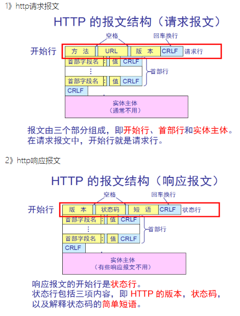

# 网络

## DNS域名解析


1. 浏览器将会检查缓存中有没有这个域名对应的解析过的 IP 地址，如果有该解析过程将会结束。浏览器缓存域名也是有限制的，包括缓存的时间、大小，可以通过 TTL 属性来设置。

2. 如果用户的浏览器中缓存中没有，操作系统会先检查自己本地的 hosts 文件是否有这个网址映射关系，如果有，就先调用这个 IP 地址映射，完成域名解析。

3. 路由器缓存，如果 DNS 记录不在自己电脑上的话，浏览器就会和与之相连的路由器共同维护 DNS 记录。

4. 如果 hosts 里没有这个域名的映射，则查找本地 DNS（ISP） 解析器缓存，是否有这个网址映射关系，如果有，直接返回，完成域名解析。

   > 电脑的本地 DNS 服务器一般是各大运营商如电信联通提供的，或者像 180.76.76.76，223.5.5.5，4 个 114 等知名 dns 服务商提供的，本身缓存了大量的常见域名的 ip，所以常见的网站，都是有记录的。不需要找根服务器。

5. 如果 hosts 与本地 DNS 解析器缓存都没有相应的网址映射关系，首先会找 TCP/IP 参数中设置的首选 DNS 服务器，在此我们叫它本地 DNS 服务器，此服务器收到查询时，如果要查询的域名，包含在本地配置区域资源中，则返回解析结果给客户机，完成域名解析，此解析具有权威性。

6. 如果要查询的域名，不由本地 DNS 服务器区域解析，但该服务器已缓存了此网址映射关系，则调用这个 IP 地址映射，完成域名解析，此解析不具有权威性。

7. 如果本地 DNS 服务器本地区域文件与缓存解析都失效，则根据本地 DNS 服务器的设置（是否设置转发器）进行查询，如果**未用转发模式**，本地 DNS 就把请求发至 13 台**根 DNS** 服务器，**根 DNS 服务器**收到请求后会判断这个域名(.com)是谁来授权管理，并会返回一个负责该**顶级域名服务器**的一个 IP。本地 DNS 服务器收到 IP 信息后，将会联系负责.com 域的这台服务器。这台负责.com 域的服务器收到请求后，如果自己无法解析，它就会找一个管理 .com 域的下一级 **权威 DNS 服务器**地址给本地 DNS 服务器。当本地 DNS 服务器收到这个地址后，就会找域名域服务器，重复上面的动作，进行查询，直至找到域名对应的主机。

8. 如果用的是**转发模式**，此 DNS 服务器就会把请求转发至上一级 DNS 服务器，由上一级服务器进行解析，上一级服务器如果不能解析，或找根 DNS 或把转请求转至上上级，以此循环。不管是本地 DNS 服务器用是是转发，还是根提示，最后都是把结果返回给本地 DNS 服务器，由此 DNS 服务器再返回给客户机。

### DNS 同时使用 TCP 和 UDP 协议

DNS 占用 53 号端口，同时使用 TCP 和 UDP 协议

1. 在区域传输的时候使用 TCP 协议

    - 辅域名服务器会定时（一般3小时）向主域名服务器进行查询以便了解数据是否有变动。如有变动，会执行一次区域传送，进行数据同步。区域传送使用TCP而不是UDP，因为数据同步传送的数据量比一个请求应答的数据量要多得多
    - TCP是一种可靠连接，保证了数据的准确性

2. 在域名解析的时候使用 UDP 协议
    
    - 客户端向DNS服务器查询域名，一般返回的内容都不超过512字节，用UDP传输即可。不用经过三次握手，这样DNS服务器负载更低，响应更快。理论上说，客户端也可以指定向DNS服务器查询时用TCP，但事实上，很多DNS服务器进行配置的时候，仅支持UDP查询包

### 递归查询与迭代查询

#### 主机向本地域名服务器的查询一般都是采用递归查询

所谓递归查询就是：如果主机所询问的本地域名服务器不知道被查询的域名的 IP 地址，那么本地域名服务器就以 DNS 客户的身份，

向其它根域名服务器继续发出查询请求报文(即替主机继续查询)，而不是让主机自己进行下一步查询。

因此，递归查询返回的查询结果或者是所要查询的 IP 地址，或者是报错，表示无法查询到所需的 IP 地址。

#### 本地域名服务器向根域名服务器的查询的迭代查询

迭代查询的特点：当根域名服务器收到本地域名服务器发出的迭代查询请求报文时，要么给出所要查询的 IP 地址，要么告诉本地服务器：“你下一步应当向哪一个域名服务器进行查询”。

然后让本地服务器进行后续的查询。根域名服务器通常是把自己知道的顶级域名服务器的 IP 地址告诉本地域名服务器，让本地域名服务器再向顶级域名服务器查询。

顶级域名服务器在收到本地域名服务器的查询请求后，要么给出所要查询的 IP 地址，要么告诉本地服务器下一步应当向哪一个权限域名服务器进行查询。

最后，知道了所要解析的 IP 地址或报错，然后把这个结果返回给发起查询的主机

### DNS 记录和报文

DNS 服务器中以资源记录的形式存储信息，每一个 DNS 响应报文一般包含多条资源记录。一条资源记录的具体格式为

```
(Name, Value, Type, TTL)
```

TTL 是资源记录的生存时间，它定义了资源记录能够被其他的DNS 服务器缓存多长时间

Type 是 DNS 的记录类型

### 参考文献

- 一次 dns 缓存引发的惨案：[https://zhuanlan.zhihu.com/p/25152493](https://zhuanlan.zhihu.com/p/25152493)

## DNS 常用记录类型

### A

A 记录代表着这是一条用于解析 IPv4 地址的记录。

Name 是主机名， Value 是主机名对应的 IP 地址

### CNAME

CNAME（Canonical Name Record）用于定义域名的别名

Name 为别名，Value 为该主机的规范主机名。该条记录用于向查询的主机返回一个主机名 对应的规范主机名，从而告诉查询主机去查询这个主机名的 IP 地址。主机别名主要是为了通过给一些复杂的主机名提供 一个便于记忆的简单的别名。

### AAAA

AAAA 记录是域名和 IPv6 地址的映射关系

### MX

MX（Mail Exchanger Record） 记录是邮件记录，用来描述邮件服务器的域名

Name 为一个邮件服务器的别名，Value 为邮件服务器的规范主机名。它的作用和 CNAME 是一 样的，都是为了解决规范主机名不利于记忆的缺点。

### NS

NS（Name Server）记录是描述 DNS 服务器网址。从 DNS 的存储结构上说，Name Server 中含有权威 DNS 服务的目录。也就是说，NS 记录指定哪台 Server 是回答 DNS 查询的权威域名服务器。

Name 是域名 Value 是负责该域名的 DNS 服务器的主机名 这个记录主要用于 DNS 链式查询时，返回下一级需要查询的 DNS 服务器的信息

## TCP 和 UDP

TCP 和 UDP都是传输层协议，他们都属于TCP/IP协议族

### UDP

UDP的全称是用户数据报协议，在网络中它与TCP协议一样用于处理数据包，是一种无连接的协议。在OSI模型中，在传输层，处于IP协议的上一层。UDP有不提供数据包分组、组装和不能对数据包进行排序的缺点，也就是说，当报文发送之后，是无法得知其是否安全完整到达的

特点如下：

1. 面向无连接

    首先 UDP 是不需要和 TCP一样在发送数据前进行三次握手建立连接的，想发数据就可以开始发送了。并且也只是数据报文的搬运工，不会对数据报文进行任何拆分和拼接操作
    
    具体来说：
    
        - 在发送端，应用层将数据传递给传输层的 UDP 协议，UDP 只会给数据增加一个 UDP 头标识下是 UDP 协议，然后就传递给网络层了
        - 在接收端，网络层将数据传递给传输层，UDP 只去除 IP 报文头就传递给应用层，不会任何拼接操作

2. 有单播，多播，广播的功能

    UDP 不止支持一对一的传输方式，同样支持一对多，多对多，多对一的方式，也就是说 UDP 提供了单播，多播，广播的功能

3. 面向报文

    发送方的UDP对应用程序交下来的报文，在添加首部后就向下交付IP层。UDP对应用层交下来的报文，既不合并，也不拆分，而是保留这些报文的边界。因此，应用程序必须选择合适大小的报文

4. 不可靠性

    首先不可靠性体现在无连接上，通信都不需要建立连接，想发就发，这样的情况肯定不可靠

    并且收到什么数据就传递什么数据，并且也不会备份数据，发送数据也不会关心对方是否已经正确接收到数据了

    再者网络环境时好时坏，但是 UDP 因为没有拥塞控制，一直会以恒定的速度发送数据。即使网络条件不好，也不会对发送速率进行调整。这样实现的弊端就是在网络条件不好的情况下可能会导致丢包，但是优点也很明显，在某些实时性要求高的场景（比如电话会议）就需要使用 UDP 而不是 TCP

5. 头部开销小，传输数据报文时是很高效的

    
    
    UDP 头部包含了以下几个数据：
    
    - 两个十六位的端口号，分别为源端口（可选字段）和目标端口
    - 整个数据报文的长度
    - 整个数据报文的检验和（IPv4 可选字段），该字段用于发现头部信息和数据中的错误

    因此 UDP 的头部开销小，只有8字节，相比 TCP 的至少20字节要少得多，在传输数据报文时是很高效的

### TCP

TCP的全称是传输控制协议是一种面向连接的、可靠的、基于字节流的传输层通信协议。TCP 是面向连接的、可靠的流协议（流就是指不间断的数据结构）

特点如下：

1. 面向连接

    面向连接，是指发送数据之前必须在两端建立连接。建立连接的方法是“三次握手”，这样能建立可靠的连接。建立连接，是为数据的可靠传输打下了基础

2. 仅支持单播传输

    每条TCP传输连接只能有两个端点，只能进行点对点的数据传输，不支持多播和广播传输方式

3. 面向字节流

    TCP不像UDP一样那样一个个报文独立地传输，而是在不保留报文边界的情况下以字节流方式进行传输

4. 可靠传输

    对于可靠传输，判断丢包、误码靠的是TCP的段编号以及确认号。TCP为了保证报文传输的可靠，就给每个包一个序号，同时序号也保证了传送到接收端实体的包的按序接收。然后接收端实体对已成功收到的字节发回一个相应的确认(ACK)；如果发送端实体在合理的往返时延(RTT)内未收到确认，那么对应的数据（假设丢失了）将会被重传

5. 提供拥塞控制

    当网络出现拥塞的时候，TCP能够减小向网络注入数据的速率和数量，缓解拥塞

6. 提供全双工通信

    TCP允许通信双方的应用程序在任何时候都能发送数据，因为TCP连接的两端都设有缓存，用来临时存放双向通信的数据。当然，TCP可以立即发送一个数据段，也可以缓存一段时间以便一次发送更多的数据段（最大的数据段大小取决于MSS）
    
### 区别

|              | UDP                                        | TCP                                                  |
| ------------ | ------------------------------------------ | ---------------------------------------------------- |
| 是否连接     | 无连接                                     | 面向连接                                             |
| 是否可靠     | 不可靠传输，不使用流量控制和拥塞控制       | 可靠传输（数据顺序和正确性），使用流量控制和拥塞控制 |
| 连接对象个数 | 支持一对一，一对多，多对一和多对多交互通信 | 只能是一对一通信                                     |
| 传输方式     | 面向报文                                   | 面向字节流                                           |
| 首部开销     | 首部开销小，仅8字节                        | 首部最小20字节，最大60字节                           |
| 适用场景     | 适用于实时应用，例如视频会议、直播         | 适用于要求可靠传输的应用，例如文件传输               |

### 使用场景

- UDP

    效率要求相对高，对准确性要求相对低的场景。例如：QQ聊天、在线视频、网络语音电话（即时通讯，速度要求高，但是出现偶尔断续不是太大问题，并且此处完全不可以使用重发机制）、广播通信（广播、多播）

- TCP

    效率要求相对低，但对准确性要求相对高的场景。因为传输中需要对数据确认、重发、排序等操作，相比之下效率没有UDP高。例如：文件传输（准确高要求高、但是速度可以相对慢）、接受邮件、远程登录

## UDP 不可靠原因

- 不保证消息交付：不确认、不重传、无超时
- 不保证交付顺序：不设置包序号，不重排，不会发生队首阻塞
- 不跟踪连接状态：不必建立连接或重启状态机
- 不进行拥塞控制：不设置客户端或网络反馈机制

## TCP 重传机制

由于TCP的下层网络（网络层）可能出现丢失、重复或失序的情况，TCP协议提供可靠数据传输服务。为保证数据传输的正确性，TCP会重传其认为已丢失（包括报文中的比特错误）的包。TCP使用两套独立的机制来完成重传

- 一是基于时间
- 二是基于确认信息

TCP在发送一个数据之后，就开启一个定时器，若是在这个时间内没有收到发送数据的ACK确认报文，则对该报文进行重传，在达到一定次数还没有成功时放弃并发送一个复位信号

## TCP 的拥塞控制机制

TCP的拥塞控制机制主要是以下四种机制

- 慢启动
- 拥塞避免
- 快速重传
- 快速恢复


### 1. 慢启动

慢启动初始启动时设置拥塞窗口值（cwnd）为1、2、4或 10 个 MSS（[最大分段大小（Maximum segment size）](https://zh.wikipedia.org/wiki/%E6%9C%80%E5%A4%A7%E5%88%86%E6%AE%B5%E5%A4%A7%E5%B0%8F)）

思路：开始的时候不要发送大量数据，而是先测试一下网络的拥塞程度，由小到大增加拥塞窗口的大小

为了防止 cwnd 增长过大引起网络拥塞，设置一个慢启动阈值（ssthresh）

慢启动阈值（Slow start threshold）（ssthress）：TCP初始化为65535个字节，这个是TCP设计的一个阈值，用于在不同的发送窗口下进行不同的算法选择

- 当 cnwd < ssthresh 使用慢开始算法
- 当 cnwd = ssthresh 即可使用慢开始算法，也可以使用拥塞避免算法
- 当 cnwd > ssthresh 使用拥塞避免算法

### 2. 拥塞避免

塞避免未必能够完全避免拥塞，是说在拥塞避免阶段将拥塞窗口控制为按线性增长，使网络不容易出现阻塞。

思路： 让拥塞窗口 cwnd 缓慢的增大，即每经过一个返回时间 RTT 就把发送方的拥塞控制窗口加一

无论是在慢开始阶段还是在拥塞避免阶段，只要发送方判断网络出现拥塞，就把慢开始门限设置为出现拥塞时的发送窗口大小的一半。然后把拥塞窗口设置为1，执行慢开始算法。如图所示:


其中，判断网络出现拥塞的根据就是**没有收到确认**，虽然没有收到确认可能是其他原因的分组丢失，但是因为无法判定，所以都当做拥塞来处理。


### 3. 快速重传

快速重传（Fast retransmit）是对 TCP 发送方降低等待重发丢失分段用时的一种改进。TCP 发送方每发送一个分段都会启动一个超时计时器，如果没能在特定时间内接收到相应分段的确认，发送方就假设这个分段在网络上丢失了，需要重发。这也是 TCP 用来估计 RTT 的测量方法

快重传要求接收方在收到一个失序的报文段后就立即发出重复确认(为的是使发送方及早知道有报文段没有到达对方)。发送方只要连续收到三个重复确认（重传阈值，通常为3）就立即重传对方尚未收到的报文段，而不必继续等待设置的重传计时器时间到期。

由于不需要等待设置的重传计时器到期，能尽早重传未被确认的报文段，能提高整个网络的吞吐量

### 4. 快速恢复

当发送方连续收到三个重复确认时，就执行“乘法减小”算法，把 ssthresh 门限减半。但是接下去并不执行慢开始算法。

考虑到如果网络出现拥塞的话就不会收到好几个重复的确认，所以发送方现在认为网络可能没有出现拥塞。所以此时不执行慢开始算法，而是将 cwnd 设置为ssthresh 的大小，然后执行拥塞避免算法。


## TCP 的流量控制机制

一般来说，流量控制就是为了让发送方发送数据的速度不要太快，要让接收方来得及接收。TCP采用大小可变的滑动窗口进行流量控制，窗口大小的单位是字节。这里说的窗口大小其实就是每次传输的数据大小

- 当一个连接建立时，连接的每一端分配一个缓冲区来保存输入的数据，并将缓冲区的大小发送给另一端
- 当数据到达时，接收方发送确认，其中包含了自己剩余的缓冲区大小。（剩余的缓冲区空间的大小被称为窗口，指出窗口大小的通知称为窗口通告 。接收方在发送的每一确认中都含有一个窗口通告）
- 如果接收方应用程序读数据的速度能够与数据到达的速度一样快，接收方将在每一确认中发送一个正的窗口通告
- 如果发送方操作的速度快于接收方，接收到的数据最终将充满接收方的缓冲区，导致接收方通告一个零窗口 。发送方收到一个零窗口通告时，必须停止发送，直到接收方重新通告一个正的窗口

### TCP 的可靠传输机制

TCP 的可靠传输机制是基于连续 ARQ 协议和滑动窗口协议的

TCP 协议在发送方维持了一个发送窗口，发送窗口以前的报文段是已经发送并确认了的报文段，发送窗口中包含了已经发送但 未确认的报文段和允许发送但还未发送的报文段，发送窗口以后的报文段是缓存中还不允许发送的报文段。当发送方向接收方发 送报文时，会依次发送窗口内的所有报文段，并且设置一个定时器，这个定时器可以理解为是最早发送但未收到确认的报文段。 如果在定时器的时间内收到某一个报文段的确认回答，则滑动窗口，将窗口的首部向后滑动到确认报文段的后一个位置，此时如 果还有已发送但没有确认的报文段，则重新设置定时器，如果没有了则关闭定时器。如果定时器超时，则重新发送所有已经发送 但还未收到确认的报文段，并将超时的间隔设置为以前的两倍。当发送方收到接收方的三个冗余的确认应答后，这是一种指示， 说明该报文段以后的报文段很有可能发生丢失了，那么发送方会启用快速重传的机制，就是当前定时器结束前，发送所有的已发 送但确认的报文段

接收方使用的是累计确认的机制，对于所有按序到达的报文段，接收方返回一个报文段的肯定回答。如果收到了一个乱序的报文 段，那么接方会直接丢弃，并返回一个最近的按序到达的报文段的肯定回答。使用累计确认保证了返回的确认号之前的报文段都 已经按序到达了，所以发送窗口可以移动到已确认报文段的后面

发送窗口的大小是变化的，它是由接收窗口剩余大小和网络中拥塞程度来决定的，TCP 就是通过控制发送窗口的长度来控制报文段的发送速率

但是 TCP 协议并不完全和滑动窗口协议相同，因为许多的 TCP 实现会将失序的报文段给缓存起来，并且发生重传时，只会重传一个报文段，因此 TCP 协议的可靠传输机制更像是窗口滑动协议和选择重传协议的一个混合体

## TCP 建立连接为何是三次握手


SYN/ACK：标志位，只为 1 或者 0

- SYN：1 表示发起连接
- ACK：1 表示确认收到 
- seq：一个随机序号的数据包
- ack：确认号，表示对这次数据包的确认，以及对下次收到数据包的期待

需要注意的是：

- 不要将确认号 ack 与标志位中的 ACK 搞混了
- 确认方 ack=发起方 seq+1，两端配对

大致过程：

客户端 SYN=1 发起连接，并发送一个 seq=x 的数据包（TCP 规定 SYN=1 时必须发送一个序号包）

服务端 ACK=1 确认收到，ack=x+1 表示我方到 x 为止的数据包已收到，期待客户端下次发我一个 seq 为 x+1 的数据包，SYN=1 发起连接，并发送一个 seq=y 的数据包

客户端 ACK=1 确认收到。ack=y+1 表示我方到 y 为止的数据包已收到，并发送一个 seq=x+1 的数据包

### 三次握手原因

在谢希仁著《计算机网络》第四版中讲“三次握手”的目的是“为了防止已失效的连接请求报文段突然又传送到了服务端，因而产生错误”。

在另一部经典的《计算机网络》一书中讲“三次握手”的目的是为了解决“网络中存在延迟的重复分组”的问题。

这两种不用的表述其实阐明的是同一个问题。

谢希仁版《计算机网络》中的例子是这样的，“已失效的连接请求报文段”的产生在这样一种情况下：client 发出的第一个连接请求报文段并没有丢失，而是在某个网络结点长时间的滞留了，以致延误到连接释放以后的某个时间才到达 server。

本来这是一个早已失效的报文段。但 server 收到此失效的连接请求报文段后，就误认为是 client 再次发出的一个新的连接请求。

于是就向 client 发出确认报文段，同意建立连接。假设不采用“三次握手”，那么只要 server 发出确认，新的连接就建立了。

由于现在 client 并没有发出建立连接的请求，因此不会理睬 server 的确认，也不会向 server 发送数据。但 server 却以为新的运输连接已经建立，并一直等待 client 发来数据。这样，server 的很多资源就白白浪费掉了。采用“三次握手”的办法可以防止上述现象发生。
例如刚才那种情况，client 不会向 server 的确认发出确认。
server 由于收不到确认，就知道 client 并没有要求建立连接。

通俗来说

TCP 是一个双工协议，为了让双方都保证，建立连接的时候，连接双方都需要向对方发送 SYC（同步请求）和 ACK（响应）。

握手阶段双方都没有烦琐的工作，因此一方向另一方发起同步（SYN）之后，另一方可以将自己的 ACK 和 SYN 打包作为一条消息回复，因此是 3 次握手——需要 3 次数据传输。

到了挥手阶段，双方都可能有未完成的工作。收到挥手请求的一方，必须马上响应（ACK），表示接收到了挥手请求。

### 参考文献

- TCP 为什么是三次握手，而不是两次或四次？：[https://www.zhihu.com/question/24853633/answer/63668444](https://www.zhihu.com/question/24853633/answer/63668444)
- 前端该了解的 HTTP 和 HTTPS：[https://juejin.im/post/5e6851f96fb9a07ca24f63a7](https://juejin.im/post/5e6851f96fb9a07ca24f63a7)

## 四次挥手


刚开始双方都处于 ESTABLISHED 状态，假如是客户端先发起关闭请求。四次挥手的过程如下：

1. 客户端会发送一个 FIN 报文，报文中会指定一个序列号。此时客户端处于 FIN_WAIT1 状态

    > 即发出连接释放报文段（FIN=1，序号seq=u），并停止再发送数据，主动关闭TCP连接，进入FIN_WAIT1（终止等待1）状态，等待服务端的确认

2. 服务端收到 FIN 之后，会发送 ACK 报文，且把客户端的序列号值 +1 作为 ACK 报文的序列号值，表明已经收到客户端的报文了，此时服务端处于 CLOSE_WAIT 状态

    > 即服务端收到连接释放报文段后即发出确认报文段（ACK=1，确认号ack=u+1，序号seq=v），服务端进入CLOSE_WAIT（关闭等待）状态，此时的TCP处于半关闭状态，客户端到服务端的连接释放。客户端收到服务端的确认后，进入FIN_WAIT2（终止等待2）状态，等待服务端发出的连接释放报文段

3. 如果服务端也想断开连接了，和客户端的第一次挥手一样，发给 FIN 报文，且指定一个序列号。此时服务端处于 LAST_ACK 的状态

    > 即服务端没有要向客户端发出的数据，服务端发出连接释放报文段（FIN=1，ACK=1，序号seq=w，确认号ack=u+1），服务端进入LAST_ACK（最后确认）状态，等待客户端的确认

4. 客户端收到 FIN 之后，一样发送一个 ACK 报文作为应答，且把服务端的序列号值 +1 作为自己 ACK 报文的序列号值，此时客户端处于 TIME_WAIT 状态。需要过一阵子以确保服务端收到自己的 ACK 报文之后才会进入 CLOSED 状态，服务端收到 ACK 报文之后，就处于关闭连接了，处于 CLOSED 状态

    > 即客户端收到服务端的连接释放报文段后，对此发出确认报文段（ACK=1，seq=u+1，ack=w+1），客户端进入TIME_WAIT（时间等待）状态。此时TCP未释放掉，需要经过时间等待计时器设置的时间2MSL后，客户端才进入 CLOSED 状态

### 为什么需要四次挥手

因为当服务端收到客户端的 SYN 连接请求报文后，可以直接发送 SYN+ACK 报文。其中 ACK 报文是用来应答的，SYN 报文是用来同步的。但是关闭连接时，当服务端收到 FIN 报文时，很可能并不会立即关闭 SOCKET，所以只能先回复一个 ACK 报文，告诉客户端，“你发的 FIN 报文我收到了”。只有等到我服务端所有的报文都发送完了，我才能发送 FIN 报文，因此不能一起发送，故需要四次挥手

1. 若客户端认为数据发送完成，则它需要向服务端发送连接释放请求
2. 服务端收到连接释放请求后，会告诉应用层要释放 TCP 链接。然后会发送 ACK 包，并进入 CLOSE_WAIT 状态，此时表明客户端到服务端的连接已经释放，不再接收客户端发的数据了。但是因为 TCP 连接是双向的，所以服务端仍旧可以发送数据给客户端
3. 服务端如果此时还有没发完的数据会继续发送，完毕后会向客户端发送连接释放请求，然后服务端便进入 LAST-ACK 状态
4. 客户端收到释放请求后，向服务端发送确认应答，此时客户端进入 TIME-WAIT 状态。该状态会持续 2MSL（最大段生存期，指报文段在网络中生存的时间，超时会被抛弃） 时间，若该时间段内没有服务端的重发请求的话，就进入 CLOSED 状态。当服务端收到确认应答后，也便进入 CLOSED 状态

TCP 使用四次挥手的原因是因为 TCP 的连接是全双工的，所以需要双方分别释放掉对方的连接，单独一方的连接释放，只代表不能再向对方发送数据，连接处于的是半释放的状态

最后一次挥手中，客户端会等待一段时间再关闭的原因，是为了防止发送给服务器的确认报文段丢失或者出错，从而导致服务器端不能正常关闭

## GET 与 POST 的区别

- 应用场景：GET 请求是一个幂等的请求，一般 Get 请求用于对服务器资源不会产生影响的场景，比如说请求一个网页的资源。而 Post 不是一个幂等的请求，一般用于对服务器资源会产生影响的情景，比如注册用户这一类的操作
- 是否缓存：因为两者应用场景不同，浏览器一般会对 get 请求缓存，但很少对 post 请求缓存
- 发送的报文格式：get 传输数据是通过 URL 请求，以 field（字段）= value 的形式，置于 URL 后，并用'?'连接，多个请求数据间用'&'连接，这个过程用户是可见的；post 传输数据通过将字段与对应值存在请求实体中发送给服务器，这个过程对用户是不可见的
- 请求长度：浏览器由于对 url 长度的限制，所以会影响 get 请求发送数据时的长度。这个限制是浏览器规定的，并不是 RFC 规定的
- 安全性：get 请求可以将请求的参数放入 url 中向服务器发送，这样的做法相对于 post 请求来说是不太安全的，因为请求的 url 会被保留在历史记录中
- 参数类型：get 方法只支持 ASCII 字符，向服务器传的中文字符可能会乱码；post 支持标准字符集，可以传递中文字符

## get 方法 url 长度限制

实际上HTTP协议规范并没有对get方法请求的url长度进行限制，这个限制是特定的浏览器及服务器对它的限制

IE对URL长度的限制是2083字节(2K+35)。由于IE浏览器对URL长度的允许值是最小的，所以开发过程中，只要URL不超过2083字节，那么在所有浏览器中工作都不会有问题

```js
GET的长度值 = URL（2083）- （你的Domain+Path）-2（2是get请求中?=两个字符的长度）
```

下面看一下主流浏览器对get方法中url的长度限制范围：

    - Microsoft Internet Explorer (Browser)：IE浏览器对URL的最大限制为2083个字符，如果超过这个数字，提交按钮没有任何反应
    - Firefox (Browser)：对于Firefox浏览器URL的长度限制为 65,536 个字符
    - Safari (Browser)：URL最大长度限制为 80,000 个字符
    - Opera (Browser)：URL最大长度限制为 190,000 个字符
    - Google (chrome)：URL最大长度限制为 8182 个字符

主流的服务器对 get 方法中 url 的长度限制范围：

    - Apache (Server)：能接受最大url长度为8192个字符
    - Microsoft Internet Information Server(IIS)：能接受最大url的长度为16384个字符

根据上面的数据，可以知道，get方法中的URL长度最长不超过2083个字符，这样所有的浏览器和服务器都可能正常工作

## PUT 和 POST 的区别

PUT 和 POST 的关键不同在于 PUT 是**幂等**的，而 POST 不是

即 PUT 无论进行多少次操作，结果都是相同的

## 常见的 HTTP 请求头和响应头

### HTTP Request Header 常见的请求头

- Accept 浏览器能够处理的内容类型
- Accept-Charset 浏览器能够显示的字符集
- Accept-Encoding 浏览器能够处理的压缩编码
- Accept-Language 浏览器当前设置的语言
- Connection 浏览器与服务器之间连接的类型
- Cookie 当前页面设置的任何 Cookie
- Host 发出请求的页面所在的域
- Referer 发出请求的页面的 URL
- USer-Agent 浏览器的用户代理字符串

### HTTP Response Header 常见的响应头

- Date 表示消息发送的时间，时间的描述格式由 rfc822 定义
- server 服务器名称
- Connection 浏览器与服务器之间连接的类型
- Cache-Control 控制 HTTP 缓存
- Content-Type 表示后面的文档属于什么 MIME 类型

    常见的 Content-Type 属性有以下 4 种
    - application/x-www-form-urlencoded 浏览器的原生 form 表单，如果不设置 enctype 属性，那么最终就会以 application/x-www-form-urlencoded 方式提交数据。该种方式提交的数据放在 body 里面，数据按照 key1=val1&key2=val2 的方式进行编码，key 和 val 都进行了 URL转码
    - multipart/form-data 该种方式也是一个常见的 POST 提交方式，通常表单上传文件时使用该种方式
    - application/json 服务器消息主体是序列化后的 JSON 字符串
    - text/xml 该种方式主要用来提交 XML 格式的数据

## 浏览器缓存


### 缓存流程


1. 浏览器第一次加载资源，服务器返回 200，浏览器从服务器下载资源文件，并缓存资源文件与 response header，以供下次加载时对比使用；
1. 下一次加载资源时，由于强制缓存优先级较高，先比较当前时间与上一次返回 200 时的时间差，如果没有超过 cache-control 设置的 max-age，则没有过期，并命中强缓存，直接从本地读取资源。如果浏览器不支持HTTP1.1，则使用 expires 头判断是否过期；
2. 如果资源已过期，则表明强制缓存没有被命中，则开始协商缓存，向服务器发送带有 If-None-Match 和 If-Modified-Since 的请求；
3. 服务器收到请求后，优先根据 Etag 的值判断被请求的文件有没有做修改，Etag 值一致则没有修改，命中协商缓存，返回 304；如果不一致则有改动，直接返回新的资源文件带上新的 Etag 值并返回 200；
4. 如果服务器收到的请求没有 Etag 值，则将 If-Modified-Since 和被请求文件的最后修改时间做比对，一致则命中协商缓存，返回 304；不一致则返回新的 last-modified 和文件并返回 200；

### 强缓存与协商缓存相同与区别

- 共同点：如果命中，都是从客户端缓存中加载资源，而不是从服务器加载资源数据；
- 区别：强缓存不发请求到服务器，协商缓存会发请求到服务器。

### 后续

当协商缓存也没有命中的时候，浏览器直接从服务器加载资源数据。

很多网站的资源后面都加了版本号，这样做的目的是：每次升级了 JS 或 CSS 文件后，为了防止浏览器进行缓存，强制改变版本号，客户端浏览器就会重新下载新的 JS 或 CSS 文件 ，以保证用户能够及时获得网站的最新更新。

### 强缓存

### Expires

`Expires` 是较老的强缓存管理 header，是 **http1.0** 提出的一个表示资源过期时间的 header，由于它是服务器返回的一个绝对时间，在服务器时间与客户端时间相差较大时，缓存管理容易出现问题，比如随意修改下客户端时间，就能影响缓存命中的结果

### Cache-Control

所以在 **http1.1** 的时候，提出了一个新的 header，就是 `Cache-Control`，这是一个相对时间，在配置缓存的时候，以秒为单位，用数值表示，如：`Cache-Control:max-age=315360000`

`Cache-Control` 描述的是一个相对时间，在进行缓存命中的时候，都是利用客户端时间进行判断，所以相比较`Expires`，`Cache-Control` 的缓存管理更有效，安全一些。

这两个 header 可以只启用一个，也可以同时启用，当 response header 中，`Expires` 和`Cache-Control`同时存在时，`Cache-Control`优先级高于`Expires`

目前主流的做法使用 Cache-Control 控制缓存，字段如下：

- **public**（不常用） 可以被所有用户缓存，发送请求的客户端、代理服务器等等
- **private** 只能被用户浏览器缓存，中间的代理服务器不能缓存，对于一些含有用户信息的HTML，通常都要设置这个字段值，避免代理服务器(CDN)缓存
- **no-cache** 设置了该字段需要先和服务端确认返回的资源是否发生了变化，如果资源未发生变化，则直接使用缓存好的资源（用于协商缓存）
- **no-store*** 设置了该字段表示禁止任何缓存，每次都会向服务端发起新的请求，拉取最新的资源
- **max-age** 设置缓存的最大有效期，单位为秒
- **s-maxage** 优先级高于 max-age，仅适用于共享缓存(CDN)，优先级高于 max-age 或者 Expires 头
- **max-stale** 设置了该字段表明客户端愿意接收已经过期的资源，但是不能超过给定的时间限制

### 协商缓存

当浏览器对某个资源的请求没有命中强缓存，就会发一个请求到服务器，验证协商缓存是否命中，命中条件为

- max-age 过期
- Cache-Control: no-cache

如果协商缓存命中，即资源没有发生改变，请求响应返回的 http 状态为 304 并且会显示一个`Not Modified`的字符串，让浏览器使用本地的缓存副本

如果发生改变，则返回修改后的资源

协商缓存是利用的是 `Last-Modified`，`If-Modified-Since` 和 `ETag`、`If-None-Match` 这两对 header 来管理的

| client                                                  | server                          |
| ------------------------------------------------------- | ------------------------------- |
| `If-None-Match` 表示资源上一次返回的 `Etag`             | `Etag` 根据资源生成的唯一标识   |
| `If-Modified-Since` 表示资源上一次返回的 `LastModified` | `LastModified` 资源最后修改时间 |

#### Last-Modified/If-Modified-Since

客户端首次请求资源时，服务器会把资源的最新修改时间（例如：Last-Modified:Thu, 19 Feb 2019 08:20:55 GMT）通过响应部首发送给客户端，当再次发送请求是，客户端将服务器返回的修改时间放在请求头发送给服务器，服务器再跟服务器上的对应资源进行比对，如果服务器的资源更新，那么返回最新的资源，此时状态码 200，当服务器资源跟客户端的请求的部首时间一致，证明客户端的资源是最新的，返回 304 状态码，表示客户端直接用缓存即可。

缺点：Last-Modified 标注的最后修改时间只能精确到秒级，如果某些文件在1秒钟以内，被修改多次的话，那么文件已将改变了但是 Last-Modified 却没有改变，这样会造成缓存命中的不准确

#### ETag/If-None-Match

ETag 的流程跟 Last-Modified 是类似的，区别就在于 ETag 是根据资源内容进行 hash，生成一个信息摘要，只要资源内容有变化，这个摘要就会发生巨变，通过这个摘要信息比对，即可确定客户端的缓存资源是否为最新，这比 Last-Modified 的精确度要更高

当 Last-Modified 和 Etag 属性同时出现的时候，Etag 的优先级更高。使用协商缓存的时候，服务器需要考虑负载平衡的问题，因此多个服务器上资源的 Last-Modified 应该保持一致，因为每个服务器上 Etag 的值都不一样，因此在考虑负载平衡时，最好不要设置 Etag 属性

#### ETag 的生成需要满足几个条件

1. 当文件改变时，ETag 值必须改变
2. 尽量便于计算，不会特别消耗 cpu。这样子利用摘要算法生成（MD5，SHA128，SHA256）需要慎重考虑，因为他们是 cpu 密集型运算
3. 必须横向拓展，分布式部署时多个服务器节点上生成的 ETag 值保持一致。这样子 inode 就排除了

#### nginx 中的 ETag 的生成

nginx 中的 ETag 由响应头的 Last-Modified 与 Content-Length 表示为十六进制组合而成

Last-Modified 是由一个 unix timestamp 表示，则意味着它只能作用于秒级的改变，而 nginx 中 ETag 添加了文件大小的附加条件

所以 nginx 计算 304 有一定的局限性：在 1s 内修改了文件并且保持文件大小不变。但这种情况出现的概率极低就是了，因为在正常情况下可以容忍一个不太完美但是搞笑的算法

原文：[http 响应头中的 ETag 值是如何生成的](https://github.com/shfshanyue/Daily-Question/issues/112)


### 刷新

- `f5`跳过强缓存，但是会检查协商缓存
- `ctrl + f5`直接从服务器加载，跳过强缓存和协商缓存

## 304 出现的影响

服务器为了提高网站访问速度，对之前访问的部分页面指定缓存机制，当客户端在此对这些页面进行请求，服务器会根据缓存内容判断页面与之前是否相同，若相同便直接返回304，此时客户端调用缓存内容，不必进行二次下载

状态码304不应该认为是一种错误，而是对客户端有缓存情况下服务端的一种响应

搜索引擎蜘蛛会更加青睐内容源更新频繁的网站。通过特定时间内对网站抓取返回的状态码来调节对该网站的抓取频次。若网站在一定时间内一直处于304的状态，那么蜘蛛可能会降低对网站的抓取次数。相反，若网站变化的频率非常之快，每次抓取都能获取新内容，那么日积月累，的回访率也会提高

### 产生较多 304 状态码的原因

- 页面更新周期长或不更新
- 纯静态页面或强制生成静态 html

### 304 状态码出现过多会造成以下问题

- 网站快照停止
- 收录减少
- 权重下降

## HTTP 1.0 和 1.1 的区别

- 连接方面：http1.0 默认使用非持久连接，而 http1.1 默认使用持久连接。http1.1 通过使用持久连接来使多个 http 请求复用同一个 TCP 连接，以此来避免使用非持久连接时每次需要建立连接的时延

    > 持久连接字段：connection: keep-alive

- 资源请求方面：在 http1.0 中，存在一些浪费带宽的现象，例如客户端只是需要某个对象的一部分，而服务器却将整个对象送过来了，并且不支持断点续传功能，http1.1 则在请求头引入了 range 头域，它允许只请求资源的某个部分，即返回码是 206（Partial Content），这样就方便了开发者自由的选择以便于充分利用带宽和连接
- 缓存方面：在 http1.0 中主要使用 header 里的 If-Modified-Since、Expires 来做为缓存判断的标准，http1.1 则引入了更多的缓存控制策略，例如 Etag、If-Unmodified-Since、If-Match、If-None-Match 等更多可供选择的缓存头来控制缓存策略
- http1.1 中新增了 host 字段，用来指定服务器的域名。http1.0 中认为每台服务器都绑定一个唯一的 IP 地址，因此，请求消息中的 URL 并没有传递主机名（hostname）。但随着虚拟主机技术的发展，在一台物理服务器上可以存在多个虚拟主机，并且它们共享一个IP地址。因此有了 host 字段，这样就可以将请求发往到同一台服务器上的不同网站
- http1.1 相对于 http1.0 还新增了很多请求方法，如 PUT、HEAD、OPTIONS 等


## keep-alive 持久连接

HTTP1.0 中默认是在每次请求/应答，客户端和服务器都要新建一个连接，完成之后立即断开连接，这就是短连接。当使用keep-alive模式时，keep-alive 功能使客户端到服务器端的连接持续有效，当出现对服务器的后继请求时，keep-alive 功能避免了建立或者重新建立连接，这就是长连接。其使用方法如下：

    - HTTP1.0 版本是默认没有 keep-alive 的（也就是默认会发送 keep-alive），所以要想连接得到保持，必须手动配置发送 Connection: keep-alive 字段。若想断开 keep-alive 连接，需发送 Connection:close 字段；
    - HTTP1.1 规定了默认保持长连接，数据传输完成了保持 TCP 连接不断开，等待在同域名下继续用这个通道传输数据。如果需要关闭，需要客户端发送 Connection：close 首部字段。

Keep-Alive 建立过程：

- 客户端向服务器在发送请求报文同时在首部添加发送 Connection: Keep-Alive 字段
- 服务器收到请求，作出回应的时候，它也添加一个头在响应中：Connection: Keep-Alive

    这样做，连接就不会中断，而是保持连接。当客户端发送另一个请求时，它会使用同一个连接。这一直继续到客户端或服务器端认为会话已经结束，其中一方中断连接。

服务端自动断开过程

<!-- - 客户端向服务器只是发送内容报文（不包含 Connection 字段） -->
- 服务器返回客户端请求的资源并关闭连接（不包含 Connection 字段）
- 客户端接收资源，发现没有 Connection 字段，断开连接

客户端请求断开过程

- 客户端向服务器发送 Connection:close 字段
- 服务器回送响应资源并断开连接
- 客户端接收资源并断开连接

开启 Keep-Alive 的优点

- 较少的 CPU 和 内存的使用（由于同时打开的连接减少）
- 允许请求和应答的 HTTP 管道化
- 降低拥塞控制（TCP 连接减少）
- 减少了后续请求的延迟
- 报告错误无需关闭 TCP 连接

开启 Keep-Alive 的缺点

- 长时间的 TCP 连接容易导致系统资源无效占用，浪费系统资源


## HTTP 1.1 和 HTTP 2.0 的区别

## HTTP/2

### 1. 二进制分帧

- HTTP/2 性能提升的核心就在于二进制分帧层。HTTP/2 是二进制协议，他采用二进制格式传输数据而不是 1.x 的文本格式，头信息和数据体都是二进制，并且统称为"帧"，可以分为头信息帧和数据帧。 帧的概念是它实现多路复用的基础。
- HTTP/2 中，同域名下所有通信都在单个连接上完成。
- 单个连接可以承载任何数量的双向数据流。
- 每个数据流都已消息的形式发送，而消息又由一个或多个帧组成，多个帧之间可以乱序发送，根据帧首部的流标识可以重新组装。

### 2. HTTP/2 对头部进行压缩

> HTTP2的头部压缩是 HPACK 算法。在客户端和服务器两端建立“字典”，用索引号表示重复的字符串，采用哈夫曼编码来压缩整数和字符串，可以达到50%~90%的高压缩率

HTTP/2 实现了头信息压缩，由于 HTTP 1.1 协议不带状态，每次请求都必须附上所有信息。所以，请求的很多字段都是重复的，比如 Cookie 和 User Agent ，一模一样的内容，每次请求都必须附带，这会浪费很多带宽，也影响速度。HTTP/2 对这一点做了优化，引入了头信息压缩机制。一方面，头信息使用 gzip 或 compress 压缩后再发送；另一方面，客户端和服务器同时维护一张头信息表，所有字段都会存入这个表，生成一个索引号，以后就不发送同样字段了，只发送索引号，这样就能提高速度了

- 在客户端与服务端使用“首部表”来跟踪和存储之前发送的键值对，对于相同的数据，不再通过每次请求和响应发送。
- 首部表再 HTTP/2 的连续存续期内始终存在，由客户端和服务器共同渐进地更新。
- 每个新的首部键值对要么被追加到当前表的末尾，要么替换表中之前的值。

### 3. HTTP/2 多路复用解决 HTTP/1.x 的队头阻塞和多个 TCP 连接的问题

之所以速度能有如此优化，主要得益于 HTTP2.0 的多路复用技术。

有了新的分帧机制后，HTTP/2 不再依赖多个 TCP 连接去处理更多并发的请求，每个数据流都拆分成很多互不依赖的帧，而这些帧可以交错（乱序发送），还可以分优先级。最后再在另一端根据每个帧首部的流标识符把它们重新组合起来。从始至终，客户端与服务器之间只需要一个连接(同个域名下)即可

### 4. 数据流

因为 HTTP/2 的数据包是不按顺序发送的，同一个连接里面连续的数据包，可能属于不同的回应。因此，必须要对数据包做标记，指出它属于哪个回应。

HTTP/2 将每个请求或回应的所有数据包，称为一个数据流（stream）。每个数据流都有一个独一无二的编号。数据包发送的时候，都必须标记数据流 ID，用来区分它属于哪个数据流。另外还规定，客户端发出的数据流，ID 一律为奇数，服务器发出的，ID 为偶数。

数据流发送到一半的时候，客户端和服务器都可以发送信号（RST_STREAM 帧），取消这个数据流。1.1 版取消数据流的唯一方法，就是关闭 TCP 连接。
这就是说，HTTP/2 可以取消某一次请求，同时保证 TCP 连接还打开着，可以被其他请求使用。
客户端还可以指定数据流的优先级。优先级越高，服务器就会越早回应。

### 5. 服务器推送

HTTP/2 允许服务器未经请求，主动向客户端发送资源，这叫做服务器推送（server push）。常见场景是客户端请求一个网页，这个网页里面包含很多静态资源。服务端能在客户端请求静态资源前主动把这些静态资源随着网页一起发给客户端了，省去了客户端建立连接、发起请求等过程，极大提升了速度

### 存在的问题

- 队头阻塞：在 HTTP/2 中，多个请求时跑在同一个 TCP 管道当中。但当出现了丢包时，HTTP/2 整个 TCP 都要开始等待重传，那么会阻塞该 TCP 连接中的所有请求，形成**头部阻塞**。而对于 HTTP/1.1 来说，可以开启多个 TCP 连接，出现这种情况反倒只回影响其中一个连接，剩余的 TCP 连接还可以正常传输数据
- TCP 与 TLS 的握手时延迟：发起 HTTP 请求时，需要经过 TCP 三次握手和 TLS 四次握手（TLS 1.2）的过程，因此共需要 3 个 RTT 的时延才能发出请求数据。另外， TCP 由于具有「拥塞控制」的特性，所以刚建立连接的 TCP 会有个「慢启动」的过程，它会对 TCP 连接产生"减速"效果
- 网络迁移需要重新链接：一个 TCP 连接是由四元组（源 IP 地址，源端口，目标 IP 地址，目标端口）确定的，这意味着如果 IP 地址或者端口变动了，就会导致需要 TCP 与 TLS 重新握手，这不利于移动设备切换网络的场景，比如 4G 网络环境切换成 WIFI。

## HTTP/3

HTTP/3 基于 UDP 协议实现了类似于 TCP 的多路复用数据流、传输可靠性等功能，这套功能被称为 QUIC 协议


### QUIC

> QUIC（Quick UDP Internet Connection）是谷歌制定的一种基于UDP的低时延的互联网传输层协议。
> 
> 2018年10月，IETF的HTTP工作组和QUIC工作组共同决定将QUIC上的HTTP映射称为 "HTTP/3"

QUIC 协议的优点有很多，这里举例几个，比如：
- 无队头阻塞
- 更快的连接建立
- 连接迁移

#### 无队头阻塞

QUIC 协议也有类似 HTTP/2 Stream 与多路复用的概念，也是可以在同一条连接上并发传输多个 Stream，Stream 可以认为就是一条 HTTP 请求。

由于 QUIC 使用的传输协议是 UDP，UDP 不关心数据包的顺序，如果数据包丢失，UDP 也不关心。

不过 QUIC 协议会保证数据包的可靠性，每个数据包都有一个序号唯一标识。当某个流中的一个数据包丢失了，即使该流的其他数据包到达了，数据也无法被 HTTP/3 读取，直到 QUIC 重传丢失的报文，数据才会交给 HTTP/3。

而其他流的数据报文只要被完整接收，HTTP/3 就可以读取到数据。这与 HTTP/2 不同，HTTP/2 只要某个流中的数据包丢失了，其他流也会因此受影响。

所以，QUIC 连接上的多个 Stream 之间并没有依赖，都是独立的，某个流发生丢包了，只会影响该流，其他流不受影响。

#### 更快的连接建立

对于 HTTP/1 和 HTTP/2 协议，TCP 和 TLS 是分层的，分别属于内核实现的传输层、openssl 库实现的表示层，因此它们难以合并在一起，需要分批次来握手，先 TCP 握手，再 TLS 握手。

HTTP/3 在传输数据前虽然需要 QUIC 协议握手，这个握手过程只需要 1 RTT，握手的目的是为确认双方的「连接 ID」，连接迁移就是基于连接 ID 实现的。

但是 HTTP/3 的 QUIC 协议并不是与 TLS 分层，而是 QUIC 内部包含了 TLS，它在自己的帧会携带 TLS 里的“记录”，再加上 QUIC 使用的是 TLS1.3，因此仅需 1 个 RTT 就可以「同时」完成建立连接与密钥协商，甚至在第二次连接的时候，应用数据包可以和 QUIC 握手信息（连接信息 + TLS 信息）一起发送，达到 0-RTT 的效果。

#### 连接转移

在前面我们提到，基于 TCP 传输协议的 HTTP 协议，由于是通过四元组（源 IP、源端口、目的 IP、目的端口）确定一条 TCP 连接，那么当移动设备的网络从 4G 切换到 WIFI 时，意味着 IP 地址变化了，那么就必须要断开连接，然后重新建立连接，而建立连接的过程包含 TCP 三次握手和 TLS 四次握手的时延，以及 TCP 慢启动的减速过程，给用户的感觉就是网络突然卡顿了一下，因此连接的迁移成本是很高的。

而 QUIC 协议没有用四元组的方式来“绑定”连接，而是通过连接 ID 来标记通信的两个端点，客户端和服务器可以各自选择一组 ID 来标记自己，因此即使移动设备的网络变化后，导致 IP 地址变化了，只要仍保有上下文信息（比如连接 ID、TLS 密钥等），就可以“无缝”地复用原连接，消除重连的成本，没有丝毫卡顿感，达到了连接迁移的功能。

### 跨站脚本攻击（XSS）

攻击者在网页上发布包含攻击性代码的数据和信息。

当浏览者看到或者打开此网页时，特定的脚本就会以浏览者用户的身份和权限来执行该攻击性代码。

通过 XSS 可以比较容易地修改用户数据、窃取用户信息，以及造成其他类型的攻击，例如 CSRF 攻击。

常见的解决办法就是：让用户无法修改可视页面的 HTML 代码，即确保输出到 HTML 页面的数据以 HTML 的方式被转义

#### XSS 三种类型

- **存储型** 指的是恶意脚本会存储在目标服务器上，当浏览器请求数据时，脚本从服务器传回并执行
- **反射型** 指的是攻击者诱导用户访问一个带有恶意代码的 URL 后，服务器端接收数据后处理，然后把带有恶意代码的数据发送到浏览器端，浏览器端解析这段带有 XSS 代码的数据后当做脚本执行，最终完成 XSS 攻击
- **DOM 型** 指的通过修改页面的 DOM 节点形成的 XSS

##### 1.存储型 XSS

1. 攻击者将恶意代码提交到目标网站的数据库中。
2. 用户打开目标网站时，网站服务端将恶意代码从数据库取出，拼接在 HTML 中返回给浏览器。
3. 用户浏览器接收到响应后解析执行，混在其中的恶意代码也被执行。
4. 恶意代码窃取用户数据并发送到攻击者的网站，或者冒充用户的行为，调用目标网站接口执行攻击者指定的操作。

这种攻击常见于带有用户保存数据的网站功能，如论坛发帖、商品评论、用户私信等。

##### 2. 反射型 XSS

1. 攻击者构造出特殊的 URL，其中包含恶意代码。
2. 用户打开带有恶意代码的 URL 时，网站服务端将恶意代码从 URL 中取出，拼接在 HTML 中返回给浏览器。
3. 用户浏览器接收到响应后解析执行，混在其中的恶意代码也被执行。
4. 恶意代码窃取用户数据并发送到攻击者的网站，或者冒充用户的行为，调用目标网站接口执行攻击者指定的操作。

反射型 XSS 跟存储型 XSS 的区别是：存储型 XSS 的恶意代码存在数据库里，反射型 XSS 的恶意代码存在 URL 里。

反射型 XSS 漏洞常见于通过 URL 传递参数的功能，如网站搜索、跳转等。

由于需要用户主动打开恶意的 URL 才能生效，攻击者往往会结合多种手段诱导用户点击。

POST 的内容也可以触发反射型 XSS，只不过其触发条件比较苛刻（需要构造表单提交页面，并引导用户点击），所以非常少见。

##### 3. DOM 型 XSS

1. 攻击者构造出特殊的 URL，其中包含恶意代码。
2. 用户打开带有恶意代码的 URL。
3. 用户浏览器接收到响应后解析执行，前端 JavaScript 取出 URL 中的恶意代码并执行。
4. 恶意代码窃取用户数据并发送到攻击者的网站，或者冒充用户的行为，调用目标网站接口执行攻击者指定的操作。

DOM 型 XSS 跟前两种 XSS 的区别：DOM 型 XSS 攻击中，取出和执行恶意代码由浏览器端完成，属于前端 JavaScript 自身的安全漏洞，而其他两种 XSS 都属于服务端的安全漏洞

比如通过网络劫持在页面传输过程中修改 HTML 页面的内容，这种劫持类型很多，有通过 WiFi 路由器劫持的，有通过本地恶意软件来劫持的，它们的共同点是在 Web 资源传输过程或者在用户使用页面的过程中修改 Web 页面的数据。

#### 防御 XSS 攻击

1. 从客户端和服务器端双重验证所有的输入数据，这一般能阻挡大部分注入的脚本
2. 对所有的数据进行适当的编码
3. 充分利用内容安全策略（CSP Content-Security-Policy）
    > CSP通过指定有效域——即浏览器认可的可执行脚本的有效来源——使服务器管理者有能力减少或消除XSS攻击所依赖的载体。一个CSP兼容的浏览器将会仅执行从白名单域获取到的脚本文件，忽略所有的其他脚本 (包括内联脚本和HTML的事件处理属性)。

    实施严格的 CSP 可以有效地防范 XSS 攻击，具体来讲 CSP 有如下几个功能：
    - 限制加载其他域下的资源文件，这样即使黑客插入了一个 JavaScript 文件，这个 JavaScript 文件也是无法被加载的；
    - 禁止向第三方域提交数据，这样用户数据也不会外泄；
    - 禁止执行内联脚本和未授权的脚本；
    - 还提供了上报机制（配置report uri），这样可以帮助我们尽快发现有哪些 XSS 攻击，以便尽快修复问题。

4. ~~设置 HTTP Header "X-XSS-Protection"， 启用 XSS 过滤~~
5. cookie 加上 HttpOnly,只允许请求，不允许 js 读取

### 跨站请求伪造攻击（CSRF）

攻击者通过各种办法伪造一个请求，模仿用户提交表单等行为，从而达到修改用户的数据、个人资料等敏感信息，或者执行特定任务的目的。

一个典型的 CSRF 攻击有着如下的流程：

- 受害者登录`a.com`，并保留了登录凭证（Cookie）
- 攻击者引诱受害者访问了`b.com`
- `b.com`向`a.com`发送了一个请求：`a.com/act=xx`浏览器会默认携带`a.com`的 Cookie
- `a.com`接收到请求后，对请求进行验证，并确认是受害者的凭证，误以为是受害者自己发送的请求
- `a.com`以受害者的名义执行了 act=xx
- 攻击完成，攻击者在受害者不知情的情况下，冒充受害者，让`a.com`执行了自己定义的操作

它和 XSS 也有所不同，简而言之：XSS 利用站点内的信任用户，CSRF 是通过伪装来自受信任用户的请求来利用受信任的网站。但是两者经常会一起使用，例如诱导用户来点击一个包含攻击的链接或地址。

#### 解决办法

1. **同源检测** 验证 HTTP Referer 字段，在 HTTP 头中有 Referer 字段，他记录该 HTTP 请求的来源地址，如果跳转的网站与来源地址相符，那就是合法的，如果不符则可能是 csrf 攻击，拒绝该请求（不过由于 http 头在某些版本的浏览器上存在可被篡改的可能性，所以这个解决方案并不完善）
2. **使用 CSRF Token 进行验证** 服务器向用户返回一个随机数 Token ，当网站再次发起请求时，在请求参数中加入服务器端返回的 token ，然后服务器对这个 token 进行验证。这种方法解决了使用 cookie 单一验证方式时，可能会被冒用的问题，但是这种方法存在一个缺点就是，我们需要给网站中的所有请求都添加上这个 token，操作比较繁琐。还有一个问题是一般不会只有一台网站服务器，如果请求经过负载平衡转移到了其他的服务器，但是这个服务器的 session 中没有保留这个 token 的话，就没有办法验证了。这种情况可以通过改变 token 的构建方式来解决
3. **对 Cookie 进行双重验证** 服务器在用户访问网站页面时，向请求域名注入一个Cookie，内容为随机字符串，然后当用户再次向服务器发送请求的时候，从 cookie 中取出这个字符串，添加到 URL 参数中，然后服务器通过对 cookie 中的数据和参数中的数据进行比较，来进行验证。使用这种方式是利用了攻击者只能利用 cookie，但是不能访问获取 cookie 的特点。并且这种方法比 CSRF Token 的方法更加方便，并且不涉及到分布式访问的问题。这种方法的缺点是如果网站存在 XSS 漏洞的，那么这种方式会失效。同时这种方式不能做到子域名的隔离
4. **在设置 cookie 属性的时候设置 SameSite ，限制 cookie 不能作为被第三方使用** 从而可以避免被攻击者利用。Samesite 一共有两种模式，一种是严格模式，在严格模式下 cookie 在任何情况下都不可能作为第三方 Cookie 使用，在宽松模式下，cookie 可以被请求是 GET 请求，且会发生页面跳转的请求所使用

PS：因为 CSRF 和 XSS 攻击相比，CSRF 攻击往往不大流行（因此对其进行防范的资源也是相当的稀少，并且对其防范的经验也是稀少的）和难以防范，所以被认为比 XSS 更具有危险性。

### SQL Injection （SQL 注入）

所谓 SQL 注入，就是通过客户端的输入把 SQL 命令注入到一个应用的数据库中，从而得以执行恶意 SQL 语句。

### 重定向攻击

顾名思义，就是在点击一个链接或者地址时，将用户导至攻击者制定的网站，进而窃取用户的资料、个人信息等敏感信息。一般是钓鱼网站常用。

### 上传文件攻击

文件上传文件攻击是指网络攻击者上传了一个可执行的文件到服务器并执行。这个上传的文件可以是木马、病毒、恶意脚本或者 WebShell 等。这种攻击方式是最为直接和有效的，部分上传文件漏洞的利用技术门槛非常的低，对于攻击者来说也是很容易实现的。

在这里，稍微多介绍一点 WebShell。文件上传漏洞本身就是一个危害巨大的漏洞，而 WebShell 更是将这种漏洞的利用无限的扩大。大多数的上传漏洞被利用后攻击者都会留下 WebShell 以方便后续进入系统。攻击者在受影响系统放置或者插入 WebShell 后，可通过该 WebShell 更容易、隐秘的在服务中为所欲为。

### Distributed Denial of Service （DDoS， 分布式拒绝服务）

DoS 攻击就是通过大量恶意流量占用带宽和计算资源以达到瘫痪对方网络的目的。

### 网络劫持

网络劫持一般分为两种:

- DNS 劫持: (输入京东被强制跳转到淘宝这就属于 dns 劫持)

  - DNS 强制解析: 通过修改运营商的本地 DNS 记录，来引导用户流量到缓存服务器
  - 302 跳转的方式: 通过监控网络出口的流量，分析判断哪些内容是可以进行劫持处理的,再对劫持的内存发起 302 跳转的回复，引导用户获取内容

- HTTP 劫持: (访问谷歌但是一直有贪玩蓝月的广告),由于 http 明文传输,运营商会修改你的 http 响应内容(即加广告)

DNS劫持由于涉嫌违法，已经被监管起来，现在很少会有DNS劫持，⽽http劫持依然⾮常盛⾏，最有效的办法就是全站HTTPS，将HTTP加密，这使得运营商⽆法获取明⽂，就⽆法劫持你的响应内容

#### 如何应对网络劫持

DNS 劫持由于涉嫌违法,已经被监管起来,现在很少会有 DNS 劫持,而 http 劫持依然非常盛行.

最有效的办法就是全站 HTTPS,将 HTTP 加密,这使得运营商无法获取明文,就无法劫持你的响应内容.

### 中间人攻击

中间人 (Man-in-the-middle attack, MITM) 是指攻击者与通讯的两端分别创建独立的联系, 并交换其所收到的数据, 使通讯的两端认为他们正在通过一个私密的连接与对方直接对话, 但事实上整个会话都被攻击者完全控制. 在中间人攻击中, 攻击者可以拦截通讯双方的通话并插入新的内容.

一般的过程如下:

- 客户端发送请求到服务端，请求被中间人截获
- 服务器向客户端发送公钥
- 中间人截获公钥，保留在自己手上。然后自己生成一个【伪造的】公钥，发给客户端
- 客户端收到伪造的公钥后，生成加密 hash 值发给服务器
- 中间人获得加密 hash 值，用自己的私钥解密获得真秘钥,同时生成假的加密 hash 值，发给服务器
- 服务器用私钥解密获得假密钥,然后加密数据传输给客户端

## OSI 七层模型


1. 应用层

    OSI参考模型中最靠近用户的一层，是为计算机用户提供应用接口，也为用户直接提供各种网络服务。我们常见应用层的网络服务协议有：HTTP，HTTPS，FTP，POP3、SMTP等

2. 表示层

    表示层提供各种用于应用层数据的编码和转换功能,确保一个系统的应用层发送的数据能被另一个系统的应用层识别。如果必要，该层可提供一种标准表示形式，用于将计算机内部的多种数据格式转换成通信中采用的标准表示形式。数据压缩和加密也是表示层可提供的转换功能之一。

    在项目开发中，为了方便数据传输，可以使用base64对数据进行编解码。如果按功能来划分，base64应该是工作在表示层。

3. 会话层

    会话层就是负责建立、管理和终止表示层实体之间的通信会话。该层的通信由不同设备中的应用程序之间的服务请求和响应组成。

4. 传输层

    传输层建立了主机端到端的链接，传输层的作用是为上层协议提供端到端的可靠和透明的数据传输服务，包括处理差错控制和流量控制等问题。该层向高层屏蔽了下层数据通信的细节，使高层用户看到的只是在两个传输实体间的一条主机到主机的、可由用户控制和设定的、可靠的数据通路。我们通常说的，TCP UDP就是在这一层。端口号既是这里的“端”。

5. 网络层

    本层通过IP寻址来建立两个节点之间的连接，为源端的运输层送来的分组，选择合适的路由和交换节点，正确无误地按照地址传送给目的端的运输层。就是通常说的IP层。这一层就是我们经常说的IP协议层。IP协议是Internet的基础。我们可以这样理解，网络层规定了数据包的传输路线，而传输层则规定了数据包的传输方式。

6. 数据链路层

    将比特组合成字节,再将字节组合成帧,使用链路层地址 (以太网使用MAC地址)来访问介质,并进行差错检测。

    网络层与数据链路层的对比，通过上面的描述，我们或许可以这样理解，网络层是规划了数据包的传输路线，而数据链路层就是传输路线。不过，在数据链路层上还增加了差错控制的功能。

7. 物理层

    实际最终信号的传输是通过物理层实现的。通过物理介质传输比特流。规定了电平、速度和电缆针脚。常用设备有（各种物理设备）集线器、中继器、调制解调器、网线、双绞线、同轴电缆。这些都是物理层的传输介质。

OSI七层模型通信特点：对等通信

对等通信，为了使数据分组从源传送到目的地，源端OSI模型的每一层都必须与目的端的对等层进行通信，这种通信方式称为对等层通信。在每一层通信过程中，使用本层自己协议进行通信。
## TCP/IP 五层协议

TCP/IP 五层协议和 OSI 七层协议对应关系如下：


- 应用层

    直接为应用进程提供服务。应用层协议定义的是应用进程间通讯和交互的规则，不同的应用有着不同的应用层协议，如 HTTP协议（万维网服务）、FTP协议（文件传输）、SMTP协议（电子邮件）、DNS（域名查询）等。

- 传输层

    有时也译为运输层，它负责为两台主机中的进程提供通信服务。该层主要有以下两种协议：

    - 传输控制协议 (Transmission Control Protocol，TCP)：提供面向连接的、可靠的数据传输服务，数据传输的基本单位是报文段（segment）；
    - 用户数据报协议 (User Datagram Protocol，UDP)：提供无连接的、尽最大努力的数据传输服务，但不保证数据传输的可靠性，数据传输的基本单位是用户数据报。

- 网络层

    有时也译为网际层，它负责为两台主机提供通信服务，并通过选择合适的路由将数据传递到目标主机。

- 数据链路层

    负责将网络层交下来的 IP 数据报封装成帧，并在链路的两个相邻节点间传送帧，每一帧都包含数据和必要的控制信息（如同步信息、地址信息、差错控制等）。

- 物理层

    确保数据可以在各种物理媒介上进行传输，为数据的传输提供可靠的环境。

从上图中可以看出，TCP/IP模型比OSI模型更加简洁，它把应用层/表示层/会话层全部整合为了应用层。

在每一层都工作着不同的设备，比如我们常用的交换机就工作在数据链路层的，一般的路由器是工作在网络层的。

## HTTP 请求方法

- HTTP1.0 定义了三种请求方法： GET, POST 和 HEAD 方法
  - GET: 通常用于请求服务器发送某些资源
  - HEAD: 请求资源的头部信息, 并且这些头部与 HTTP GET 方法请求时返回的一致. 该请求方法的一个使用场景是在下载一个大文件前先获取其大小再决定是否要下载, 以此可以节约带宽资源
  - POST: 发送数据给服务器
- HTTP1.1 新增了五种请求方法：OPTIONS, PUT, DELETE, TRACE 和 CONNECT
  - OPTIONS: 用于获取目的资源所支持的通信选项

      - 获取服务器支持的所有HTTP请求方法
      - 用来检查访问权限。例如：在进行 CORS 跨域资源共享时，对于复杂请求，就是使用 OPTIONS 方法发送嗅探请求，以判断是否有对指定资源的访问权限

  - PUT: 用于新增资源或者使用请求中的有效负载替换目标资源的表现形式
  - DELETE: 用于删除指定的资源
  - PATCH: 用于对资源进行部分修改
  - CONNECT: HTTP/1.1 协议中预留给能够将连接改为管道方式的代理服务器
  - TRACE: 回显服务器收到的请求，主要用于测试或诊断

## HTTP 请求/响应报文



### 请求报文

请求报文由 4 部分组成：

- 请求行：方法 url 协议版本
- 请求头部：请求头键值对
- 空行
- 请求体

### 响应报文

响应报文由 4 部分组成：

- 响应行：协议版本 状态码 状态码短语（如 OK）
- 响应头：响应头键值对
- 空行
- 响应体

## HTTPS

### HTTP 和 HTTPS 的区别

- HTTPS协议需要CA证书，费用较高；而HTTP协议不需要
- HTTP协议是超文本传输协议，信息是明文传输的，HTTPS则是具有安全性的SSL加密传输协议
- 使用不同的连接方式，端口也不同，HTTP协议端口是80，HTTPS协议端口是443
- HTTP协议连接很简单，是无状态的；HTTPS协议是有SSL和HTTP协议构建的可进行加密传输、身份认证的网络协议，比HTTP更加安全

### TLS

> [HTTP灵魂之问，巩固你的 HTTP 知识体系](https://juejin.cn/post/6844904100035821575#heading-74) 关于 TLS 部分

TLS 协议位于传输层之上，应用层之下。首次进行 TLS 协议传输需要两个 RTT ，接下来可以通过 Session Resumption 减少到一个 RTT。

在 TLS 中使用了两种加密技术，分别为：对称加密和非对称加密。还有一种算法为 散列函数 hash。这三种算法的作用如下：

- 对称加密算法采用协商的密钥对数据加密
- 非对称加密实现身份认证和密钥协商
- 基于散列函数验证信息的完整性


1. 客户端发送一个随机值，需要的协议和加密方式
2. 服务端收到客户端的随机值，自己也产生一个随机值，并根据客户端需求的协议和加密方式来使用对应的方式，发送自己的证书（如果需要验证客户端证书需要说明）
3. 客户端收到服务端的证书并验证是否有效，验证通过会再生成一个随机值，通过服务端证书的公钥去加密这个随机值并发送给服务端，如果服务端需要验证客户端证书的话会附带证书
4. 服务端收到加密过的随机值并使用私钥解密获得第三个随机值，这时候两端都拥有了三个随机值，可以通过这三个随机值按照之前约定的加密方式生成密钥，接下来的通信就可以通过该密钥来加密解密
5. 通过以上步骤可知，在 TLS 握手阶段，两端使用非对称加密的方式来通信，但是因为非对称加密损耗的性能比对称加密大，所以在正式传输数据时，两端使用对称加密的方式通信。

通过以上步骤可知，在 TLS 握手阶段，两端使用非对称加密的方式来通信，但是因为非对称加密损耗的性能比对称加密大，所以在正式传输数据时，两端使用对称加密的方式通信。

### HTTPS 的特点

优点：

- 使用HTTPS协议可以认证用户和服务器，确保数据发送到正确的客户端和服务器
- 使用HTTPS协议可以进行加密传输、身份认证，通信更加安全，防止数据在传输过程中被窃取、修改，确保数据安全性
- HTTPS是现行架构下最安全的解决方案，虽然不是绝对的安全，但是大幅增加了中间人攻击的成本

缺点：

- HTTPS需要做服务器和客户端双方的加密个解密处理，耗费更多服务器资源，过程复杂
- HTTPS协议握手阶段比较费时，增加页面的加载时间
- SSL证书是收费的，功能越强大的证书费用越高
- HTTPS连接服务器端资源占用高很多，支持访客稍多的网站需要投入更大的成本
- SSL证书需要绑定IP，不能再同一个IP上绑定多个域名

### 参考文献

- HTTPS：[https://yuchengkai.cn/docs/cs/#https](https://yuchengkai.cn/docs/cs/#https)

## 从输入 URL 到页面加载完成的过程

1. 解析 URL

    首先会对 URL 进行解析，分析所需要使用的传输协议和请求的资源的路径。如果输入的 URL 中的协议或者主机名不合法，将会把地址栏中输入的内容传递给搜索引擎。如果没有问题，浏览器会检查 URL 中是否出现了非法字符，如果存在非法字符，则对非法字符进行转义后再进行下一过程

2. 缓存判断

    浏览器会判断所请求的资源是否在缓存里，如果请求的资源在缓存里并且没有失效，那么就直接使用，否则向服务器发起新的请求

3. DNS 解析
    
    [DNS 域名解析](#DNS域名解析)

    查找 DNS 缓存，浏览器会在这个阶段检查 4 个地方是否存在缓存
    
4. 获取 MAC 地址
    
    当浏览器得到 IP 地址后，数据传输还需要知道目的主机 MAC 地址，因为应用层下发数据给传输层，TCP 协议会指定源端口号和目的端口号，然后下发给网络层。网络层会将本机地址作为源地址，获取的 IP 地址作为目的地址。然后将下发给数据链路层，数据链路层的发送需要加入通信双方的 MAC 地址，本机的 MAC 地址作为源 MAC 地址，目的 MAC 地址需要分情况处理。通过将 IP 地址与本机的子网掩码相与，可以判断是否与请求主机在同一个子网里，如果在同一个子网里，可以使用 APR 协议获取到目的主机的 MAC 地址，如果不在一个子网里，那么请求应该转发给网关，由它代为转发，此时同样可以通过 ARP 协议来获取网关的 MAC 地址，此时目的主机的 MAC 地址应该为网关的地址

5. TCP 三次握手

    下面是 TCP 建立连接的三次握手的过程，首先客户端向服务器发送一个 SYN 连接请求报文段和一个随机序号，服务端接收到请求后向客户端发送一个 SYN ACK报文段，确认连接请求，并且也向客户端发送一个随机序号。客户端接收服务器的确认应答后，进入连接建立的状态，同时向服务器也发送一个ACK 确认报文段，服务器端接收到确认后，也进入连接建立状态，此时双方的连接就建立起来了

6. HTTPS 握手

    如果使用的是 HTTPS 协议，在通信前还存在 TLS 的一个四次握手的过程。首先由客户端向服务器端发送使用的协议的版本号、一个随机数和可以使用的加密方法。服务器端收到后，确认加密的方法，也向客户端发送一个随机数和自己的数字证书。客户端收到后，首先检查数字证书是否有效，如果有效，则再生成一个随机数，并使用证书中的公钥对随机数加密，然后发送给服务器端，并且还会提供一个前面所有内容的 hash 值供服务器端检验。服务器端接收后，使用自己的私钥对数据解密，同时向客户端发送一个前面所有内容的 hash 值供客户端检验。这个时候双方都有了三个随机数，按照之前所约定的加密方法，使用这三个随机数生成一把秘钥，以后双方通信前，就使用这个秘钥对数据进行加密后再传输

7. 返回数据
   
      当页面请求发送到服务器端后，服务器端会返回一个 html 文件作为响应，浏览器接收到响应后，开始对 html 文件进行解析，开始页面的渲染过程

8. 页面渲染

    浏览器首先会根据 html 文件构建 DOM 树，根据解析到的 css 文件构建 CSSOM 树，如果遇到 script 标签，则判是否含有 defer 或者 async 属性，要不然 script 的加载和执行会造成页面的渲染的阻塞。当 DOM 树和 CSSOM 树建立好后，根据它们来构建渲染树。渲染树构建好后，会根据渲染树来进行布局。布局完成后，最后使用浏览器的 UI 接口对页面进行绘制。这个时候整个页面就显示出来了

9.  TCP 四次握手

    最后一步是 TCP 断开连接的四次挥手过程。若客户端认为数据发送完成，则它需要向服务端发送连接释放请求。服务端收到连接释放请求后，会告诉应用层要释放 TCP 链接。然后会发送 ACK 包，并进入 CLOSE_WAIT 状态，此时表明客户端到服务端的连接已经释放，不再接收客户端发的数据了。但是因为 TCP 连接是双向的，所以服务端仍旧可以发送数据给客户端。服务端如果此时还有没发完的数据会继续发送，完毕后会向客户端发送连接释放请求，然后服务端便进入 LAST-ACK 状态。客户端收到释放请求后，向服务端发送确认应答，此时客户端进入 TIME-WAIT 状态。该状态会持续 2MSL（最大段生存期，指报文段在网络中生存的时间，超时会被抛弃） 时间，若该时间段内没有服务端的重发请求的话，就进入 CLOSED 状态。当服务端收到确认应答后，也便进入 CLOSED 状态

### 参考文献

- 从输入 URL 到页面加载完成的过程：[https://yuchengkai.cn/docs/cs/](https://yuchengkai.cn/docs/cs/)

## Cookie 属性

### expires

expires 选项用来设置“cookie 什么时间内有效”。expires 其实是 cookie 失效日期，expires 必须是 GMT 格式的时间（可以通过 new Date().toGMTString()或者 new Date().toUTCString() 来获得）。

如 expires=Thu, 25 Feb 2016 04:18:00 GMT 表示 cookie 讲在 2016 年 2 月 25 日 4:18 分之后失效，对于失效的 cookie 浏览器会清空。如果没有设置该选项，则默认有效期为 session，即会话 cookie。这种 cookie 在浏览器关闭后就没有了。

> expires 是 http/1.0 协议中的选项，在新的 http/1.1 协议中 expires 已经由 max-age 选项代替，两者的作用都是限制 cookie 的有效时间。expires 的值是一个时间点（cookie 失效时刻= expires），而 max-age 的值是一个以秒为单位时间段（cookie 失效时刻= 创建时刻+ max-age）。另外，max-age 的默认值是 -1(即有效期为 session )；若 max-age 有三种可能值：负数、0、正数。负数：有效期 session；0：删除 cookie；正数：有效期为创建时刻+ max-age

### domain 和 path

domain 是域名，path 是路径，两者加起来就构成了 URL，domain 和 path 一起来限制 cookie 能被哪些 URL 访问。

一句话概括：某 cookie 的 domain 为“baidu.com”, path 为“/ ”，若请求的 URL(URL 可以是 js/html/img/css 资源请求，但不包括 XHR 请求)的域名是“baidu.com”或其子域如“api.baidu.com”、“dev.api.baidu.com”，且 URL 的路径是“/ ”或子路径“/home”、“/home/login”，则浏览器会将此 cookie 添加到该请求的 cookie 头部中。

所以 domain 和 path2 个选项共同决定了 cookie 何时被浏览器自动添加到请求头部中发送出去。如果没有设置这两个选项，则会使用默认值。domain 的默认值为设置该 cookie 的网页所在的域名，path 默认值为设置该 cookie 的网页所在的目录。

### secure

secure 选项用来设置 cookie 只在确保安全的请求中才会发送。当请求是 HTTPS 或者其他安全协议时，包含 secure 选项的 cookie 才能被发送至服务器。

默认情况下，cookie 不会带 secure 选项(即为空)。所以默认情况下，不管是 HTTPS 协议还是 HTTP 协议的请求，cookie 都会被发送至服务端。但要注意一点，secure 选项只是限定了在安全情况下才可以传输给服务端，但并不代表你不能看到这个 cookie。

### HttpOnly

这个选项用来设置 cookie 是否能通过 js 去访问。默认情况下，cookie 不会带 httpOnly 选项(即为空)，所以默认情况下，客户端是可以通过 js 代码去访问（包括读取、修改、删除等）这个 cookie 的。当 cookie 带 httpOnly 选项时，客户端则无法通过 js 代码去访问（包括读取、修改、删除等）这个 cookie。

在客户端是不能通过 js 代码去设置一个 httpOnly 类型的 cookie 的，这种类型的 cookie 只能通过服务端来设置。

### SameSite

Cookie 的 SameSite 属性用来限制第三方 Cookie，从而减少安全风险（控制 CSRF 漏洞）。

#### Strict

Strict 最为严格，完全禁止第三方 Cookie，跨站点时，任何情况下都不会发送 Cookie。换言之，只有当前网页的 URL 与请求目标一致，才会带上 Cookie。

#### Lax

Lax 规则稍稍放宽，大多数情况也是不发送第三方 Cookie，但是导航到目标网址的 Get 请求除外。

#### None

Chrome 计划将 Lax 变为默认设置。这时，网站可以选择显式关闭 SameSite 属性，将其设为 None。不过，前提是必须同时设置 Secure 属性（Cookie 只能通过 HTTPS 协议发送），否则无效。

### 参考文献

- 聊一聊 cookie：[https://juejin.im/post/5b18d322e51d4506cf10af7c](https://juejin.im/post/5b18d322e51d4506cf10af7c)
- Cookie 的 SameSite 属性：[https://www.ruanyifeng.com/blog/2019/09/cookie-samesite.html](https://www.ruanyifeng.com/blog/2019/09/cookie-samesite.html)

### 双向通讯方式

### HTTP 短轮询 (polling)

客户端每隔特定的时间（比如 1s）便向服务端发起请求，获取最新的资源信息。该方式会造成较多的资源浪费，尤其当服务端内容更新频率低于轮询间隔时，就会造成服务端资源、客户端资源的浪费。除此之外，过于频繁的请求也会给服务端造成额外的压力，当服务端负载较高的时候，甚至可能导致雪崩等情况发生。

### HTTP 长轮询 (long-polling)

HTTP 长轮询解决了短轮询的一些问题，长轮询实现特点主要为当客户端向服务端发起请求后，服务端保持住连接，当数据更新响应之后才断开连接。然后客户端会重新建立连接，并继续等待新数据。此技术的主要问题在于，在重新连接过程中，页面上的数据可能会过时且不准确。

### XHR Streaming

相比 HTTP 长轮询，XHR Streaming 可以维护客户端和服务端之间的连接。但使用 XHR Streaming 过程中，XMLHttpRequest对象的数量将不断增长，因此在使用过程中需要定期关闭连接，来清除缓冲区。

### Server-Sent Events

SSE（Server-Sent Events）方案思想便是 XHR Streaming，主要基于浏览器中EventSourceAPI 的封装和协议。它会对 HTTP 服务开启一个持久化的连接，以text/event-stream格式发送事件， 会一直保持开启直到被要求关闭。

### Websocket

最后我们来介绍 WebSocket，它实现了浏览器与服务端全双工通信。前面我们提到，HTTP 短轮询、长轮询都会带来额外的资源浪费，因此 Websocket 在实现实时通信的同时，能更好地节省服务端资源和带宽。

Websocket 是如何实现全双工通信的呢？Websocket 建立在 TCP 协议之上，握手阶段采用 HTTP 协议，但这个 HTTP 协议的请求头中，有以下的标识性内容。

`Connection: Upgrade`、`Upgrade: websocket`：表示这个连接将要被转换为 WebSocket 连接。

`Sec-WebSocket-Key`：向服务端提供所需的信息，以确认客户端有权请求升级到 WebSocket。

`Sec-WebSocket-Protocol`：指定一个或多个的 WebSocket 协议。

`Sec-WebSocket-Version`：指定 WebSocket 的协议版本。

如果服务端同意启动 WebSocket 连接，会在握手过程中的 HTTP 协议中返回包含 `Sec-WebSocket-Accept` 的响应消息，接下来客户端和服务端便建立 WebSocket 连接，并通过 WebSocket 协议传输数据。

由于不再需要通过 HTTP 协议通信，省去请求头等内容设置，Websocket 数据格式会更加轻量，通信更加高效，性能开销也相应地降低。除此之外，不同于 HTTP 协议，Websocket 协议没有同源限制，因此客户端可以与任意服务端通信。

## CDN

### 概念

CDN（Content Delivery Network，内容分发网络）是指一种通过互联网互相连接的电脑网络系统，利用最靠近每位用户的服务器，更快、更可靠地将音乐、图片、视频、应用程序及其他文件发送给用户，来提供高性能、可扩展性及低成本的网络内容传递给用户

典型的 CDN 系统由下面三个部分组成

- 分发服务系统

    最基本的工作单元就是 Cache 设备，cache（边缘cache）负责直接响应最终用户的访问请求，把缓存在本地的内容快速地提供给用户。同时 cache 还负责与源站点进行内容同步，把更新的内容以及本地没有的内容从源站点获取并保存在本地。Cache 设备的数量、规模、总服务能力是衡量一个 CDN 系统服务能力的最基本的指标

- 负载均衡系统

    主要功能是负责对所有发起服务请求的用户进行访问调度，确定提供给用户的最终实际访问地址。两级调度体系分为全局负载均衡（GSLB）和本地负载均衡（SLB）。全局负载均衡主要根据用户就近性原则，通过对每个服务节点进行“最优”判断，确定向用户提供服务的 cache 的物理位置。本地负载均衡主要负责节点内部的设备负载均衡

- 运营管理系统

    运营管理系统分为运营管理和网络管理子系统，负责处理业务层面的与外界系统交互所必须的收集、整理、交付工作，包含客户管理、产品管理、计费管理、统计分析等功能
    
### 作用

CDN 一般会用来托管 Web 资源（包括文本、图片和脚本等），可供下载的资源（媒体文件、软件、文档等），应用程序（门户网站等）。使用CDN来加速这些资源的访问

1. 性能方面

    - 用户收到的内容来自最近的数据中心，延迟更低，内容加载更快
    - 部分资源请求分配给了 CDN，减少了服务器的负载

2. 安全方面，CDN 有助于防御 DDoS、MITM 等网络攻击

    > MITM 中间人攻击：[维基百科](https://zh.wikipedia.org/wiki/%E4%B8%AD%E9%97%B4%E4%BA%BA%E6%94%BB%E5%87%BB)
    - 针对 DDoS：通过监控分析异常流量，限制其请求频率
    - 针对 MITM： 从源服务器到 CDN 节点到 ISP（Internet Service Provider），全链路 HTTPS 通信

    除此之外，CDN作为一种基础的云服务，同样具有资源托管、按需扩展（能够应对流量高峰）等方面的优势

3. CDN 原理

      1. 用户未使用CDN缓存资源的过程：

            1. 浏览器通过DNS对域名进行解析（就是上面的 DNS 解析过程），依次得到此域名对应的 IP 地址
            2. 浏览器根据得到的 IP 地址，向域名的服务主机发送数据请求
            3. 服务器向浏览器返回响应数据
         
      2. 用户使用CDN缓存资源的过程：
            1. 对于点击的数据的URL，经过本地 DNS 系统的解析，发现该 URL对应的是一个 CDN 专用的DNS服务器，DNS 系统就会将域名解析权交给 CNAME 指向的 CDN 专用的 DNS 服务器。
            2. CDN 专用 DNS 服务器将 CDN 的全局负载均衡设备 IP 地址返回给用户
            3. 用户向 CDN 的全局负载均衡设备发起数据请求
            4. CDN 的全局负载均衡设备根据用户的 IP 地址，以及用户请求的内容 URL，选择一台用户所属区域的区域负载均衡设备，告诉用户向这台设备发起请求
            5. 区域负载均衡设备选择一台合适的缓存服务器来提供服务，将该缓存服务器的 IP 地址返回给全局负载均衡设备
            6. 全局负载均衡设备把服务器的 IP 地址返回给用户
            7. 用户向该缓存服务器发起请求，缓存服务器响应用户的请求，将用户所需内容发送至用户终端
            
            如果缓存服务器没有用户想要的内容，那么缓存服务器就会向它的上一级缓存服务器请求内容，以此类推，直到获取到需要的资源。最后如果还是没有，就会回到自己的服务器去获取资源
            
            CNAME（意为：别名）：在域名解析中，实际上解析出来的指定域名对应的 IP 地址，或者该域名的一个 CNAME，然后再根据这个 CNAME 来查找对应的 IP 地址。

4. CDN 的使用场景

    - 使用第三方的CDN服务：如果想要开源一些项目，可以使用第三方的CDN服务
    - 使用 CDN 进行静态资源的缓存：将自己网站的静态资源放在CDN上，比如js、css、图片等。可以将整个项目放在 CDN 上，完成一键部署
    - 直播本质上是使用流媒体进行传送，CDN也是支持流媒体传送的，所以直播完全可以使用CDN来提高访问速度。CDN在处理流媒体的时候与处理普通静态文件有所不同，普通文件如果在边缘节点没有找到的话，就会去上一层接着寻找，但是流媒体本身数据量就非常大，如果使用回源的方式，必然会带来性能问题，所以流媒体一般采用的都是主动推送的方式来进行

## WebSocket

WebSocket 是 HTML5 提供的一种浏览器与服务器进行全双工通讯的网络技术，属于应用层协议。它基于 TCP 传输协议，并复用 HTTP 的握手通道。浏览器和服务器只需要完成一次握手，两者之间就直接可以创建持久性的连接， 并进行双向数据传输

WebSocket 的出现就解决了半双工通信的弊端。它最大的特点是：服务器可以向客户端主动推动消息，客户端也可以主动向服务器推送消息。

WebSocket原理：客户端向 WebSocket 服务器通知（notify）一个带有所有接收者 ID（recipients IDs）的事件（event），服务器接收后立即通知所有活跃的（active）客户端，只有 ID 在接收者 ID 序列中的客户端才会处理这个事件

### 特点

1. 支持双向通信，实用性更强
2. 可以发送文本，也可以发送二进制数据
3. 建立在 TCP 协议之上，服务端的实现比较容易
4. 数据格式比较轻量，性能开销小，通信高效
5. 没有同源限制，客户端可以与任意服务器通信
6. 协议标识符 ws（如果加密，则为 wss），服务器网址就是 URL
7. 与 HTTP 协议有着良好的兼容性，默认端口也是 80 和 443，并且握手协议采用 HTTP 协议，因此握手时不容易屏蔽，能通过各种 HTTP 代理服务器

### 使用方法

客户端中

```js
// 在index.html中直接写WebSocket，设置服务端的端口号为 9999
let ws = new WebSocket('ws://localhost:9999');
// 在客户端与服务端建立连接后触发
ws.onopen = function() {
    console.log("Connection open."); 
    ws.send('hello');
};

// 在服务端给客户端发来消息的时候触发
ws.onmessage = function(res) {
    console.log(res);       // 打印的是MessageEvent对象
    console.log(res.data);  // 打印的是收到的消息
};

// 在客户端与服务端建立关闭后触发
ws.onclose = function(evt) {
  console.log("Connection closed.");
}; 

// 关闭连接
ws.close();
```

## 即时通讯的实现 短轮询/长轮询/SSE/WebSocket

短轮询和长轮询的目的都是用于实现客户端和服务器端的一个即时通讯

### 短轮询

浏览器每隔一段时间向浏览器发送 http 请求，服务器端在收到请求后，不论是否有数据更新，都直接进行响应。这种方式实现的即时通信，本质上还是浏览器发送请求，服务器接受请求的一个过程，通过让客户端不断的进行请求，使得客户端能够模拟实时地收到服务器端的数据的变化。这种方式的优点是比较简单，易于理解。缺点是这种方式由于需要不断的建立 http 连接，严重浪费了服务器端和客户端的资源。当用户增加时，服务器端的压力就会变大，这是很不合理的
### 长轮询

首先由客户端向服务器发起请求，当服务器收到客户端发来的请求后，服务器端不会直接进行响应，而是先将这个请求挂起，然后判断服务器端数据是否有更新。如果有更新，则进行响应，如果一直没有数据，则到达一定的时间限制才返回。客户端 JavaScript 响应处理函数会在处理完服务器返回的信息后，再次发出请求，重新建立连接。长轮询和短轮询比起来，它的优点是明显减少了很多不必要的 http 请求次数，相比之下节约了资源。长轮询的缺点在于，连接挂起也会导致资源的浪费

### SSE

服务器使用流信息向服务器推送信息。严格地说，http 协议无法做到服务器主动推送信息。但是，有一种变通方法，就是服务器向客户端声明，接下来要发送的是流信息。也就是说，发送的不是一次性的数据包，而是一个数据流，会连续不断地发送过来。这时，客户端不会关闭连接，会一直等着服务器发过来的新的数据流，视频播放就是这样的例子。SSE 就是利用这种机制，使用流信息向浏览器推送信息。它基于 http 协议，目前除了 IE/Edge，其他浏览器都支持。它相对于前面两种方式来说，不需要建立过多的 http 请求，相比之下节约了资源

### WebSocket

WebSocket 是 HTML5 定义的一个新协议议，与传统的 http 协议不同，该协议允许由服务器主动的向客户端推送信息。使用 WebSocket 协议的缺点是在服务器端的配置比较复杂。WebSocket 是一个全双工的协议，也就是通信双方是平等的，可以相互发送消息，而 SSE 的方式是单向通信的，只能由服务器端向客户端推送信息，如果客户端需要发送信息就是属于下一个 http 请求了

### 总结

上面的四个通信协议，短轮询/长轮询/SSE都是基于HTTP协议的

性能方面

WebSocket > 长连接（SEE） > 长轮询 > 短轮询

兼容性方面

短轮询 > 长轮询 > 长连接（SEE） > WebSocket
