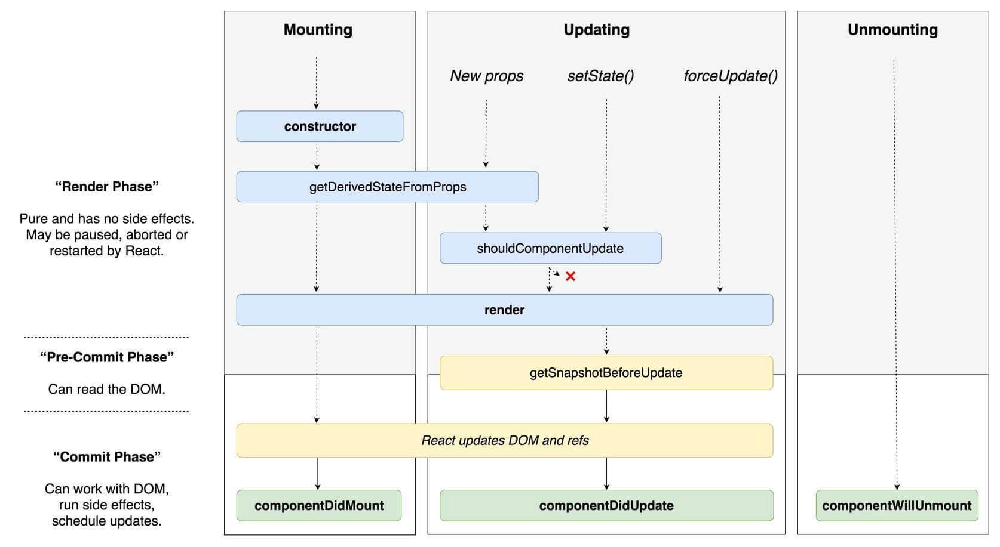
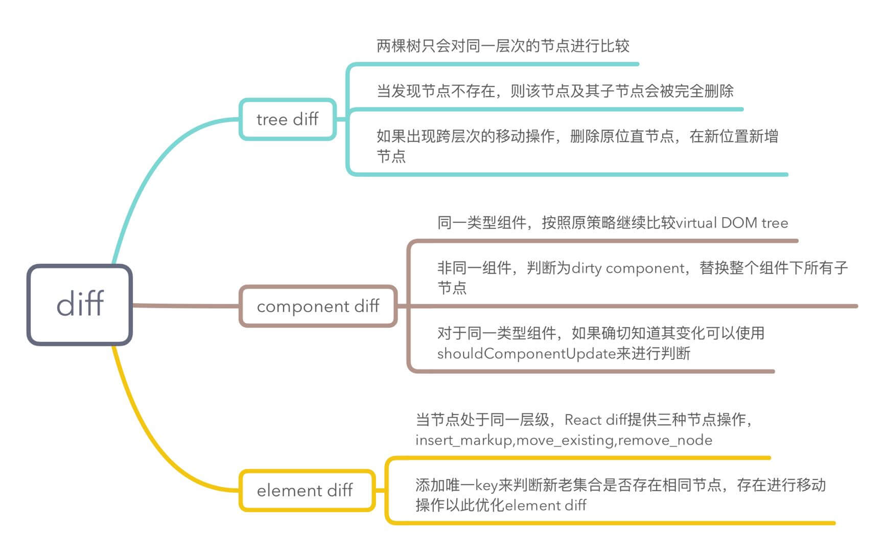
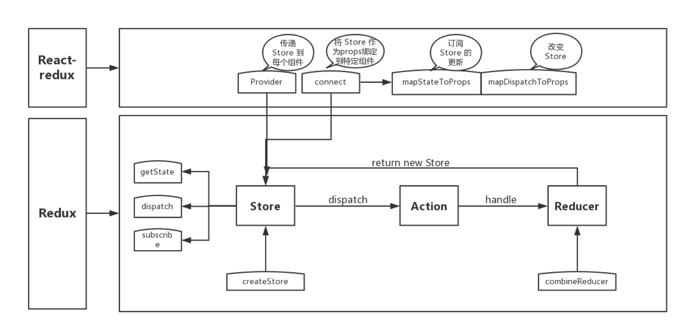

# React

## Fiber

[原文](https://juejin.im/post/5c92f499f265da612647b754)

产生原因：

随着应用变得越来越庞大，整个更新渲染的过程开始变得吃力，大量的组件渲染会导致主进程长时间被占用，
导致一些动画或高频操作出现卡顿和掉帧的情况。而关键点，便是`同步阻塞`。
在之前的`reconcilation`调度算法中，React 需要实例化每个类组件，生成一颗组件树，使用`同步递归`的方式进行遍历渲染，而这个过程最大的问题就是无法`暂停和恢复`

解决方法：

解决同步阻塞的方法，通常有两种: `异步`与`任务分割`。而 React Fiber 便是为了实现任务分割而诞生的

简述：

- 在 React V16 将调度算法进行了重构， 将之前的 stack reconciler 重构成新版的 fiber reconciler，变成了具有链表和指针的`单链表树遍历算法`。通过指针映射，每个单元都记录着遍历当下的上一步与下一步，从而使遍历变得可以被暂停和重启
- 这里我理解为是一种`任务分割调度算法`，主要是 将原先同步更新渲染的任务分割成一个个独立的`小任务单位`，根据不同的优先级，将小任务分散到浏览器的空闲时间执行，充分利用主进程的事件循环机制

核心：

```js
class Fiber {
  constructor(instance) {
    this.instance = instance;
    // 指向第一个 child 节点
    this.child = child;
    // 指向父节点
    this.return = parent;
    // 指向第一个兄弟节点
    this.sibling = previous;
  }
}
```

- **链表树遍历算法**: 通过`节点保存与映射`，便能够随时地进行 停止和重启，这样便能达到实现任务分割的基本前提

  1. 首先通过不断遍历子节点，到树末尾
  2. 开始通过 sibling 遍历兄弟节点
  3. return 返回父节点，继续执行 2
  4. 直到 root 节点后，跳出遍历

- **任务分割**，React 中的渲染更新可以分成两个阶段:

  - **reconciliation**阶段: vdom 的数据对比，是个适合拆分的阶段，比如对比一部分树后，先暂停执行个动画调用，待完成后再回来继续比对
  - **Commit**阶段: 将 change list 更新到 dom 上，并不适合拆分，才能保持数据与 UI 的同步。否则可能由于阻塞 UI 更新，
    而导致数据更新和 UI 不一致的情况

- **分散执行**: 任务分割后，就可以把小任务单元分散到浏览器的空闲期间去排队执行，
  而实现的关键是两个新 API: `requestIdleCallback`与 `requestAnimationFrame`

  - 低优先级的任务交给`requestIdleCallback`处理，这是个浏览器提供的事件循环空闲期的回调函数，需要 pollyfill，
    而且拥有 deadline 参数，限制执行事件，以继续切分任务

  - 高优先级的任务交给`requestAnimationFrame`处理

    ```js
    // 类似于这样的方式
    requestIdleCallback((deadline) => {
      // 当有空闲时间时，我们执行一个组件渲染；
      // 把任务塞到一个个碎片时间中去；
      while (
        (deadline.timeRemaining() > 0 || deadline.didTimeout) &&
        nextComponent
      ) {
        nextComponent = performWork(nextComponent);
      }
    });
    ```

- **优先级策略**:文本框输入 > 本次调度结束需完成的任务 > 动画过渡 > 交互反馈 > 数据更新 > 不会显示但以防将来会显示的任务

## 生命周期

v16.3 版本之前的生命周期


在 v16.3 中，React 对生命周期有了新的`变动建议`



- 使用`getDerivedStateFromProps`替换`componentWillMount`
- 使用`getSnapshotBeforeUpdate`替换`componentWillUpdate`
- 避免使用`componentWillReceiveProps`

在 v16.4 中，修正了 getDerivedStateFromProps


其实该变动的原因，正是由于上述提到的 Fiber。首先，从上面我们知道 React 可以分成 reconciliation 与 commit 两个阶段，对应的生命周期如下:

- reconciliation

  - componentWillMount
  - componentWillReceiveProps
  - shouldComponentUpdate
  - componentWillUpdate

- commit
  - componentDidMount
  - componentDidUpdate
  - componentWillUnmount

在 Fiber 中，reconciliation 阶段进行了任务分割，涉及到 暂停 和 重启，因此可能会导致 reconciliation 中的生命周期函数在一次更新渲染循环中被`多次调用`的情况，产生一些意外错误

新的生命周期如下：

```js
class Component extends React.Component {
  // 替换 `componentWillReceiveProps` ，
  // 初始化和 update 时被调用
  // 静态函数，无法使用 this
  static getDerivedStateFromProps(nextProps, prevState) {}

  // 判断是否需要更新组件
  // 可以用于组件性能优化
  shouldComponentUpdate(nextProps, nextState) {}

  // 组件被挂载后触发
  componentDidMount() {}

  // 替换 componentWillUpdate
  // 可以在更新之前获取最新 dom 数据
  getSnapshotBeforeUpdate() {}

  // 组件更新后调用
  componentDidUpdate() {}

  // 组件即将销毁
  componentWillUnmount() {}

  // 组件已销毁
  componentDidUnMount() {}
}
```

### 新的生命周期用法


## setState

### setState 特点:

- **异步与同步**： setState 并不是单纯的异步或同步，这其实与调用时的环境相关

  - 在**合成事件**和**生命周期钩子(除 componentDidUpdate)**中，setState 是“异步”的

    - 原因：因为在 setState 的实现中，有一个判断: 当更新策略正在事务流的执行中时，该组件更新会被推入 dirtyComponents 队列中等待执行；否则，开始执行 batchedUpdates 队列更新

      - 在生命周期钩子调用中，更新策略都处于更新之前，组件仍处于事务流中，而 componentDidUpdate 是在更新之后，此时组件已经不在事务流中了，因此则会同步执行
      - 在合成事件中，React 是基于**事务流完成的事件委托机制**实现，也是处于事务流中

    - 问题：无法在 setState 后马上从 this.state 上获取更新后的值

    - 解决：如果需要马上同步去获取新值，setState 其实是可以传入第二个参数的。setState(updater, callback)，在回调中即可获取最新值

  - 在**原生事件**和**setTimeout**中，setState 是同步的，可以马上获得更新后的值

    - 原因：原生事件是浏览器本身的实现，与事务流无关，自然是同步；而 setTimeout 是放置于定时器线程中延后执行，此时事务流已结束，因此也是同步

- **批量更新**：在**合成事件**和**生命周期钩子**中，setState 更新队列时，存储的是**合并状态**(Object.assign)。
  因此前面设置的 key 值会被后面所覆盖，最终只会执行一次更新

- **函数式**：于 Fiber 及 合并 的问题，官方推荐可以传入 函数 的形式。setState(fn)，在 fn 中返回新的 state 对象即可，
  例如 this.setState((state, props) => newState)

  - 使用函数式，可以用于避免 setState 的批量更新的逻辑，传入的函数将会被 顺序调用。

#### 旧版本 setState 源码分析（<=15）

setState 的主要逻辑都在 ReactUpdateQueue 中实现，在调用 setState 后，并没有立即修改 state，而是将传入的参数放到了组件内部的 \_pendingStateQueue 中，之后调用 enqueueUpdate 来进行更新。

```js
// 对外暴露的 React.Component
function ReactComponent() {
  this.updater = ReactUpdateQueue;
}
//setState 方法挂载到原型链上
ReactComponent.prototype.setState = function(partialState, callback) {
  // 调用 setState 后，会调用内部的 updater.enqueueSetState
  this.updater.enqueueSetState(this, partialState);
  if (callback) {
    this.updater.enqueueCallback(this, callback, "setState");
  }
};

var ReactUpdateQueue = {
  enqueueSetState(component, partialState) {
    // 在组件的 _pendingStateQueue 上暂存新的 state
    if (!component._pendingStateQueue) {
      component._pendingStateQueue = [];
    }
    var queue = component._pendingStateQueue;
    queue.push(partialState);
    enqueueUpdate(component);
  },
  enqueueCallback: function(component, callback, callerName) {
    // 在组件的 _pendingCallbacks 上暂存 callback
    if (component._pendingCallbacks) {
      component._pendingCallbacks.push(callback);
    } else {
      component._pendingCallbacks = [callback];
    }
    enqueueUpdate(component);
  },
};
```

enqueueUpdate 首先会通过 batchingStrategy.isBatchingUpdates 判断当前是否在更新流程，如果不在更新流程，会调用 batchingStrategy.batchedUpdates () 进行更新。如果在流程中，会将待更新的组件放入 dirtyComponents 进行缓存。

```js
var dirtyComponents = [];
function enqueueUpdate(component) {
  if (!batchingStrategy.isBatchingUpdates) {
    // 开始进行批量更新
    batchingStrategy.batchedUpdates(enqueueUpdate, component);
    return;
  }
  // 如果在更新流程，则将组件放入脏组件队列，表示组件待更新
  dirtyComponents.push(component);
}
```

batchingStrategy 是 React 进行批处理的一种策略，该策略的实现基于 Transaction，虽然名字和数据库的事务一样，但是做的事情却不一样。

```js
class ReactDefaultBatchingStrategyTransaction extends Transaction {
  constructor() {
    this.reinitializeTransaction();
  }
  getTransactionWrappers() {
    return [
      {
        initialize: () => {},
        close: ReactUpdates.flushBatchedUpdates.bind(ReactUpdates),
      },
      {
        initialize: () => {},
        close: () => {
          ReactDefaultBatchingStrategy.isBatchingUpdates = false;
        },
      },
    ];
  }
}

var transaction = new ReactDefaultBatchingStrategyTransaction();

var batchingStrategy = {
  // 判断是否在更新流程中
  isBatchingUpdates: false,
  // 开始进行批量更新
  batchedUpdates: function(callback, component) {
    // 获取之前的更新状态
    var alreadyBatchingUpdates = ReactDefaultBatchingStrategy.isBatchingUpdates;
    // 将更新状态修改为 true
    ReactDefaultBatchingStrategy.isBatchingUpdates = true;
    if (alreadyBatchingUpdates) {
      // 如果已经在更新状态中，等待之前的更新结束
      return callback(callback, component);
    } else {
      // 进行更新
      return transaction.perform(callback, null, component);
    }
  },
};
```

Transaction 通过 perform 方法启动，然后通过扩展的 getTransactionWrappers 获取一个数组，该数组内存在多个 wrapper 对象，每个对象包含两个属性：initialize、close。perform 中会先调用所有的 wrapper.initialize，然后调用传入的回调，最后调用所有的 wrapper.close。

```js
class Transaction {
  reinitializeTransaction() {
    this.transactionWrappers = this.getTransactionWrappers();
  }
  perform(method, scope, ...param) {
    this.initializeAll(0);
    var ret = method.call(scope, ...param);
    this.closeAll(0);
    return ret;
  }
  initializeAll(startIndex) {
    var transactionWrappers = this.transactionWrappers;
    for (var i = startIndex; i < transactionWrappers.length; i++) {
      var wrapper = transactionWrappers[i];
      wrapper.initialize.call(this);
    }
  }
  closeAll(startIndex) {
    var transactionWrappers = this.transactionWrappers;
    for (var i = startIndex; i < transactionWrappers.length; i++) {
      var wrapper = transactionWrappers[i];
      wrapper.close.call(this);
    }
  }
}
```

我们简化一下代码，再重新看一下 setState 的流程。

```js
// 1. 调用 Component.setState
ReactComponent.prototype.setState = function(partialState) {
  this.updater.enqueueSetState(this, partialState);
};

// 2. 调用 ReactUpdateQueue.enqueueSetState，将 state 值放到 _pendingStateQueue 进行缓存
var ReactUpdateQueue = {
  enqueueSetState(component, partialState) {
    var queue =
      component._pendingStateQueue || (component._pendingStateQueue = []);
    queue.push(partialState);
    enqueueUpdate(component);
  },
};

// 3. 判断是否在更新过程中，如果不在就进行更新
var dirtyComponents = [];
function enqueueUpdate(component) {
  // 如果之前没有更新，此时的 isBatchingUpdates 肯定是 false
  if (!batchingStrategy.isBatchingUpdates) {
    // 调用 batchingStrategy.batchedUpdates 进行更新
    batchingStrategy.batchedUpdates(enqueueUpdate, component);
    return;
  }
  dirtyComponents.push(component);
}

// 4. 进行更新，更新逻辑放入事务中进行处理
var batchingStrategy = {
  isBatchingUpdates: false,
  // 注意：此时的 callback 为 enqueueUpdate
  batchedUpdates: function(callback, component) {
    var alreadyBatchingUpdates = ReactDefaultBatchingStrategy.isBatchingUpdates;
    ReactDefaultBatchingStrategy.isBatchingUpdates = true;
    if (alreadyBatchingUpdates) {
      // 如果已经在更新状态中，重新调用 enqueueUpdate，将 component 放入 dirtyComponents
      return callback(callback, component);
    } else {
      // 进行事务操作
      return transaction.perform(callback, null, component);
    }
  },
};
```

### 事务

是 React 中的一个调用结构，用于包装一个方法，结构为: **initialize - perform(method) - close**。通过事务，可以统一管理一个方法的开始与结束；处于事务流中，表示进程正在执行一些操作

```js
/*
 *                       wrappers (injected at creation time)
 *                                      +        +
 *                                      |        |
 *                    +-----------------|--------|--------------+
 *                    |                 v        |              |
 *                    |      +---------------+   |              |
 *                    |   +--|    wrapper1   |---|----+         |
 *                    |   |  +---------------+   v    |         |
 *                    |   |          +-------------+  |         |
 *                    |   |     +----|   wrapper2  |--------+   |
 *                    |   |     |    +-------------+  |     |   |
 *                    |   |     |                     |     |   |
 *                    |   v     v                     v     v   | wrapper
 *                    | +---+ +---+   +---------+   +---+ +---+ | invariants
 * perform (anyMethod) | |   | |   |   |         |   |   | |   | | maintained
 * +----------------->|-|---|-|---|-->|anyMethod|---|---|-|---|-|-------->
 *                    | |   | |   |   |         |   |   | |   | |
 *                    | |   | |   |   |         |   |   | |   | |
 *                    | |   | |   |   |         |   |   | |   | |
 *                    | +---+ +---+   +---------+   +---+ +---+ |
 *                    |  initialize                    close    |
 *                    +-----------------------------------------+
 */
```

启动事务可以拆分成三步来看：

1. 先执行 wrapper 的 initialize，此时的 initialize 都是一些空函数，可以直接跳过；
2. 然后执行 callback（也就是 enqueueUpdate），执行 enqueueUpdate 时，由于已经进入了更新状态，batchingStrategy.isBatchingUpdates 被修改成了 true，所以最后还是会把 component 放入脏组件队列，等待更新；
3. 后面执行的两个 close 方法，第一个方法的 flushBatchedUpdates 是用来进行组件更新的，第二个方法用来修改更新状态，表示更新已经结束。

```js
getTransactionWrappers () {
  return [
    {
      initialize: () => {},
      close: ReactUpdates.flushBatchedUpdates.bind(ReactUpdates)
    },
    {
      initialize: () => {},
      close: () => {
        ReactDefaultBatchingStrategy.isBatchingUpdates = false;
      }
    }
  ]
}
```

flushBatchedUpdates 里面会取出所有的脏组件队列进行 diff，最后更新到 DOM

```js
function flushBatchedUpdates() {
  if (dirtyComponents.length) {
    runBatchedUpdates();
  }
}

function runBatchedUpdates() {
  // 省略了一些去重和排序的操作
  for (var i = 0; i < dirtyComponents.length; i++) {
    var component = dirtyComponents[i];

    // 判断组件是否需要更新，然后进行 diff 操作，最后更新 DOM。
    ReactReconciler.performUpdateIfNecessary(component);
  }
}
```

performUpdateIfNecessary () 会调用 Component.updateComponent ()，在 updateComponent () 中，会从 \_pendingStateQueue 中取出所有的值来更新。

```js
// 获取最新的 state
_processPendingState() {
  var inst = this._instance;
  var queue = this._pendingStateQueue;

  var nextState = { ...inst.state };
  for (var i = 0; i < queue.length; i++) {
    var partial = queue[i];
    Object.assign(
      nextState,
      typeof partial === 'function' ? partial(inst, nextState) : partial
   );
  }
  return nextState;
}
// 更新组件
updateComponent(prevParentElement, nextParentElement) {
  var inst = this._instance;
  var prevProps = prevParentElement.props;
  var nextProps = nextParentElement.props;
  var nextState = this._processPendingState();
  var shouldUpdate =
      !shallowEqual(prevProps, nextProps) ||
      !shallowEqual(inst.state, nextState);

  if (shouldUpdate) {
    //diff 、update DOM
  } else {
    inst.props = nextProps;
    inst.state = nextState;
  }
  // 后续的操作包括判断组件是否需要更新、diff、更新到 DOM
}
```

## diff



## Render Props

The Render Props 是一种在不重复代码的情况下共享组件间功能的方法。

```js
<DataProvider render={(data) => <h1>Hello {data.target}</h1>} />
```

通过使用 prop 来定义呈现的内容，组件只是注入功能，而不需要知道它如何应用于 UI。render prop 模式意味着用户通过定义单独组件来传递 prop 方法，来指示共享组件应该返回的内容。

Render Props 的核心思想是，通过一个函数将 class 组件的 state 作为 props 传递给纯函数组件

```js
import React from 'react';

const SharedComponent extends React.Component {
  state = {...}
  render() {
    return (
      <div>
        {this.props.render(this.state)}
      </div>
    );
  }
}

export default SharedComponent;
```

## HOC

> A higher-order component is a function that takes a component and returns a new component.

实现高阶组件的方式有以下两种:

- 属性代理(Props Proxy)
- 反向继承(Inheritance Inversion)

### 属性代理

#### 操作 props

```js
const HOC = (WrappedComponent) =>
  class WrapperComponent extends Component {
    render() {
      const newProps = {
        name: "HOC",
      };
      return <WrappedComponent {...this.props} />;
    }
  };
```

在上面的例子中，我们为被包裹组件(WrappedComponent)新增加了固定的 name 属性，因此 WrappedComponent 组件中就会多一个 name 的属性。

#### 获得 refs 的引用

我们在属性代理中，可以轻松的拿到被包裹的组件的实例引用(ref)，例如:

```js
import React, { Component } from "React";

const HOC = (WrappedComponent) =>
  class wrapperComponent extends Component {
    storeRef(ref) {
      this.ref = ref;
    }
    render() {
      return <WrappedComponent {...this.props} ref={::this.storeRef} />;
    }
  };
```

面的例子中，wrapperComponent 渲染接受后，我们就可以拿到 WrappedComponent 组件的实例，进而实现调用实例方法的操作(当然这样会在一定程度上是反模式的，不是非常的推荐)。

#### 抽象 state

属性代理的情况下，我们可以将被包裹组件(WrappedComponent)中的状态提到包裹组件中，一个常见的例子就是实现不受控组件到受控的组件的转变

```js
class WrappedComponent extends Component {
  render() {
    return <input name="name" {...this.props.name} />;
  }
}

const HOC = (WrappedComponent) =>
  class extends Component {
    constructor(props) {
      super(props);
      this.state = {
        name: "",
      };

      this.onNameChange = this.onNameChange.bind(this);
    }

    onNameChange(event) {
      this.setState({
        name: event.target.value,
      });
    }

    render() {
      const newProps = {
        value: this.state.name,
        onChange: this.onNameChange,
      };
      return <WrappedComponent {...this.props} {...newProps} />;
    }
  };
```

上面的例子中通过高阶组件，我们将不受控组件(WrappedComponent)成功的转变为受控组件

### 反向继承

反向继承是指返回的组件去继承之前的组件(这里都用 WrappedComponent 代指)

```js
const HOC = (WrappedComponent) =>
  class extends WrappedComponent {
    render() {
      return super.render();
    }
  };
```

我们可以看见返回的组件确实都继承自 WrappedComponent,那么所有的调用将是反向调用的(例如:super.render())，这也就是为什么叫做反向继承。

#### 渲染劫持

渲染劫持是指我们可以有意识地控制 WrappedComponent 的渲染过程，从而控制渲染控制的结果。例如我们可以根据部分参数去决定是否渲染组件:

```js
const HOC = (WrappedComponent) =>
  class extends WrappedComponent {
    render() {
      if (this.props.isRender) {
        return super.render();
      } else {
        return null;
      }
    }
  };
```

甚至我们可以修改修改 render 的结果:

```js
//例子来源于《深入React技术栈》

const HOC = (WrappedComponent) =>
  class extends WrappedComponent {
    render() {
      const elementsTree = super.render();
      let newProps = {};
      if (elementsTree && elementsTree.type === "input") {
        newProps = { value: "may the force be with you" };
      }
      const props = Object.assign({}, elementsTree.props, newProps);
      const newElementsTree = React.cloneElement(
        elementsTree,
        props,
        elementsTree.props.children,
      );
      return newElementsTree;
    }
  };
class WrappedComponent extends Component {
  render() {
    return <input value={"Hello World"} />;
  }
}
export default HOC(WrappedComponent);
//实际显示的效果是input的值为"may the force be with you"
```

### 参考文献

- React 高阶组件(HOC)入门指南：[https://github.com/MrErHu/blog/issues/4](https://github.com/MrErHu/blog/issues/4)

## mixin、HOC、render props、react-hooks 的优劣如何

### Mixin 的缺陷

- 组件与 Mixin 之间存在隐式依赖（Mixin 经常依赖组件的特定方法，但在定义组件时并不知道这种依赖关系）
- 多个 Mixin 之间可能产生冲突（比如定义了相同的 state 字段）
- Mixin 倾向于增加更多状态，这降低了应用的可预测性（The more state in your application, the harder it is to reason about it.），导致复杂度剧增
- 隐式依赖导致依赖关系不透明，维护成本和理解成本迅速攀升：
  - 难以快速理解组件行为，需要全盘了解所有依赖 Mixin 的扩展行为，及其之间的相互影响
  - 组价自身的方法和 state 字段不敢轻易删改，因为难以确定有没有 Mixin 依赖它
  - Mixin 也难以维护，因为 Mixin 逻辑最后会被打平合并到一起，很难搞清楚一个 Mixin 的输入输出

### HOC 相比 Mixin 的优势

- HOC 通过外层组件通过 Props 影响内层组件的状态，而不是直接改变其 State 不存在冲突和互相干扰,这就降低了耦合度
- 不同于 Mixin 的打平+合并，HOC 具有天然的层级结构（组件树结构），这又降低了复杂度。

### HOC 的缺陷

- 扩展性限制: HOC 无法从外部访问子组件的 State 因此无法通过 shouldComponentUpdate 滤掉不必要的更新,React 在支持 ES6 Class 之后提供了 React.PureComponent 来解决这个问题
- Ref 传递问题: Ref 被隔断,后来的 React.forwardRef 来解决这个问题
- Wrapper Hell: HOC 可能出现多层包裹组件的情况,多层抽象同样增加了复杂度和理解成本
- 命名冲突: 如果高阶组件多次嵌套,没有使用命名空间的话会产生冲突,然后覆盖老属性
- 不可见性: HOC 相当于在原有组件外层再包装一个组件,你压根不知道外层的包装是啥,对于你是黑盒

### Render Props 优点

上述 HOC 的缺点 Render Props 都可以解决

### Render Props 缺陷

- 使用繁琐: HOC 使用只需要借助装饰器语法通常一行代码就可以进行复用,Render Props 无法做到如此简单
- 嵌套过深: Render Props 虽然摆脱了组件多层嵌套的问题,但是转化为了函数回调的嵌套

### React Hooks 优点

- 简洁: React Hooks 解决了 HOC 和 Render Props 的嵌套问题,更加简洁
- 解耦: React Hooks 可以更方便地把 UI 和状态分离,做到更彻底的解耦
- 组合: Hooks 中可以引用另外的 Hooks 形成新的 Hooks,组合变化万千
- 函数友好: React Hooks 为函数组件而生,从而解决了类组件的几大问题:
  - this 指向容易错误
  - 分割在不同声明周期中的逻辑使得代码难以理解和维护
  - 代码复用成本高（高阶组件容易使代码量剧增）

### React Hooks 缺陷

- 额外的学习成本（Functional Component 与 Class Component 之间的困惑）
- 写法上有限制（不能出现在条件、循环中），并且写法限制增加了重构成本
- 破坏了 PureComponent、React.memo 浅比较的性能优化效果（为了取最新的 props 和 state，每次 render()都要重新创建事件处函数）
- 在闭包场景可能会引用到旧的 state、props 值
- 内部实现上不直观（依赖一份可变的全局状态，不再那么“纯”）
- React.memo 并不能完全替代 shouldComponentUpdate（因为拿不到 state change，只针对 props change）

## react-redux 是如何工作的

- Provider: Provider 的作用是从最外部封装了整个应用，并向 connect 模块传递 store
- connect: 负责连接 React 和 Redux
  - 获取 state: connect 通过 context 获取 Provider 中的 store，通过 store.getState()获取整个 store tree 上所有 state
  - 包装原组件: 将 state 和 action 通过 props 的方式传入到原组件内部 wrapWithConnect 返回一个 ReactComponent 对象 Connect，Connect 重新 render 外部传入的原组件 WrappedComponent，并把 connect 中传入的 mapStateToProps, mapDispatchToProps 与组件上原有的 props 合并后，通过属性的方式传给 WrappedComponent
  - 监听 store tree 变化: connect 缓存了 store tree 中 state 的状态,通过当前 state 状态和变更前 state 状态进行比较,从而确定是否调用 this.setState()方法触发 Connect 及其子组件的重新渲染



## redux 异步中间件之间的优劣

### redux-thunk 优点

- 体积小: redux-thunk 的实现方式很简单,只有不到 20 行代码
- 使用简单: redux-thunk 没有引入像 redux-saga 或 redux-observable 额外的范式,上手简单

### redux-thunk 缺陷

- 样板代码过多: 与 redux 本身一样,通常一个请求需要大量的代码,而且很多都是重复性质的
- 耦合严重: 异步操作与 redux 的 action 偶合在一起,不方便管理
- 功能孱弱: 有一些实际开发中常用的功能需要自己进行封装

### redux-saga 优点

- 异步解耦: 异步操作被被转移到单独 saga.js 中，不再是掺杂在 action.js 或 component.js 中
- action 摆脱 thunk function: dispatch 的参数依然是一个纯粹的 action (FSA)，而不是充满 “黑魔法” thunk function
- 异常处理: 受益于 generator function 的 saga 实现，代码异常/请求失败 都可以直接通过 try/catch 语法直接捕获处理
- 功能强大: redux-saga 提供了大量的 Saga 辅助函数和 Effect 创建器供开发者使用,开发者无须封装或者简单封装即可使用
- 灵活: redux-saga 可以将多个 Saga 可以串行/并行组合起来,形成一个非常实用的异步 flow
- 易测试，提供了各种 case 的测试方案，包括 mock task，分支覆盖等等

### redux-saga 缺陷

- 额外的学习成本: redux-saga 不仅在使用难以理解的 generator function,而且有数十个 API,学习成本远超 redux-thunk,最重要的是你的额外学习成本是只服务于这个库的,与 redux-observable 不同,redux-observable 虽然也有额外学习成本但是背后是 rxjs 和一整套思想
- 体积庞大: 体积略大,代码近 2000 行，min 版 25KB 左右
- 功能过剩: 实际上并发控制等功能很难用到,但是我们依然需要引入这些代码
- ts 支持不友好: yield 无法返回 TS 类型

### redux-observable 优点

- 功能最强: 由于背靠 rxjs 这个强大的响应式编程的库,借助 rxjs 的操作符,你可以几乎做任何你能想到的异步处理
- 背靠 rxjs: 由于有 rxjs 的加持,如果你已经学习了 rxjs,redux-observable 的学习成本并不高,而且随着 rxjs 的升级 redux-observable 也会变得更强大

### redux-observable 缺陷

- 学习成本奇高: 如果你不会 rxjs,则需要额外学习两个复杂的库
- 社区一般: redux-observable 的下载量只有 redux-saga 的 1/5,社区也不够活跃,在复杂异步流中间件这个层面 redux-saga 仍处于领导地位

## redux 与 mobx 的区别

- redux 将数据保存在单一的 store 中，mobx 将数据保存在分散的多个 store 中
- redux 使用 plain object 保存数据，需要手动处理变化后的操作；mobx 适用 observable 保存数据，数据变化后自动处理响应的操作
- redux 使用不可变状态，这意味着状态是只读的，不能直接去修改它，而是应该返回一个新的状态，同时使用纯函数；mobx 中的状态是可变的，可以直接对其进行修改
- mobx 相对来说比较简单，在其中有很多的抽象，mobx 更多的使用面向对象的编程思维；redux 会比较复杂，因为其中的函数式编程思想掌握起来不是那么容易，同时需要借助一系列的中间件来处理异步和副作用
- mobx 中有更多的抽象和封装，调试会比较困难，同时结果也难以预测；而 redux 提供能够进行时间回溯的开发工具，同时其纯函数以及更少的抽象，让调试变得更加的容易
  场景辨析:

基于以上区别,我们可以简单得分析一下两者的不同使用场景.

- mobx 更适合数据不复杂的应用: mobx 难以调试,很多状态无法回溯,面对复杂度高的应用时,往往力不从心.
- redux 适合有回溯需求的应用: 比如一个画板应用、一个表格应用，很多时候需要撤销、重做等操作，由于 redux 不可变的特性，天然支持这些操作.
- mobx 适合短平快的项目: mobx 上手简单,样板代码少,可以很大程度上提高开发效率.
- 当然 mobx 和 redux 也并不一定是非此即彼的关系,你也可以在项目中用 redux 作为全局状态管理,用 mobx 作为组件局部状态管理器来

## 为什么需要 Virtual DOM

首先,我们都知道在前端性能优化的一个秘诀就是尽可能少地操作 DOM,不仅仅是 DOM 相对较慢,更因为**频繁变动 DOM 会造成浏览器的回流或者重绘,这些都是性能的杀手,因此我们需要这一层抽象,在 patch 过程中尽可能地一次性将差异更新到 DOM 中**,这样保证了 DOM 不会出现性能很差的情况.

其次,现代前端框架的一个基本要求就是无须手动操作 DOM,一方面是因为**手动操作 DOM 无法保证程序性能**,多人协作的项目中如果 review 不严格,可能会有开发者写出性能较低的代码,另一方面更重要的是**省略手动 DOM 操作可以大大提高开发效率**.

最后,也是 Virtual DOM 最初的目的,就是更好的**跨平台**,比如 Node.js 就没有 DOM,如果想实现 SSR(服务端渲染),那么一个方式就是借助 Virtual DOM,因为 Virtual DOM 本身是 JavaScript 对象

## React Hooks

React Hooks 是 React 16.7.0 版本推出的新特性

React Hooks 要解决的问题是**状态共享**，是继 render-props 和 higher-order components 之后的第三种状态共享方案，不会产生 JSX **嵌套地狱**问题。

简单来说，Hook 解决的就是“嵌套地狱”的问题，正如 async 解决“回调地狱”一样。它们都做到了将原来不同“维度”的代码封装到了同一维度，以达到更直观、透明的将“计算结果”传递下去的目的。

而 class 不得不借助高阶组件等等概念，解决代码复用等问题，但是由于引入额外的概念（函数）反而使得代码更加复杂，现在的 class 难以解决这个问题，所以他就被抛弃了。

使用 useState 可以将 class 组件中的 state 部分解耦出来，作为一个函数单独在多个组件之间公用，而在 class 组件中就需要封装高阶组件然后以 props 的形式传给子组件

```js
function useCount() {
  const [count, setCount] = useState(0);
  return [count, setCount];
}
```

对于 useEffect 来说，可以用来实现 class 组件的生命周期

class 实现

```js
function useFriendStatus(WrappedComponent) {
  return class extends React.Component {
    componentDidMount() {
      ChatAPI.subscribeToFriendStatus(
        this.props.friend.id,
        this.handleStatusChange,
      );
    }

    componentDidUpdate(prevProps) {
      ChatAPI.unsubscribeFromFriendStatus(
        prevProps.friend.id,
        this.handleStatusChange,
      );
      ChatAPI.subscribeToFriendStatus(
        this.props.friend.id,
        this.handleStatusChange,
      );
    }

    componentWillUnmount() {
      ChatAPI.unsubscribeFromFriendStatus(
        this.props.friend.id,
        this.handleStatusChange,
      );
    }

    render() {
      return <WrappedComponent isOnline={isOnline} />;
    }
  };
}
```

react hooks 实现

```js
import React, { useState, useEffect } from "react";

function FriendStatus(props) {
  const [isOnline, setIsOnline] = useState(null);

  useEffect(() => {
    function handleStatusChange(status) {
      setIsOnline(status.isOnline);
    }

    ChatAPI.subscribeToFriendStatus(props.friend.id, handleStatusChange);
    // Specify how to clean up after this effect:
    return function cleanup() {
      ChatAPI.unsubscribeFromFriendStatus(props.friend.id, handleStatusChange);
    };
  });

  if (isOnline === null) {
    return "Loading...";
  }
  return isOnline ? "Online" : "Offline";
}

// FriendStatus获取好友状态
function FriendStatus(props) {
  const isOnline = useFriendStatus(props.friend.id);

  if (isOnline === null) {
    return "Loading...";
  }
  return isOnline ? "Online" : "Offline";
}

// FriendListItem获取好友状态
function FriendListItem(props) {
  const isOnline = useFriendStatus(props.friend.id);

  return (
    <li style={{ color: isOnline ? "green" : "black" }}>{props.friend.name}</li>
  );
}
```

上面例子中，使用 useEffect 能够将高阶组件的父组件生命周期中的含有副作用的功能解耦出去，避免了多一层的组件嵌套

useState 结合 useEffect 使用

```js
function useRepos(id) {
  const [repos, setRepos] = React.useState([]);
  const [loading, setLoading] = React.useState(true);

  React.useEffect(() => {
    setLoading(true);

    fetchRepos(id).then((repos) => {
      setRepos(repos);
      setLoading(false);
    });
  }, [id]);

  return [loading, repos];
}
```

- Talking about hooks：[https://juejin.im/post/5d0ae589518825122925c2de](https://juejin.im/post/5d0ae589518825122925c2de)
- 为什么会出现 React Hooks?：[https://juejin.im/post/5d478b2d518825673a6ae1b9](https://juejin.im/post/5d478b2d518825673a6ae1b9)
