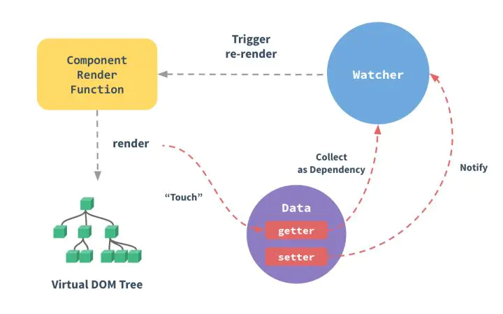

# Vue

## Vue依赖收集



每个组件实例都有相应的 Watcher 实例对象，它会在组件渲染的过程中把属性记录为依赖，之后当依赖项的 setter 被调用时，会通知 watcher 重新计算，从而致使它关联的组件得以更新。

- Observe 类主要给响应式对象的属性添加 getter/setter 用于依赖收集与派发更新
- Dep 类用于收集当前响应式对象的依赖关系
- Watcher 类是观察者，实例分为渲染 watcher(render)、计算属性 watcher(computed)、侦听器 watcher(watch)三种


### Observe

Vue中用Observer类来管理上述响应式化Object.defineProperty的过程

这个方法主要用 data 作为参数去实例化一个 Observer 对象实例，Observer 是一个 Class，用于依赖收集和 notify 更新，Observer 的构造函数使用 defineReactive 方法给对象的键响应式化，给对象的属性递归添加 getter/setter ，当data被取值的时候触发 getter 并搜集依赖，当被修改值的时候先触发 getter 再触发 setter 并派发更新

```js
// 监听者,监听对象属性值的变化
class Observer {
  constructor(value) {
    this.value = value;
    this.walk(value);
  }
  // 遍历属性值并监听
  walk(value) {
    Object.keys(value).forEach(key => this.convert(key, value[key]));
  }
  // 执行监听的具体方法
  convert(key, val) {
    defineReactive(this.value, key, val);
  }
}

function observe(value) {
  // 当值不存在，或者不是复杂数据类型时，不再需要继续深入监听
  if (!value || typeof value !== 'object') {
    return;
  }
  return new Observer(value);
}
```

defineReactive

```js
function defineReactive(obj, key, val) {
  const dep = new Dep();
  // 给当前属性的值添加监听
  let chlidOb = observe(val);
  Object.defineProperty(obj, key, {
    enumerable: true,
    configurable: true,
    get: () => {
      // 如果Dep类存在target属性，将其添加到dep实例的subs数组中
      // target指向一个Watcher实例，每个Watcher都是一个订阅者
      // Watcher实例在实例化过程中，会读取data中的某个属性，从而触发当前get方法
      if (Dep.target) {
        dep.depend();
      }
      return val;
    },
    set: newVal => {
      if (val === newVal) return;
      val = newVal;
      // 对新值进行监听
      chlidOb = observe(newVal);
      // 通知所有订阅者，数值被改变了
      dep.notify();
    },
  });
}
```

### Dep

```js
let uid = 0;
// 用于储存订阅者并发布消息
class Dep {
  constructor() {
    // 设置id,用于区分新Watcher和只改变属性值后新产生的Watcher
    this.id = uid++;
    // 储存订阅者的数组
    this.subs = [];
  }
  // 触发target上的Watcher中的addDep方法,参数为dep的实例本身
  depend() {
    Dep.target.addDep(this);
  }
  // 添加订阅者
  addSub(sub) {
    this.subs.push(sub);
  }
  notify() {
    // 通知所有的订阅者(Watcher)，触发订阅者的相应逻辑处理
    this.subs.forEach(sub => sub.update());
  }
}
// 为Dep类设置一个静态属性,默认为null,工作时指向当前的Watcher
Dep.target = null;
```

由于JavaScript是单线程模型，所以虽然有多个观察者函数，但是一个时刻内，就只会有一个观察者函数在执行，那么此刻正在执行的那个观察者函数，所对应的Watcher实例，便会被赋给Dep.target这一类变量，从而只要访问Dep.target就能知道当前的观察者是谁。 在后续的依赖收集工作里，getter里会调用dep.depend()，而setter里则会调用dep.notify()

### Watcher

Watcher订阅者作为Observer和Compile之间通信的桥梁，主要做的事情是:
1、在自身实例化时往属性订阅器(dep)里面添加自己
2、自身必须有一个update()方法
3、待属性变动dep.notice()通知时，能调用自身的update()方法，并触发Compile中绑定的回调，则功成身退。

```js
class Watcher {
  constructor(vm, expOrFn, cb) {
    this.depIds = {}; // hash储存订阅者的id,避免重复的订阅者
    this.vm = vm; // 被订阅的数据一定来自于当前Vue实例
    this.cb = cb; // 当数据更新时想要做的事情
    this.expOrFn = expOrFn; // 被订阅的数据
    this.val = this.get(); // 维护更新之前的数据
  }
  // 对外暴露的接口，用于在订阅的数据被更新时，由订阅者管理员(Dep)调用
  update() {
    this.run();
  }
  addDep(dep) {
    // 如果在depIds的hash中没有当前的id,可以判断是新Watcher,因此可以添加到dep的数组中储存
    // 此判断是避免同id的Watcher被多次储存
    if (!this.depIds.hasOwnProperty(dep.id)) {
      dep.addSub(this);
      this.depIds[dep.id] = dep;
    }
  }
  run() {
    const val = this.get();
    console.log(val);
    if (val !== this.val) {
      this.val = val;
      this.cb.call(this.vm, val);
    }
  }
  get() {
    // 当前订阅者(Watcher)读取被订阅数据的最新更新后的值时，通知订阅者管理员收集当前订阅者
    Dep.target = this;
    const val = this.vm._data[this.expOrFn];
    // 置空，用于下一个Watcher使用
    Dep.target = null;
    return val;
  }
}
```

### initState顺序

```js
// vue/src/core/instance/state.js
export function initState (vm: Component) {
  vm._watchers = []
  const opts = vm.$options
  if (opts.props) initProps(vm, opts.props)
  if (opts.methods) initMethods(vm, opts.methods)
  if (opts.data) {
    initData(vm)
  } else {
    observe(vm._data = {}, true /* asRootData */)
  }
  if (opts.computed) initComputed(vm, opts.computed)
  if (opts.watch && opts.watch !== nativeWatch) {
    initWatch(vm, opts.watch)
  }
}
```

### 参考文献

- Vue源码阅读 - 依赖收集原理：[https://juejin.im/post/5b40c8495188251af3632dfa](https://juejin.im/post/5b40c8495188251af3632dfa)
- Vue响应式原理-理解Observer、Dep、Watcher：[https://juejin.im/post/5cf3cccee51d454fa33b1860](https://juejin.im/post/5cf3cccee51d454fa33b1860)
- Vue源码解读之Dep,Observer和Watcher：[https://segmentfault.com/a/1190000016208088](https://segmentfault.com/a/1190000016208088)

## 生命周期

### 生命周期示意图


## Vue组件通信

- props/$emit+v-on: 通过props将数据自上而下传递，而通过$emit和v-on来向上传递信息。
- EventBus: 通过EventBus进行信息的发布与订阅
- vuex: 是全局数据管理库，可以通过vuex管理全局的数据流
- $parent/$children: 访问父 / 子实例
- $ref: 如果在普通的 DOM 元素上使用，引用指向的就是 DOM 元素；如果用在子组件上，引用就指向组件实例
- $attrs/$listeners: Vue2.4中加入的$attrs/$listeners可以进行跨级的组件通信
- provide/inject：以允许一个祖先组件向其所有子孙后代注入一个依赖，不论组件层次有多深，并在起上下游关系成立的时间里始终生效，这成为了跨组件通信的基础

## Proxy与Object.defineProperty的优劣对比

Proxy的优势如下:

- Proxy可以直接监听对象而非属性
- Proxy可以直接监听数组的变化
- Proxy有多达13种拦截方法,不限于apply、ownKeys、deleteProperty、has等等是Object.defineProperty不具备的
- Proxy返回的是一个新对象,我们可以只操作新的对象达到目的,而Object.defineProperty只能遍历对象属性直接修改
- Proxy作为新标准将受到浏览器厂商重点持续的性能优化，也就是传说中的新标准的性能红利

Object.defineProperty的优势如下:

- 兼容性好,支持IE9

### Object.defineProperty不能监听数组吗

在一些技术博客上，我看到过这样一种说法，认为 Object.defineProperty 有一个缺陷是无法监听数组变化：

> 无法监控到数组下标的变化，导致直接通过数组的下标给数组设置值，不能实时响应。所以 Vue 才设置了 7 个变异数组（push、pop、shift、unshift、splice、sort、reverse）的 hack 方法来解决问题。
> Object.defineProperty的第一个缺陷, 无法监听数组变化。 然而 Vue 的文档提到了 Vue 是可以检测到数组变化的，但是只有以下八种方法,vm.items[indexOfItem] = newValue 这种是无法检测的。

```js
function defineReactive(data, key, value) {
  Object.defineProperty(data, key, {
    enumerable: true,
    configurable: true,
     get: function defineGet() {
      console.log(`get key: ${key} value: ${value}`)
      return value
    },
     set: function defineSet(newVal) {
      console.log(`set key: ${key} value: ${newVal}`)
      value = newVal
    }
  })
}
function observe(data) {
  Object.keys(data).forEach(function(key) {
    defineReactive(data, key, data[key])
  })
}
let arr = [1, 2, 3]
observe(arr);
```

Object.defineProperty 在数组中的表现和在对象中的表现是一致的，数组的索引就可以看做是对象中的 key。

1. 通过索引访问或设置对应元素的值时，可以触发 getter 和 setter 方法。
2. 通过 push 或 unshift 会增加索引，对于新增加的属性，需要再手动初始化才能被 observe。
3. 通过 pop 或 shift 删除元素，会删除并更新索引，也会触发 setter 和 getter 方法。

所以，Object.defineProperty是有监控数组下标变化的能力的，只是 Vue2.x 放弃了这个特性。

这种说法是有问题的，事实上，Object.defineProperty 本身是可以监控到数组下标的变化的，只是在 Vue 的实现中，从性能 / 体验的性价比考虑，放弃了这个特性。

### Proxy实现双向绑定

```js
const input = document.getElementById('input');
const p = document.getElementById('p');
const obj = {};

const newObj = new Proxy(obj, {
  get: function(target, key, receiver) {
    console.log(`getting ${key}!`);
    return Reflect.get(target, key, receiver);
  },
  set: function(target, key, value, receiver) {
    console.log(target, key, value, receiver);
    if (key === 'text') {
      input.value = value;
      p.innerHTML = value;
    }
    return Reflect.set(target, key, value, receiver);
  },
});

input.addEventListener('keyup', function(e) {
  newObj.text = e.target.value;
});
```

## 既然Vue通过数据劫持可以精准探测数据变化,为什么还需要虚拟DOM进行diff检测差异

现代前端框架有两种方式侦测变化,一种是pull一种是push

pull: 其代表为React,我们可以回忆一下React是如何侦测到变化的,我们通常会用setStateAPI显式更新,然后React会进行一层层的Virtual Dom Diff操作找出差异,然后Patch到DOM上,React从一开始就不知道到底是哪发生了变化,只是知道「有变化了」,然后再进行比较暴力的Diff操作查找「哪发生变化了」，另外一个代表就是Angular的脏检查操作。

push: Vue的响应式系统则是push的代表,当Vue程序初始化的时候就会对数据data进行依赖的收集,一但数据发生变化,响应式系统就会立刻得知,因此Vue是一开始就知道是「在哪发生变化了」,但是这又会产生一个问题,如果你熟悉Vue的响应式系统就知道,通常一个绑定一个数据就需要一个Watcher,一但我们的绑定细粒度过高就会产生大量的Watcher,这会带来内存以及依赖追踪的开销,而细粒度过低会无法精准侦测变化,因此Vue的设计是选择中等细粒度的方案,在组件级别进行push侦测的方式,也就是那套响应式系统,通常我们会第一时间侦测到发生变化的组件,然后在组件内部进行Virtual Dom Diff获取更加具体的差异,而Virtual Dom Diff则是pull操作,Vue是push+pull结合的方式进行变化侦测的。

所谓Push-based就是说，改动数据之后，数据本身会把这个改动推送出去，告知渲染系统自动进行渲染。在React里面，它是一个Pull的形式，用户要给系统一个明确的信号(setState)说明现在需要重新渲染了，这个系统才会重新渲染。两者并没有绝对的优劣之分，更多的也是思维模式和开发习惯的不同。

### 参考文献

- 既然Vue通过数据劫持可以精准探测数据变化,为什么还需要虚拟DOM进行diff检测差异：[https://www.cxymsg.com/guide/vue.html#vue](https://www.cxymsg.com/guide/vue.html#vue)

## Vue为什么没有类似于React中shouldComponentUpdate的生命周期

React是pull的方式侦测变化,当React知道发生变化后,会使用Virtual Dom Diff进行差异检测,但是很多组件实际上是肯定不会发生变化的,这个时候需要用shouldComponentUpdate进行手动操作来减少diff,从而提高程序整体的性能.

Vue是pull+push的方式侦测变化的,在一开始就知道那个组件发生了变化,因此在push的阶段并不需要手动控制diff,而组件内部采用的diff方式实际上是可以引入类似于shouldComponentUpdate相关生命周期的,但是通常合理大小的组件不会有过量的diff,手动优化的价值有限,因此目前Vue并没有考虑引入shouldComponentUpdate这种手动优化的生命周期。

### 参考文献

- Vue为什么没有类似于React中shouldComponentUpdate的生命周期：[https://www.cxymsg.com/guide/vue.html](https://www.cxymsg.com/guide/vue.html)

## Vue中的key到底有什么用

key是为Vue中的vnode标记的唯一id,通过这个key,我们的diff操作可以更准确、更快速

diff算法的过程中,先会进行新旧节点的首尾交叉对比,当无法匹配的时候会用新节点的key与旧节点进行比对,然后超出差异.

> diff程可以概括为：oldCh和newCh各有两个头尾的变量StartIdx和EndIdx，它们的2个变量相互比较，一共有4种比较方式。如果4种比较都没匹配，如果设置了key，就会用key进行比较，在比较的过程中，变量会往中间靠，一旦StartIdx>EndIdx表明oldCh和newCh至少有一个已经遍历完了，就会结束比较,这四种比较方式就是首、尾、旧尾新头、旧头新尾.

- 准确: 如果不加key,那么vue会选择复用节点(Vue的就地更新策略),导致之前节点的状态被保留下来,会产生一系列的bug.
- 快速: key的唯一性可以被Map数据结构充分利用,相比于遍历查找的时间复杂度O(n),Map的时间复杂度仅仅为O(1)。

### 参考文献

- Vue中的key到底有什么用：[https://www.cxymsg.com/guide/vue.html#vue中的key到底有什么用？](https://www.cxymsg.com/guide/vue.html#vue%E4%B8%AD%E7%9A%84key%E5%88%B0%E5%BA%95%E6%9C%89%E4%BB%80%E4%B9%88%E7%94%A8%EF%BC%9F)
