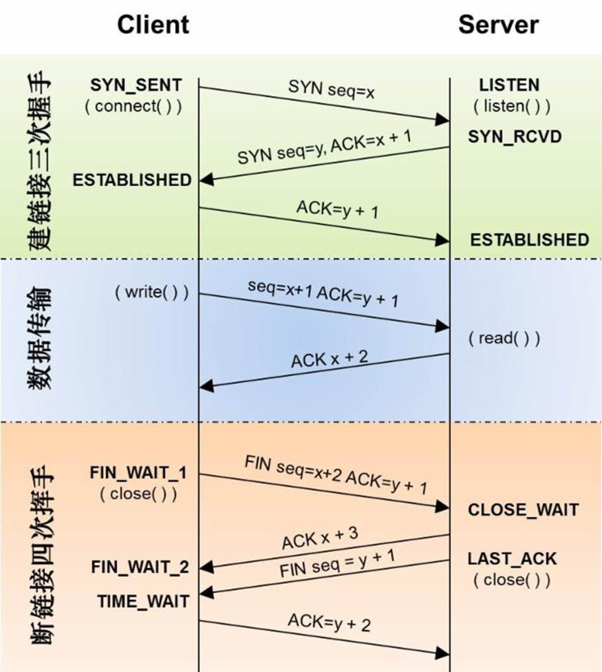

# 网络

## DNS域名解析

[原文](https://www.zhihu.com/question/23042131/answer/24922954)

- 浏览器缓存

    当用户通过浏览器访问某域名时，浏览器首先会在自己的缓存中查找是否有该域名对应的IP地址（若曾经访问过该域名且没有清空缓存便存在）

- 系统缓存

    当浏览器缓存中无域名对应IP则会自动检查用户计算机系统Hosts文件DNS缓存是否有该域名对应IP

- 路由器缓存

    当浏览器及系统缓存中均无域名对应IP则进入路由器缓存中检查，以上三步均为客服端的DNS缓存

- ISP（互联网服务提供商）DNS缓存

    当在用户客服端查找不到域名对应IP地址，则将进入ISP DNS缓存中进行查    询。比如你用的是电信的网络，则会进入电信的DNS缓存服务器中进行查找；　　
- 根域名服务器

    当以上均未完成，则进入根服务器进行查询。全球仅有13台根域名服务器，1个主根域名服务器，其余12为辅根域名服务器。根域名收到请求后会查看区域文件记录，若无则将其管辖范围内顶级域名（如.com）服务器IP告诉本地DNS服务器；

- 顶级域名服务器

    顶级域名服务器收到请求后查看区域文件记录，若无则将其管辖范围内主域名服务器的IP地址告诉本地DNS服务器；
　　
- 主域名服务器

    主域名服务器接受到请求后查询自己的缓存，如果没有则进入下一级域名服务器进行查找，并重复该步骤直至找到正确纪录；

- 保存结果至缓存

    本地域名服务器把返回的结果保存到缓存，以备下一次使用，同时将该结果反馈给客户端，客户端通过这个IP地址与web服务器建立链接

## TCP建立连接为何是三次握手

[原文](https://www.zhihu.com/question/24853633/answer/63668444)

在谢希仁著《计算机网络》第四版中讲“三次握手”的目的是“为了防止已失效的连接请求报文段突然又传送到了服务端，因而产生错误”。

在另一部经典的《计算机网络》一书中讲“三次握手”的目的是为了解决“网络中存在延迟的重复分组”的问题。

这两种不用的表述其实阐明的是同一个问题。

谢希仁版《计算机网络》中的例子是这样的，“已失效的连接请求报文段”的产生在这样一种情况下：client发出的第一个连接请求报文段并没有丢失，而是在某个网络结点长时间的滞留了，以致延误到连接释放以后的某个时间才到达server。
本来这是一个早已失效的报文段。但server收到此失效的连接请求报文段后，就误认为是client再次发出的一个新的连接请求。
于是就向client发出确认报文段，同意建立连接。假设不采用“三次握手”，那么只要server发出确认，新的连接就建立了。
由于现在client并没有发出建立连接的请求，因此不会理睬server的确认，也不会向server发送数据。
但server却以为新的运输连接已经建立，并一直等待client发来数据。
这样，server的很多资源就白白浪费掉了。
采用“三次握手”的办法可以防止上述现象发生。
例如刚才那种情况，client不会向server的确认发出确认。
server由于收不到确认，就知道client并没有要求建立连接。
