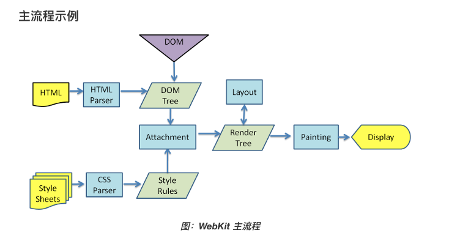

# 浏览器

## 进程 线程 携程

### 进程

进程（Process）是计算机中的程序关于某数据集合上的一次运行活动，是**系统进行资源分配和调度的基本单位**，是操作系统结构的基础。在早期面向进程设计的计算机结构中，进程是程序的基本执行实体；在当代面向线程设计的计算机结构中，进程是线程的容器。程序是指令、数据及其组织形式的描述，进程是程序的实体。

组成

进程是一个实体。每一个进程都有它自己的地址空间，一般情况下，包括文本区域（text region）、数据区域（data region）和堆栈（stack region）。文本区域存储处理器执行的代码；数据区域存储变量和进程执行期间使用的动态分配的内存；堆栈区域存储着活动过程调用的指令和本地变量。

特征

动态性：进程的实质是程序在多道程序系统中的一次执行过程，进程是动态产生，动态消亡的。
并发性：任何进程都可以同其他进程一起并发执行
独立性：进程是一个能独立运行的基本单位，同时也是系统分配资源和调度的独立单位；
异步性：由于进程间的相互制约，使进程具有执行的间断性，即进程按各自独立的、不可预知的速度向前推进
结构特征：进程由程序、数据和进程控制块三部分组成。
多个不同的进程可以包含相同的程序：一个程序在不同的数据集里就构成不同的进程，能得到不同的结果；但是执行过程中，程序不能发生改变。

### 线程

在多线程 OS 中，通常是在一个进程中包括多个线程，**每个线程都是作为利用 CPU 的基本单位**，是花费最小开销的实体。线程具有以下属性。

- 轻型实体
  线程中的实体基本上不拥有系统资源，只是有一点必不可少的、能保证独立运行的资源。
  线程的实体包括程序、数据和 TCB。线程是动态概念，它的动态特性由线程控制块 TCB（Thread Control Block）描述。TCB 包括以下信息：

  - 线程状态。
  - 当线程不运行时，被保存的现场资源。
  - 一组执行堆栈。
  - 存放每个线程的局部变量主存区。
  - 访问同一个进程中的主存和其它资源。
    用于指示被执行指令序列的程序计数器、保留局部变量、少数状态参数和返回地址等的一组寄存器和堆栈。

- 独立调度和分派的基本单位。
  在多线程 OS 中，线程是能独立运行的基本单位，因而也是独立调度和分派的基本单位。由于线程很“轻”，故线程的切换非常迅速且开销小（在同一进程中的）。

- 可并发执行。
  在一个进程中的多个线程之间，可以并发执行，甚至允许在一个进程中所有线程都能并发执行；同样，不同进程中的线程也能并发执行，充分利用和发挥了处理机与外围设备并行工作的能力。

- 共享进程资源。

在同一进程中的各个线程，都可以共享该进程所拥有的资源，这首先表现在：所有线程都具有相同的地址空间（进程的地址空间），这意味着，线程可以访问该地址空间的每一个虚地址；此外，还可以访问进程所拥有的已打开文件、定时器、信号量机构等。由于同一个进程内的线程共享内存和文件，所以线程之间互相通信不必调用内核。

### 协程

协程与子例程一样，协程（coroutine）也是一种程序组件。相对子例程而言，协程更为一般和灵活，但在实践中使用没有子例程那样广泛。
协程源自 Simula 和 Modula-2 语言，但也有其他语言支持。

协程不是进程或线程，其执行过程更类似于子例程，或者说不带返回值的函数调用。
一个程序可以包含多个协程，可以对比与一个进程包含多个线程，因而下面我们来比较协程和线程。我们知道多个线程相对独立，有自己的上下文，切换受系统控制；而协程也相对独立，有自己的上下文，但是其切换由自己控制，由当前协程切换到其他协程由当前协程来控制。

协程和线程区别：协程避免了无意义的调度，由此可以提高性能，但也因此，程序员必须自己承担调度的责任，同时，协程也失去了标准线程使用多 CPU 的能力。

## 浏览器内核

### 浏览器内核种类

| 浏览器  | 内核（渲染引擎）                | JavaScript 引擎 |
| ------- | ------------------------------- | --------------- |
| Chrome  | Blink（28~）Webkit（Chrome 27） | V8              |
| FireFox | Gecko                           | SpiderMonkey    |
| Safari  | Webkit                          | JavaScriptCore  |
| IE      | Trident                         | Chakra          |

### 浏览器进程

以 Chrome 浏览器为例，多进程架构包括：

- **浏览器进程**：选项卡之外的所有内容都由浏览器进程处理，浏览器进程则主要用于控制和处理用户可见的 UI 部分（包括地址栏，书签，后退和前进按钮）和负责与其他进程的协调工作，同时提供存储功能（以前还负责网络请求，现在这部分有单独的进程）
- **GPU 进程**：负责整个浏览器界面的渲染。Chrome 刚开始发布的时候是没有 GPU 进程的，而使用 GPU 的初衷是为了实现 3D CSS 效果，只是后面网页、Chrome 的 UI 界面都用 GPU 来绘制，这使 GPU 成为浏览器普遍的需求，最后 Chrome 在多进程架构上也引入了 GPU 进程
- **网络进程**：负责发起和接受网络请求，以前是作为模块运行在浏览器进程一时在面的，后面才独立出来，成为一个单独的进程
- **渲染器进程**：负责控制显示tab标签页内的所有内容，核心任务是将HTML、CSS、JS转为用户可以与之交互的网页，排版引擎Blink和JS引擎V8都是运行在该进程中，默认情况下Chrome会为每个Tab标签页创建一个渲染进程
- **插件进程**：主要是负责插件的运行，因为插件可能崩溃，所以需要通过插件进程来隔离，以保证插件崩溃也不会对浏览器和页面造成影响

### 浏览器内核是多线程

- GUI 渲染线程
- JavaScript 引擎线程
- 定时触发器线程
- 事件触发线程
- 异步 http 请求线程

### GUI 渲染线程

- 负责渲染浏览器界面，解析 HTML、CSS，构建 DOM 树、CSSOM 树和 RenderObject 树，布局和绘制等
- 当界面需要重绘（Repaint）或由于某种操作引发（reflow）时，该线程就会执行
- 注意，**GUI 渲染线程与 JS 引擎线程是互斥的**，当 JS 引擎执行时 GUI 线程会被挂起（相当于被冻结了），GUI 更会会保存在一个队列中**等到 JS 引擎空闲时**立即被执行

### JS 引擎线程

- 也称为 JS 内核，负责处理 Javascript 脚本程序（例如 V8 引擎）
- JS 引擎线程负责解析 Javascript 脚本，运行代码
- JS 引擎一直等待着任务队列中任务的到来，然后加以处理，一个 Tab 页中无论什么时候都只有一个 JS 引擎线程(单线程) 在运行程序
- 同样注意，**GUI 渲染线程和 JS 引擎线程是互斥的**，所以如果 JS 执行的时间过长，这样就会造成页面的渲染不连贯，导致页面渲染加载阻塞

### 事件触发线程

- 归属于浏览器而不是 JS 引擎，用来控制事件循环，**管理任务队列**
- 当 JS 引擎执行代码块如 setTimeout，鼠标点击，AJAX 异步请求时，会将对应任务添加到事件线程中
- 当对应的事件符合触发条件被触发时，该线程会把事件添加到待处理队列的队尾，等待 JS 引擎的处理
- 注意，由于 JS 的单线程关系，所以这些待处理队列中的事件都得排队等待 JS 引擎处理（当 JS 引擎空闲时才会去执行）

### 定时器触发线程

- setInterval 与 setTimeout 所在的线程
- 浏览器定时计数器并不是 JS 引擎计数的（因为 JS 引擎是单线程的，如果处于阻塞线程状态就会影响计时的准确）
- 因此通过单独线程来计时并触发定时（计时完毕后，添加到任务队列中，等待 JS 引擎空闲后执行）
- 注意，W3C 在 HTML 标准中规定，规定要求 setTimeout 中低于 4ms 的时间间隔算为 4ms

### 异步 http 请求线程

- 在 XMLHttpRequest 在连接后是通过浏览器新开一个线程请求
- 将检测到状态变更时，如果设置有回调函数，异步线程就产生状态变更事件，将这个回调再放入待处理队列中，等待 JS 引擎空闲执行

## Chromium 四种进程模式

Chromium 提供了四种进程模式，不同的进程模式会对 tab 进程做不同的处理，比如采用某个模式况会给 tab 分配新进程，而采用另外一个模式则不会，下面是四种模式的介绍，Chrome 默认采用第一个模式

- **Process-per-site-instance (default)** - 同一个 site-instance 使用一个进程
- **Process-per-site** - 同一个 site 使用一个进程
- **Process-per-tab** - 每个 tab 使用一个进程
- **Single process** - 所有 tab 共用一个进程

#### site 与 site-instance 的区别

- site 

    指的是相同的 registered domain name (e.g., http://google.com or http://bbc.co.uk) 和 scheme (e.g., https://) 。比如 https://z.baidu.com 和 https://b.baidu.com 就可以理解为同一个 site（注意这里要和 Same-origin policy 区分开来，同源策略还涉及到子域名和端口）

- site-instance

    指的是一组 connected pages from the same site，这里 connected 的定义是 can obtain references to each other in script code 怎么理解这段话呢。满足下面两中情况并且打开的新页面和旧页面属于上面定义的同一个 site，就属于同一个 site-instance

    - 用户通过 <a target="_blank"> 这种方式点击打开的新页面
    - JavaScript code 打开的新页面（比如 window.open)

Single process 和 Process-per-tab 就不用说了，意如其名。 如果使用 Process-per-site 模式，当你打开了一个 tab 访问 https://a.baidu.com，然后再打开一个 tab 访问 https://b.baidu.com，这两个 tab 其实用的是同一个进程，因为这两个 tab 被分在同一个 group。这就意味着，你在其中一个 tab 写一个死循环，这两个 tab 都会 hang

Process-per-site-instance 是最重要的，因为这个是 Chrome 默认使用的模式，也就是几乎所有的用户都在用的模式。当你打开一个 tab 访问 https://a.baidu.com，然后再打开一个 tab 访问 https://b.baidu.com，这两个 tab 会使用两个进程。如果 https://b.baidu.com 是通过 https://a.baidu.com 页面的 JavaScript 代码打开的，这两个 tab 会使用同一个进程，比如下图的例子，可以看到两个 tab 的 processId 是相同的

### 为什么使用 Process-per-site-instance 这种进程模式

因为这种模型兼顾了性能与易用性，是一个比较中庸通用的模式

- 相较于 Process-per-tab，能够少开很多进程，就意味着更少的内存占用
- 相较于 Process-per-site，能够更好的隔离相同域名下毫无关联的 tab，更加安全

同时这么做也满足了 different subdomains or ports of a site to access each other via Javascript 这种需求。

我们一开始的时候说过，同一个进程的多个线程是共享内存的。所以当两个 tab 使用同一个进程的时候，这两个 tab 就是“通的”。比如 A 页面使用 JavaScript 打开 B 页面，那么 B 页面可以通过 window.opener 访问 A 页面的 window 对象。

## load 事件与 DOMContentLoaded 事件的先后

- 当 DOMContentLoaded 事件触发时，仅当 DOM 加载完成，不包括样式表，图片。
  (譬如如果有 async 加载的脚本就不一定完成)
- 当 onload 事件触发时，页面上所有的 DOM，样式表，脚本，图片都已经加载完成了。（渲染完毕了）

顺序是：DOMContentLoaded -> load

DOMContentLoaded 的其他情况：

1. 如果页面中同时存在 css 和 js，并且存在 js 在 css 后面，则 DOMContentLoaded 事件会在 css 加载完后才执行，因为 js 下载解析执行使用 js 引擎线程阻塞 GUI 渲染线程。
2. 其他情况下，DOMContentLoaded 都不会等待 css 加载，并且 DOMContentLoaded 事件也不会等待图片、视频等其他资源加载。

当文档中没有脚本时，浏览器解析完文档便能触发 DOMContentLoaded 事件。如果文档中包含脚本，则脚本会阻塞文档的解析，而脚本需要等 CSSOM 构建完才能执行(JS 因为可能会去获取 DOM 的样式，所以 JS 会等待样式表加载完毕，而 JS 是阻塞 DOM 的解析的，所以在有外部样式表的时候，JS 会一直阻塞到外部样式表下载完毕)。在任何情况下 DOMContentLoaded 的触发不需要等待图片或其他资源加载完成。

## css 加载会造成阻塞吗

原文：[css 加载会造成阻塞吗](https://segmentfault.com/a/1190000018130499)

结论：

1. css 加载不会阻塞 DOM 树的解析
2. css 加载会阻塞 DOM 树的渲染
3. css 加载会阻塞后面 js 语句的执行

浏览器渲染流程如下：

1. 浏览器获取 HTML 文件，然后对文件进行解析，形成 DOM Tree
2. 与此同时，进行 CSS 解析，生成 Style Rules
3. 接着将 DOM Tree 与 Style Rules 合成为 Render Tree
4. 接着进入布局（Layout）阶段，也就是为每个节点分配一个应出现在屏幕上的确切坐标
5. 随后调用 GPU 进行绘制（Paint），遍历 Render Tree 的节点，并将元素呈现出来

解释：

1. DOM 解析和 CSS 解析是两个并行的进程，所以这也就是为什么 CSS 加载不会阻塞 DOM 的解析
2. 然而由于 Render 树是依赖 DOM 树和 CSSOM 树的，所以它必须等待到 CSSOM 树构建完成，也就是 CSS 资源加载完成（或加载失败）后，才能开始渲染。因此 CSS 加载是会阻塞 DOM 的渲染的
3. 由于 js 可能会操作之前的 DOM 节点和 CSS 样式，因此浏览器会维持 html 中 css 和 js 的顺序。因此样式表会在后面的 js 执行前先加载执行完成。所以 css 会阻塞后面的 js 执行

## 普通图层和复合图层

渲染步骤中就提到了 composite 概念。

可以简单的这样理解，浏览器渲染的图层一般包含两大类：普通图层以及复合图层。

首先，普通文档流内可以理解为一个复合图层（这里称为默认复合层，里面不管添加多少元素，其实都是在同一个复合图层中）

其次，absolute 布局（fixed 也一样），虽然可以脱离普通文档流，但它仍然属于默认复合层。

然后，可以通过硬件加速的方式，声明一个新的复合图层，它会单独分配资源
（当然也会脱离普通文档流，这样一来，不管这个复合图层中怎么变化，也不会影响默认复合层里的回流重绘）

可以简单理解下：GPU 中，各个复合图层是单独绘制的，所以互不影响，这也是为什么某些场景硬件加速效果一级棒

### 如何变成符合图层

将该元素变成一个复合图层，就是传说中的硬件加速技术

- 最常用的方式：translate3d、translateZ
- opacity 属性/过渡动画（需要动画执行的过程中才会创建合成层，动画没有开始或结束后元素还会回到之前的状态）
- will-chang 属性（这个比较偏僻），一般配合 opacity 与 translate 使用（而且经测试，除了上述可以引发硬件加速的属性外，其它属性并不会变成复合层），作用是提前告诉浏览器要变化，这样浏览器会开始做一些优化工作（这个最好用完后就释放）
- `<video><iframe><canvas><webgl>`等元素
- 其它，譬如以前的 flash 插件

### absolute 和硬件加速的区别

可以看到，absolute 虽然可以脱离普通文档流，但是无法脱离默认复合层。

所以，就算 absolute 中信息改变时不会改变普通文档流中 render 树，但是，浏览器最终绘制时，是整个复合层绘制的，所以 absolute 中信息的改变，仍然会影响整个复合层的绘制。

浏览器会重绘它，如果复合层中内容多，absolute 带来的绘制信息变化过大，资源消耗是非常严重的

而硬件加速直接就是在另一个复合层了（另起炉灶），所以它的信息改变不会影响默认复合层（当然了，内部肯定会影响属于自己的复合层），仅仅是引发最后的合成（输出视图）

### 复合图层的作用

一般一个元素开启硬件加速后会变成复合图层，可以独立于普通文档流中，改动后可以避免整个页面重绘，提升性能

但是尽量不要大量使用复合图层，否则由于资源消耗过度，页面反而会变的更卡

## 浏览器中页面的渲染过程

1. 页面导航：用户输入 URL，浏览器进程进行请求和准备处理
2. 页面渲染：获取到相关资源后，渲染器进程负责选项卡内部的渲染处理

### 页面导航过程

当用户在地址栏中输入内容时，浏览器内部会进行以下处理

1. 首首先浏览器进程的 UI 线程会进行处理：如果是 URI，则会发起网络请求来获取网站内容；如果不是，则进入搜索引擎。
2. 如果需要发起网络请求，请求过程由网络线程来完成。HTTP 请求响应如果是 HTML 文件，则将数据传递到渲染器进程；如果是其他文件则意味着这是下载请求，此时会将数据传递到下载管理器。
3. 如果请求响应为 HTML 内容，此时浏览器应导航到请求站点，网络线程便通知 UI 线程数据准备就绪。
4. 接下来，UI 线程会寻找一个渲染器进程来进行网页渲染。当数据和渲染器进程都准备好后，HTML 数据通过 IPC 从浏览器进程传递到渲染器进程中。
5. 渲染器进程接收 HTML 数据后，将开始加载资源并渲染页面。
6. 渲染器进程完成渲染后，通过 IPC 通知浏览器进程页面已加载。

### 页面渲染过程

流程如下

1. 解析（Parse）：解析 HTML/CSS/JavaScript 代码
   1. 解析 HTML 内容，产生一个 DOM 节点树
   2. 解析 CSS，产生 CSS 规则树
   3. 解析 JS 脚本，由于 JS 脚本可以通过 DOM API 和 CSS API 来操作 DOM 节点树和 CSS 规则树，因此该过程会等待 JS 运行完成才继续解析 HTML
   4. 解析完成后，我们得到了 DOM 节点树和 CSS 规则树，布局过程便是通过 DOM 节点树和 CSS 顾恩泽树来构造渲染树）（Render Tree）
2. 布局（layout）：定位坐标和大小、是否换行、各种 position/overflow/z-index 属性等计算
   1. 通过解析之后，渲染器进程知道每个节点的结构和样式，如果需要渲染页面，浏览器还需需要进行布局，布局过程便是我们常熟ode渲染书的创建过程
   2. 这个过程中，像 header 和 display:none 的元素，它们会存在 DOM 节点树中，但不会被添加到渲染树中
   3. 布局完成后，进入绘制环节
3. 绘制（Paint）：判断元素渲染层级顺序
   1. 在绘制步骤中，渲染器主线程会遍历渲染树来创建绘制记录
   2. 需要注意的是，如果渲染树发生了改变，则渲染器会触发重绘（Repaint）和重排（Reflow）
      - 重绘：屏幕的一部分要重画，比如某个 CSS 的背景色变了，但是元素的几何尺寸没有变
      - 重排：元素的几何尺寸变了（渲染树的一部分或全部发生了变化），需要重新验证并计算渲染树

      为了不对每个小的变化都进行完整的布局计算，渲染器会将更改的元素和它的子元素进行脏位标记，表示该元素需要重新布局。其中，全局样式更改会触发全局布局，部分样式或元素更改会触发增量布局，增量布局是异步完成的，全局布局则会同步触发
      
      重排需要涉及变更的所有的结点几何尺寸和位置，成本比重绘的成本高得多的多。所以我们要注意以避免频繁地进行增加、删除、修改 DOM 结点、移动 DOM 的位置、Resize 窗口、滚动等操作，因为这些操作可能会导致性能降低
    
4. 光栅化（Raster）：将计算后的信息转换为屏幕上的像素
   1. 通过解析、布局和绘制过程，浏览器获得了文档的结构、每个元素的样式、绘制顺序等信息。将这些信息转换为屏幕上的像素，这个过程被称为光栅化
   2. 光栅化可以被 GPU 加速，光栅化后的位图会被存储在 GPU 内存中。根据前面介绍的渲染流程，当页面布局变更了会触发重排和重绘，还需要重新进行光栅化。此时如果页面中有动画，则主线程中过多的计算任务很可能会影响动画的性能
   3. 因此，现代的浏览器通常使用合成的方式，将页面的各个部分分成若干层，分别对其进行栅格化（将它们分割成了不同的瓦片），并通过合成器线程进行页面的合成

      合成过程如下：
      1. 当主线程创建了合成层并确定了绘制顺序，便将这些信息提交给合成线程
      2. 合成器线程将每个图层栅格化，然后将每个图块发送给光栅线程
      3. 光栅线程栅格化每个瓦片，并将它们存储在 GPU 内存中
      4. 合成器线程通过 IPC 提交给浏览器进程，这些合成器帧被发送到 GPU 进程处理，并显示在屏幕上

      合成的真正目的是，在移动合成层的时候不用重新光栅化。因为有了合成器线程，页面才可以独立于主线程进行流畅的滚动