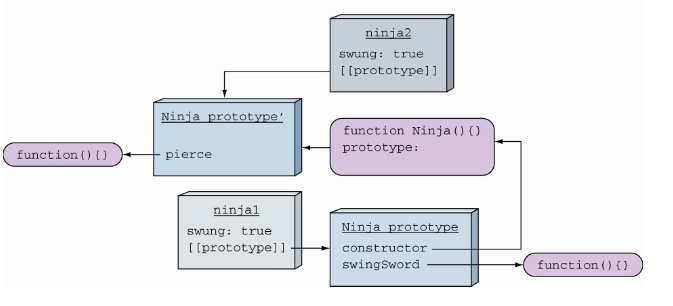
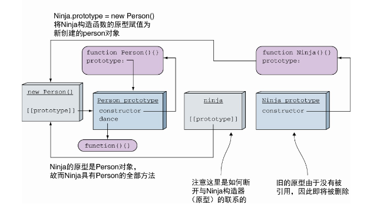
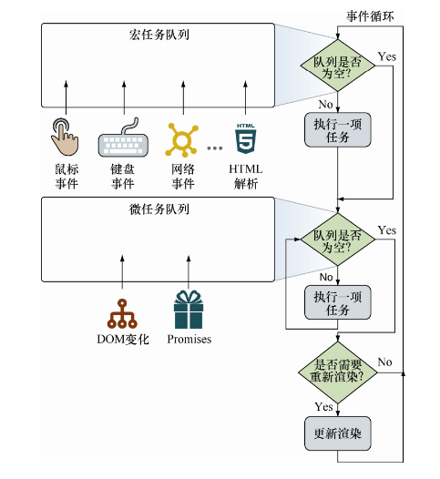

# Javascript 忍者秘籍（第二版）


## 3.4 函数的实参和形参

- 形参是我们定义函数时所列举的变量
- 实参是我们调用函数时所传递给函数的值

### 4.3.1 使用箭头函数绕过函数上下文

箭头函数作为回调函数还有一个更优秀的特性:箭头函数没有单独的this值。箭头函数的this与声明所在的上下文的相同。

```js
function Button(){
   this.clicked = false;
   this.click = () => {
    this.clicked = true;
    assert(button.clicked, "The button has been clicked");    };
}
```

调用箭头函数时，不会隐式传入this参数，而是从定义时的函数继承上下文。在本例中，箭头函数在构造函数内部，this指向新创建的对象本身，因此无论何时调用click函数，this都将指向新创建的button对象。

### 5.4.2 代码嵌套与词法环境

无论何时创建函数，都会创建一个与之相关联的词法环境，并存储 在名为[[Environment]]的内部属性上(也就是说无法直接访问或操作)。两个中括号用于标志内部属性。

无论何时调用函数，都会创建一个新的执行环境，被推入执行上下 文栈。此外，还会创建一个与之相关联的词法环境。现在来看最重要的部分:外部环境与新建的词法环境，JavaScript引擎将调用函数的内置[[Environment]]属性与创建函数时的环境进行关联。

### 5.5.2 定义变量的关键字和词法环境

- for循环存在块状作用域
- 关键字var定义的变量忽略块状作用域

### 5.5.3 在词法环境中注册标识符

JavaScript 代码执行分为两个阶段

1. 没有执行代码，但是 JavaScript 引擎会访问并注册在当前词法环境中所声明的变量和函数
2. 第二阶段
   1. 如果是创建一个函数环境，那么创建形参及函数参数的默认值。如果是非函数环境，将跳过此过程。
   2. 如果是创建全局或函数环境，就扫描当前代码进行函数声明（不会扫描其他函数的函数体），但是不会扫描函数表达式或箭头函数。对于所找到的函数声明，将创建函数，并绑定到当前环境与函数名形同的标识符上。**若标识符已经存在，那么该标识符的值将被重写**。如果是块级作用域，将跳过此步骤。
   3. 扫描当前代码进行变量声明。在函数或全局环境中，找到所有当前函数以及其他函数之外通过var声明的变量，并找到所有在其他函数或代码块之外通过let或const定义的变量。在块级环境中，仅查找当前 块中通过let或const定义的变量。对于所查找到的变量，若该标识符不存在，进行注册并将其初始化为undefined。**若该标识符已经存在，将保留其值**。

## 5.7 小结

- JavaScript 引擎通过此法案环境跟踪标识符（俗称作用域）


### 6.2.2 使用生成器

用生成器生成ID序列

```js
function* IdGenerator() {
  let id = 0;
  while (true) {
    yield ++id;
  }
}

const idIterator = IdGenerator();

const id1 = IdIterator.next().value;
const id2 = IdIterator.next().value;
...
```

### 6.2.4 探索生成器内部构成

迭代器执行过程

- 挂起开始——创建了一个生成器后，它最先以这种状态开始。其中的任何代码都未执行。
- 执行——生成器中的代码执行的状态。执行要么是刚开始，要么是从上次挂起的时候继续的。当生成器对应的迭代器调用了 next 方法，并且当前存在可执行的代码时，生成器都会转移到这个状态。
- 挂起让渡——当生成器在执行过程中遇到了一个 yield 表达式，它会创建一个包含着返回值的新对象，随后再挂起执行。生成器在这个状态暂停并等待继续执行。
- 完成——在生成器执行期间，如果代码执行到 return 语句或者全部代码执行完毕，生成器就进入该状态。

通过执行上下文跟踪生成器函数

- 当我们调用生成器函数时，控制流则进入了生成器，正如进入任何其他函数一样，当前将会创建一个新的函数环境上下文和相对应的词法字典并列，并将该上下文入栈。而生成器比较特殊，它不会执行任何函数代码。取而代之则生成一个新的迭代器再从中返回，通过在代码中用生成的迭代器变量可以来引用这个迭代器。由于迭代器是用来控制生成器的执行的，故而迭代器中保存着一个在它创建位置处的执行上下文。
- 当程序从生成器中执行完毕后，发生了一个有趣的现象。一般情况下，当程序从一个标准函数返回后，对应的执行环境上下文会从栈中弹出，并被完整地销毁。但在生成器中不是这样。
- 相对应的生长期会从栈中弹出，但由于迭代器还保存着对它的引用，所以它不会被销毁。你可以把它看作一种类似闭包的事物。在闭包中，为了在闭包创建的时候保证变量都可用，所以函数会对创建它的环境持有一个引用。以这种方式，我们能保证只要函数还存在，环境及变量就都存在着。生成器，从另一个角度看，还必须恢复执行。由于所有函数的执行都被执行上下文所控制，故而迭代器保持了一 个对当前执行环境的引用，保证只要迭代器还需要它的时候它都存在。
- 如果这只是一个普通的函数调用，这个语句会创建一个新的 next() 的执行环境上下文项，并放入栈中。但你可能注意到了，生成器绝不标准，对next方法调用的表现也很不同。它会重新激活对应的执行上下文，并把该上下文放入栈的 顶部，从它上次离开的地方继续执行。

## 7.1 理解原型

测试对象是否具有某一个特定的属性，我们可以使用操作符 in。

在 JavaScrip中，对象的原型属性是内置属性（使用标记[[prototype]]），无法直接访问

内置的Object.setPrototypeOf需要传入两个对象作为番薯，并将第二个参数对象设置为第一个对象的原型


### 7.2.2 JavaScript 动态特性的副作用

```js
function Ninja() {
	this.swung = true;
}

const ninja1 = new Ninja();

Ninja.prototype.swingSword = function() {
	return this.swung;
}
// 使用字面量对象重写 Ninja 的原型对象，仅有一个 pierce 方法

ninja1.swingSword(); // 尽管我们已经完全替换了Ninja的构造器原型，但是实例化后的 Ninja 对象扔具有 swingSword 方法，因为对象 ninja1 仍然保持着对旧的 Ninja 原型的引用

Ninja.prototype = {
  pierce: function() {
		return true;	
	}
}

ninja1.swingSword();

const ninja2 = new Ninja();

ninja2.pierce();
ninja2.swingSword;
// 新创建的 ninja2 实例拥有新原型的引用，因此不具有 swingSword 方法，仅具有 pierce 方法
```



## 7.3 实现继承

```js
function Person() {}

function Ninja() {}

Ninja.prototype = new Person(); // 丢失原始 Ninja.prototype 对象

const ninja = new Ninja();
```



### 7.3.1 重写 constructor 属性的问题

通过设置 Person 实例对象作为 Ninja 构造器的原型时，我们丢失了 Ninja 与 Ninja 初始原型之间的关联。

```js
ninja.constructor === Ninja // 失败，如上图所示，会找到 Person
```

通过使用 Object.defineProperty 来给 Ninja.prototype 增加新的 constructor 属性

```js
function Person () {}
Person.prototype.dance = function () {};

function Ninja () {}
Ninja.prototype = new Person();

Object.defineProperty(Ninja.prototype, 'constructor'， {
	enumerable: false, // 定义新的不可枚举的 constructor 属性，属性值为 Ninja 
	value: Ninja,
	writable: true
});

const ninja = new Ninja();
ninja.constructor === Ninja; // 成功
```

### 8.1.1 定义 getter 和 setter

在对象字面量中定义 getter 和 setter

```js
const ninjaCollection = {
  ninjas: ['a', 'b', 'c'],
  get firstNinja() {
    report('Getting firstNinja');
    return this.ninjas[0];
  }
  
  set firstNinja(value) {
    report('Setting firstNinja');
    this.ninjas[0] = value;
  }
};

ninjaCollection.firstNinja === 'a'; // get
ninjaCollection.firstNinja = 'd'; // set
```

在 class 中使用 getter 和 setter

```js
class NinjaCollection {
  constructor() {
    this.ninjas = ['a', 'b', 'c'];
  }
  
  get firstNinja() {
    report('Getting firstNinja');
    return this.ninjas[0];
  }
  
  set firstNinja(value) {
    report('Setting firstNinja');
    this.ninja[0] = value;
  }
}

const ninjaCollection = new NinjaCollection();
ninjaCollection.firstNinja === 'a'; // get
ninjaCollection.firstNinja = 'd'; //set
```

通过 Object.defineProperty 定义 getter 和 setter

```js
function Ninja() {
  let _skillLevel = 0;
  
  Object.defineProperty(this, 'skillLevel', {
    get: () => {
      report('The get method is called');
      return _skillLevel;
    },
    set: (value) => {
      report('The set method is called');
      _skillLevel = value;
    }
  })
}

const ninja = new Ninja();
ninja._skillLevel === 0;
ninja._skillLevel = 10;
```


## 8.2 使用代理控制访问

通过 Proxy 构造器创建代理

```js
const representative = new Proxy(emperor, {
  get: (target, key) => {
    report(`Reading ${key} through a proxy`);
    return key in target ? target[key] : 'Don`t bother the emperor';
  },
  set: (target, key, value) => {
  	report(`Writing ${key} through a proxy`);
  	target[key] = value;
	}
})
```

### 8.2.3 使用代理自动填充属性

```js
function Folder() {
  return Proxy({}, {
    get: (target, property) => {
      report(`Reading ${property}`);
      if (!(property in target)) {
        target[property] = new Folder();
      }
      return target[property];
    }
  })
}

const rootFolder = new Folder();
try {
  rootFolder.ninjasDir.firstNinjaDir.ninjaFile = 'yoshi.txt';
 	// 每当访问属性时，都会执行代理方法，若该属性不存在，则创建该属性
} catch (e) {
  // 使用代理不会抛出异常
}
```

## 8.2.5 代理的性能消耗

尽管使用代理可以创造性地控制对 象的访问，但是大量的控制操作将带来性能问题。可以在多性能不敏感 的程序里使用代理，但是若多次执行代码时仍然要小心谨慎。像往常一 样，我们建议你彻底地测试代码的性能。


### 9.2.1 别把对象当作 Map

由于这两个原因:

1. 原型继承属性

```js
const dictionary = {
  ja: {
   "Ninjas for hire": "レンタル用の忍者" },   "zh": {
   "Ninjas for hire": "忍者出租"
  },
  ko: {
   "Ninjas for hire":"고용 닌자"
   
   }
};
assert(dictionary.ja["Ninjas for hire"] === "レンタル用の忍者",     "We know how to say 'Ninjas for hire' in Japanese!");
assert(typeof dictionary.ja["constructor"] === "undefined",     dictionary.ja["constructor"]);
```

视同访问 constructor 属性，这是在字典中未定义的单词。在本例中我们期望字典返回 undefined。但是结果并非如此，返回的结果为 `"function Object() { [native code] }"`

2. key仅支持字符串

所以通常 不能使用对象作为map。由于这种限制，ECMAScript委员会定义了一个 全新类型: Map


## 13.1 深入事件循环

- 宏任务的例子很多，包括创建主文档对象、解析HTML、执行主线 (或全局)JavaScript代码，更改当前URL以及各种事件，如页面加载、 输入、网络事件和定时器事件。从浏览器的角度来看，宏任务代表一个 个离散的、独立工作单元。运行完任务后，浏览器可以继续其他调度， 如重新渲染页面的UI或执行垃圾回收。

- 而微任务是更小的任务。微任务更新应用程序的状态，但必须在浏 览器任务继续执行其他任务之前执行，浏览器任务包括重新渲染页面的 UI。微任务的案例包括promise回调函数、DOM发生变化等。微任务需 要尽可能快地、通过异步方式执行，同时不能产生全新的微任务。微任 务使得我们能够在重新渲染UI之前执行指定的行为，避免不必要的UI重 绘，UI重绘会使应用程序的状态不连续。

事件循环基于两个基本原则：

- 一次处理一个任务
- 一个任务开始后直到运行完成，不会被其他任务中断



事件循环将首先检查宏任 务队列，如果宏任务等待，则立即开始执行宏任务。直到该任务运行完 成(或者队列为空)，事件循环将移动去处理微任务队列。如果有任务 在该队列中等待，则事件循环将依次开始执行，完成一个后执行余下的 微任务，直到队列中所有微任务执行完毕。注意处理宏任务和微任务队 列之间的区别:单次循环迭代中，最多处理一个宏任务(其余的在队列 中等待)，而队列中的所有微任务都会被处理。

- 两类任务队列都是独立于事件循环的，这意味着任务队列的添加行 为也发生在事件循环之外。如果不这样设计，则会导致在执行 JavaScript代码时，发生的任何事件都将被忽略。正因为我们不希望 看到这种情况，因此检测和添加任务的行为，是独立于事件循环完成的。 
- 因为JavaScript基于单线程执行模型，所以这两类任务都是逐个执行 的。当一个任务开始执行后，在完成前，中间不会被任何其他任务 中断。除非浏览器决定中止执行该任务，例如，某个任务执行时间 过长或内存占用过大。
-  所有微任务会在下一次渲染之前执行完成，因为它们的目标是在渲 染前更新应用程序状态。 
- 浏览器通常会尝试每秒渲染60次页面，以达到每秒60帧(60 fps) 的速度。60fps通常是检验体验是否平滑流畅的标准，比方在动画 里——这意味着浏览器会尝试在16ms内渲染一帧。需要注意图13.1 所示的“更新渲染”是如何发生在事件循环内的，因为在页面渲染 时，任何任务都无法再进行修改。 这些设计和原则都意味着，如果想要实现平滑流畅的应用，我们是没有太多时间浪费在处理单个 事件循环任务的。理想情况下，单个任务和该任务附属的所有微任 务，都应在16ms内完成。


### 13.2.1 在事件循环中执行计时器

如果interval事件触发，并且队列中已经有对应的任务等待执行时，则不会再添加新任务

计时器提供一种异步延迟执行代 码片段的能力，至少要延迟指定的毫秒数。因为JavaScript单线程的本质，我们只能控制计时器何时被加入队列中，而无法控制何时执行。

```js
setTimeout(function repeatMe(){
  /* Some long block of code... */
  setTimeout(repeatMe, 10);
}, 10);   ⇽--- 注册延迟任务，每10ms重新执行自身（任务本身执行后才）


setInterval(() => {
  /* Some long block of code... */
}, 10);  ⇽--- 注册周期任务，每10ms执行一次任务
```

两段代码看起来功能是等价的，但实际未必。很明显，setTimeout 内的代码在前一个回调函数执行完成之后，至少延迟10ms执行(取决于事件队列的状态，等待时间只会大于10ms);

而setInterval会尝试每 10ms 执行回调函数，不关心前一个回调函数是否执行。从上一节的例子中可以看到，间隔执行函数可以一个接一个地依次执行。