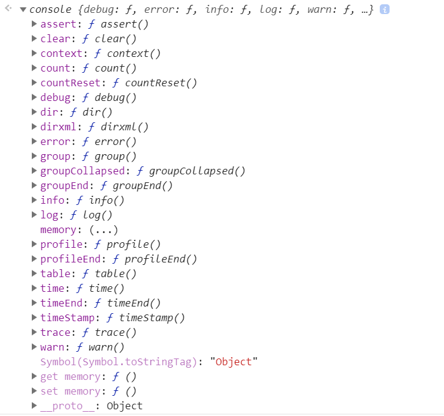
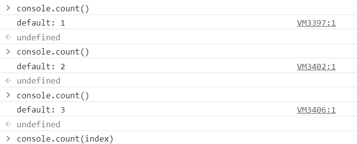
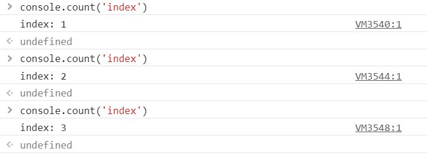
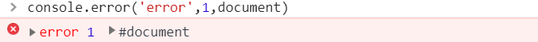

# Console方法详解

console中文翻译为控制台，在前端开发中，Console对象提供对浏览器控制台的接入。但不同浏览器间还是有撷取差别的，下文就Chrome举例说明一些常用console方法。



Console对象可以在任何全局对象中访问，如 Window，WorkerGlobalScope 以及通过属性工作台提供的特殊定义。它被浏览器定义为 Window.console，也可被简单的 console 调用。

## console.assert()

判断第一个参数是否为真，false的话抛出异常并且在控制台输出相应信息。

console.assert( )方法在Node.js中的实现和浏览器中可用的console.assert()方法实现是不同的。

在浏览器中当console.assert()方法接受到一个值为假断言（assertion）的时候，会向控制台输出传入的内容，但是并不会中断代码的执行，而在Node.js中一个值为假的断言将会导致一个AssertionError被抛出，使得代码执行被打断。

### 语法

```js
console.assert(assertion, obj1 [, obj2, ..., objN]);
console.assert(assertion, msg [, subst1, ..., substN]);
```

### 参数

`assertion`

一个布尔表达式。如果assertion为假，消息将会被输出到控制台之中。

`obj1 ... objN`

被用来输出的Javascript对象列表，最后输出的字符串是各个对象依次拼接的结果。

`msg`

一个包含零个或多个子串的Javascript字符串。

`subst1 ... substN`

各个消息作为字串的Javascript对象。这个参数可以让你能够控制输出的格式。

### 案例


## console.clear()

清空控制台。

控制台显示的内容将会被一些信息替换，比如‘Console was cleared’这样的信息。

### 案例


MDN上有这样一句话

> 需要的注意的一点是在Google Chrome浏览器中，如果用户在设置中勾选了“Preserve log”选项，console.clear()将不会起作用。

效果如下


类似于浏览器自带清空功能


## console.context()

暂时没查到

## console.count()

输出 count() 被调用的次数。此函数接受一个可选参数 `label`。

如果有 label，此函数输出为那个指定的 label 和 count() 被调用的次数。

如果 label 被忽略，此函数输出 count() 在其所处位置上被调用的次数。

### 语法

```js
console.count([label]);
```

### 参数

`label`

字符串，如果有，count() 输出此给定的 label 及其被调用的次数。

### 案例





## console.countReset()

重置count()。接受一个可选参数`label`，重置对应计数器。

### 语法

```js
console.countReset([label]);
```

### 参数

`label`

一个字符串， 若传入此参数 countReset() 重置此label的count为0。
若忽略此参数  countReset() 重置count()默认的 default 字段的count为0。

### 案例


## console.dir()

在控制台中显示指定JavaScript对象的属性，并通过类似文件树样式的交互列表显示。

### 语法

```js
console.dir(object);
```

### 参数

`object`

打印出该对象的所有属性和属性值.

### 案例


## console.dirxml()

显示一个明确的XML/HTML元素的包括所有后代元素的交互树。 如果无法作为一个element被显示，那么会以JavaScript对象的形式作为替代。 它的输出是一个继承的扩展的节点列表，可以让你看到子节点的内容。

### 语法

```js
console.dirxml(object);
```

### 参数

`object`

一个属性将被输出的JavaScript对象。

### 案例


## console.error()

向 Web 控制台输出一条错误消息。

### 语法

```js
console.error(obj1 [, obj2, ..., objN]);
console.error(msg [, subst1, ..., substN]);
console.exception(obj1 [, obj2, ..., objN]);
console.exception(msg [, subst1, ..., substN]);
```

`console.exception()` 是 `console.error()` 的别名；它们功能相同。

### 参数

`obj1 ... objN`

要输出的 JavaScript 对象列表。 这些对象的字符串形式按顺序加起来然后输出。

`msg`

一个字符串，它包含零个或多个替代字符串。

`subst1 ... substN`

JavaScript 对象可以用此来替换msg里的替代字符串。你可以控制输出的格式。

### 案例



## console.group()系列

`console.group()`

在 Web控制台上创建一个新的分组.随后输出到控制台上的内容都会被添加一个缩进,表示该内容属于当前分组,直到调用console.groupEnd()之后,当前分组结束.

`console.groupEnd()`

在 Web控制台中退出一格缩进(结束分组).

`console.groupCollapsed()`

在 Web控制台上创建一个新的分组.随后输出到控制台上的内容都会被添加一个缩进,表示该内容属于当前分组,直到调用console.groupEnd() 之后,当前分组结束.和 console.group()方法的不同点是,新建的分组默认是折叠的.用户必须点击一个按钮才能将折叠的内容打开.

### 语法

```js
console.group();
console.groupEnd();
console.groupCollapsed();
```

### 参数

无

## console.info()

向web控制台输出一个通知信息。在Firefox和Chrome中，web控制台的日志中的项目旁边会显示一个小的‘I‘图标.
(在Chrome 70.0.3538.77版本中和下面的console.log没有任何区别)

### 语法

```js
console.info(obj1 [, obj2, ..., objN]);
console.info(msg [, subst1, ..., substN]);
```

### 参数

`obj1 ... objN`

要输出的JavaScript对象列表。对象obj1,obj2,...列出顺序和输出顺序一致。

`msg`

JavaScript字符串。可包含零个或多个替换字符串。

`subst1 ... substN`

 用于替换msg内的替换字符串的JavaScript对象。 可以对输出的格式进行额外的控制。

 ## console.log()

向 Web 控制台输出一条消息。

### 语法

```js
console.log(obj1 [, obj2, ..., objN);
console.log(msg [, subst1, ..., substN);
console.log('String: %s, Int: %d,Float: %f, Object: %o', str, ints, floats, obj)
console.log(`temp的值为: ${temp}`)
```

### 参数

`obj1 ... objN`

一个用于输出的 JavaScript 对象列表。其中每个对象会以字符串的形式按照顺序依次输出到控制台。

`msg`

一个JavaScript字符串，其中包含零个或多个替代字符串。

`subst1 ... substN`

 JavaScript 对象，用来依次替换msg中的替代字符串。你可以在替代字符串中指定对象的输出格式。

## console.profile()

(存在兼容性问题)

开始记录性能描述信息。

你可以选择提供一个参数来命名描述信息，这将允许你在有多个描述信息被记录时来选择只停止那个描述信息（被你命名的那个）。请查阅Console.profileEnd()来确认这个参数是如何被解释的。

要停止记录，请调用`Console.profileEnd()`。

## console.table()

### 语法

```js
console.table(data [, columns]);
```

### 参数

`数据`

要显示的数据必须是数组或者是对象.

`列元素`

一个数组需要包含列的名称进行输出否则显示为索引.

### 案例


待续...

