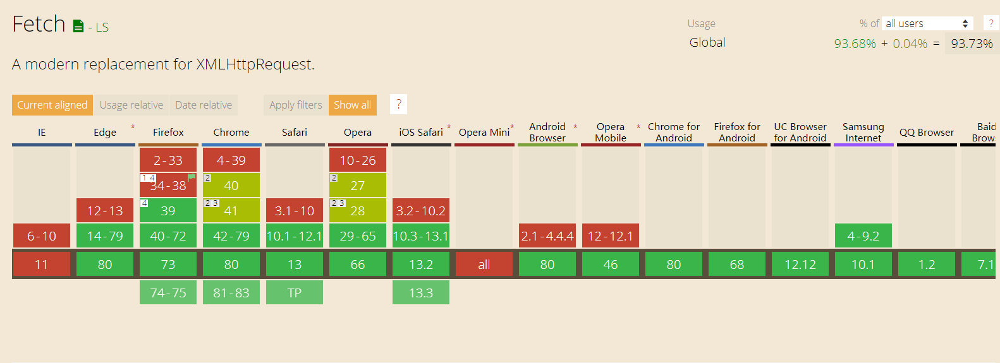

# Fetch

## 介绍

Fetch API 是近年来被提及将要取代 XHR 的技术新标准，是一个 HTML5 的 API。

Fetch 并不是 XHR 的升级版本，而是从一个全新的角度来思考的一种设计。Fetch 是基于 Promise 语法结构，而且它的设计足够低阶，这表示它可以在实际需求中进行更多的弹性设计。对于 XHR 所提供的能力来说，Fetch 已经足够取代 XHR ，并且提供了更多拓展的可能性。

详细介绍：[https://developer.mozilla.org/zh-CN/docs/Web/API/Fetch_API](https://developer.mozilla.org/zh-CN/docs/Web/API/Fetch_API)

## 常见问题

### 兼容性



fetch首先是基于Promise实现的，所以在低版本浏览器中Promise可能也未被原生支持，所以还需要Promise的polyfill；大多数情况下，实现fetch的polyfill需要涉及到的：

- promise的polyfill，例如es6-promise、babel-polyfill提供的promise实现。
- fetch的polyfill实现，例如isomorphic-fetch和whatwg-fetch

### fetch默认不携带cookie

fetch发送请求默认是不发送cookie的，不管是同域还是跨域；那么问题就来了，对于那些需要权限验证的请求就可能无法正常获取数据，这时可以配置其`credentials`项，其有3个值：

- omit: 默认值，忽略cookie的发送
- same-origin: 表示cookie只能同域发送，不能跨域发送
- include: cookie既可以同域发送，也可以跨域发送

### fetch请求对某些错误http状态不会reject

这主要是由fetch返回promise导致的，因为fetch返回的promise在某些错误的http状态下如400、500等不会reject，相反它会被resolve；只有网络错误会导致请求不能完成时，fetch 才会被 reject；所以一般会对fetch请求做一层封装，例如下面代码所示：

```js
function checkStatus(response) {
  if (response.status >= 200 && response.status < 300) {
    return response;
  }
  const error = new Error(response.statusText);
  error.response = response;
  throw error;
}

function parseJSON(response) {
  return response.json();
}

export default function request(url, options) {
  let opt = options||{};
  return fetch(url, {credentials: 'include', ...opt})
    .then(checkStatus)
    .then(parseJSON)
    .then((data) => ( data ))
    .catch((err) => ( err ));
}
```

### fetch不支持超时timeout处理

用过fetch的都知道，fetch不像大多数ajax库那样对请求设置超时timeout，它没有有关请求超时的feature，这一点比较蛋疼。所以在fetch标准添加超时feature之前，都需要polyfill该特性。

实际上，我们真正需要的是abort()， timeout可以通过timeout+abort方式来实现，起到真正超时丢弃当前的请求。

而在目前的fetch指导规范中，fetch并不是一个具体实例，而只是一个方法；其返回的promise实例根据Promise指导规范标准是不能abort的，也不能手动改变promise实例的状态，只能由内部来根据请求结果来改变promise的状态。

既然不能手动控制fetch方法执行后返回的promise实例状态，那么是不是可以创建一个可以手动控制状态的新Promise实例呢。所以：

#### 方法一：单纯setTimeout方式

```js
var oldFetchfn = fetch; //拦截原始的fetch方法
window.fetch = function(input, opts){//定义新的fetch方法，封装原有的fetch方法
    return new Promise(function(resolve, reject){
        var timeoutId = setTimeout(function(){
            reject(new Error("fetch timeout"))
        }, opts.timeout);
        oldFetchfn(input, opts).then(
            res=>{
                clearTimeout(timeoutId);
                resolve(res)
            },
            err=>{
                clearTimeout(timeoutId);
                reject(err)
            }
        )
    })
}
```

当然在上面基础上可以模拟类似XHR的abort功能：

```js
var oldFetchfn = fetch;
window.fetch = function(input, opts){
    return new Promise(function(resolve, reject){
        var abort_promise = function(){
            reject(new Error("fetch abort"))
        };
        var p = oldFetchfn(input, opts).then(resolve, reject);
        p.abort = abort_promise;
        return p;
    })
}
```

#### 方法二：利用Promise.race方法

```js
var oldFetchfn = fetch; //拦截原始的fetch方法
window.fetch = function(input, opts){//定义新的fetch方法，封装原有的fetch方法
    var fetchPromise = oldFetchfn(input, opts);
    var timeoutPromise = new Promise(function(resolve, reject){
        setTimeout(()=>{
             reject(new Error("fetch timeout"))
        }, opts.timeout)
    });
    retrun Promise.race([fetchPromise, timeoutPromise])
}
```

#### fetch不支持progress事件

XHR是原生支持progress事件的，例如下面代码这样：

```js
var xhr = new XMLHttpRequest()
xhr.open('POST', '/uploads')
xhr.onload = function() {}
xhr.onerror = function() {}
function updateProgress (event) {
  if (event.lengthComputable) {
    var percent = Math.round((event.loaded / event.total) * 100)
    console.log(percent)
  }
xhr.upload.onprogress =updateProgress; //上传的progress事件
xhr.onprogress = updateProgress; //下载的progress事件
}
xhr.send();
```

但是fetch是不支持有关progress事件的；不过可喜的是，根据fetch的指导规范标准，其内部设计实现了Request和Response类；其中Response封装一些方法和属性，通过Response实例可以访问这些方法和属性，例如response.json()、response.body等等；

值得关注的地方是，response.body是一个可读字节流对象，其实现了一个getRender()方法，其具体作用是：

getRender()方法用于读取响应的原始字节流，该字节流是可以循环读取的，直至body内容传输完成；

### 参考文献

- Fetch API：[https://developer.mozilla.org/zh-CN/docs/Web/API/Fetch_API](https://developer.mozilla.org/zh-CN/docs/Web/API/Fetch_API)
- fetch使用的常见问题及解决办法：[https://www.cnblogs.com/wonyun/p/fetch_polyfill_timeout_jsonp_cookie_progress.html](https://www.cnblogs.com/wonyun/p/fetch_polyfill_timeout_jsonp_cookie_progress.html)
